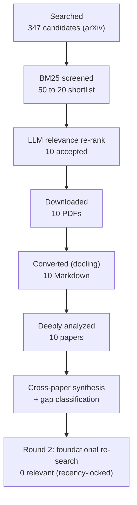
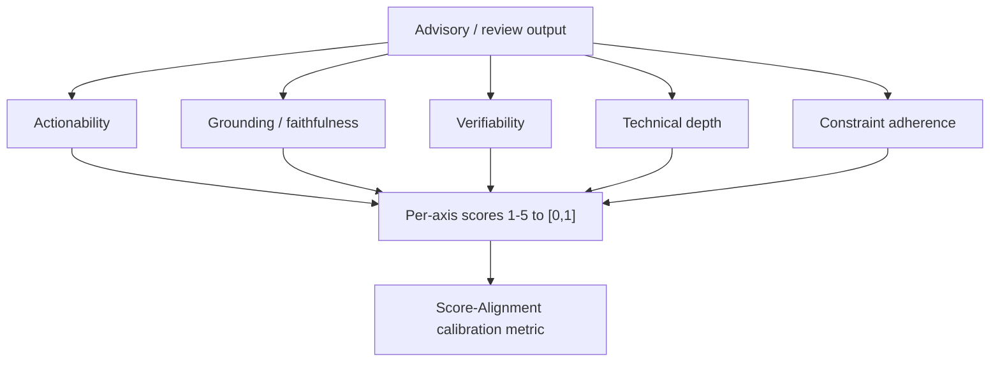
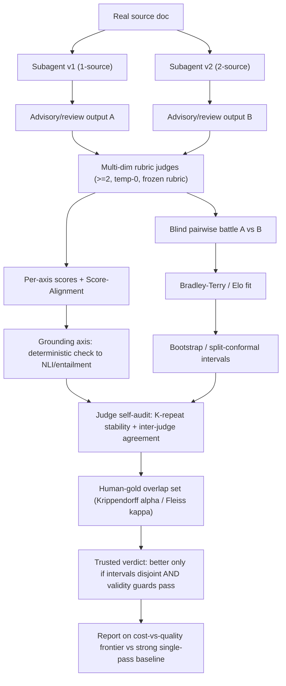

# Research Report: Benchmarking & Runtime Quality Evaluation of LLM Agents and Expert Assistants — LLM-as-Judge Methodology, Biases, Rubric/Pairwise/Elo & Reference-Free Scoring of Free-Form Advisory Output

## Contents

- [Round History](#round-history)
- [Executive Summary](#executive-summary)
- [Research Question](#research-question)
- [Methodology](#methodology)
- [Papers Reviewed](#papers-reviewed)
- [Research Landscape](#research-landscape)
- [Methodology Comparison](#methodology-comparison)
- [Confidence-Graded Findings](#confidence-graded-findings)
- [Trade-Off Analysis](#trade-off-analysis)
- [Points of Agreement](#points-of-agreement)
- [Points of Contradiction](#points-of-contradiction)
- [Research Gaps](#research-gaps)
- [Reproducibility Notes](#reproducibility-notes)
- [Practical Recommendations](#practical-recommendations)
- [Downstream Application: A Phase-10 Output-Quality Harness](#downstream-application-a-phase-10-output-quality-harness)
- [Readiness Assessment](#readiness-assessment)
- [Future Directions](#future-directions)
- [Evidence Map](#evidence-map)
- [References](#references)
- [Appendix: Run Metadata](#appendix-run-metadata)

## Round History

Iterative gap-closure loop (hard cap: 4 rounds).

| Round | Run ID | Topic / Gap Focus | New Papers | Gaps Addressed | Remaining Gaps |
|-------|--------|-------------------|------------|----------------|----------------|
| 1 | `20260613T102451Z` | Original topic: LLM-as-judge, rubric, pairwise/Elo, reference-free, free-form advisory evaluation | 10 analyzed | Initial shortlist + full synthesis | 3 academic (1 HIGH, 2 MEDIUM), 3 engineering, 1 out-of-scope |
| 2 | `round2-foundational` | Close HIGH academic Gap 1 — foundational LLM-as-judge bias literature (MT-Bench, G-Eval, AlpacaEval, Chatbot Arena/Elo, position/verbosity bias) | 0 relevant (181 candidates, **all dated 2026-06-11**, 0 canonical, 0 pre-2026) | Gap 1 **reclassified** as environment-limited | 2 academic (MEDIUM), 3 engineering, 1 out-of-scope |

**Stop reason**: Round-2 search returned **0 relevant foundational papers** — the only reachable source (arXiv) is recency-locked to a single day (2026-06-11), and the auxiliary sources failed (Semantic Scholar `429` rate-limit without API key; OpenAlex `400` malformed-date filter). The remaining HIGH academic gap is therefore **un-closeable in this environment** and is reclassified as environment-limited (import out-of-band). All other open gaps are MEDIUM-academic or engineering. Loop stopped at round 2 (below the 4-round cap) per the "new search returned 0 relevant papers" stopping condition.

## Executive Summary

This review asks how to make *"is the advice good?"* a repeatable, measured signal for free-form advisory/review outputs from LLM agents and expert assistants — covering LLM-as-judge methodology and its biases, rubric-based evaluation, pairwise/Elo comparison, reference-free scoring, and judge↔human meta-evaluation. Ten papers (arXiv, June 2026) were deeply analyzed. They converge on a near-complete, evidence-backed blueprint: **decompose quality into multiple named rubric dimensions** rather than one scalar [2606.13349, 2606.12984, 2606.13192]; **compare versions with pairwise Bradley-Terry/Elo carrying explicit uncertainty** against a diverse opponent pool, not win-rate vs one fixed baseline [2606.13221, 2606.13349]; treat **reference-free scoring as viable but unreliable where no single correct answer exists** [2606.12984, 2606.13111]; **self-audit the judge** (multi-judge bias dilution, within-judge stability, inter-judge & human agreement) [2606.13111, 2606.13349, 2606.13221]; and **guard validity at the system level** with an independent gold authority, a cost-vs-quality frontier, and a strong simple baseline [2606.13436, 2606.13003].

**Scope**: 10 papers analyzed from arXiv (single ~June 2026 batch; auxiliary sources unavailable).
**Overall Confidence**: Medium-High — internally consistent, convergent across independent domains, but leaning on recent *applications* rather than the canonical method papers (unretrievable here).
**Verdict**: **HAS_GAPS** — the harness blueprint is implementable now; the one HIGH academic gap (foundational bias taxonomy) is environment-limited and must be imported out-of-band.

## Research Question

How can the runtime *output quality* of free-form advisory and review outputs produced by LLM agents / expert assistants be evaluated **reliably and repeatably**, specifically via:

1. LLM-as-judge methodology and the mitigation of its biases (position, verbosity, self-preference, intransitivity);
2. rubric- / checklist-based multi-dimension scoring;
3. pairwise comparison and Elo / Bradley-Terry win-rate ranking for comparing system versions;
4. reference-free quality scoring (no gold answer); and
5. meta-evaluation — judge↔human agreement / inter-rater reliability.

**In scope**: methodology for *scoring and ranking free-form text quality* and for *trusting the evaluator*. **Out of scope**: task-accuracy-only benchmarks, training-time reward optimization for its own sake, and online behavioral (A/B) funnels not available to a subagent factory.

## Methodology

### Search Strategy

- **Sources**: arXiv (only functioning source). Semantic Scholar, OpenAlex, DBLP, HuggingFace were configured but failed at runtime (S2 `429`; OpenAlex `400`).
- **Query variants**: 16 synonym/benchmark-expanded variants (LLM-as-a-judge, G-Eval, MT-Bench/Chatbot Arena pairwise, AlpacaEval win-rate, Elo/Bradley-Terry, rubric/checklist, reference-free, meta-evaluation, panel-of-judges, calibration).
- **Time window**: requested 36-month primary / 60-month fallback; **effective window collapsed to a single day (2026-06-11)** by the recency-locked index.
- **Screening**: BM25 (347 → 50 → 20) followed by an LLM relevance re-rank sub-agent (→ 10 accepted).

### Pipeline Summary

| Metric | Count |
|--------|-------|
| Total candidates (round 1) | 347 |
| After BM25 screening | 20 |
| After LLM relevance re-rank | 10 |
| Downloaded | 10 |
| Successfully converted | 10 |
| Deeply analyzed | 10 |
| Round-2 foundational candidates | 181 (0 relevant) |
| Iterations | 2 |

## Papers Reviewed

All papers are arXiv preprints dated 2026-06-11 (year 2026); no licenses are recorded. Relevance is to the *output-quality-harness* downstream use.

| # | Title (short) [id] | Lead Authors | Year | Quality | Relevance |
|---|--------------------|--------------|------|---------|-----------|
| 1 | Soft-Elo: Conformal Elo Estimation for LLM evaluation [2606.13221] | Kargi, Salinas | 2026 | High | **HIGH** |
| 2 | AgentBeats: Agentifying Agent Assessment [2606.13608] | Liu, Tu, Chen | 2026 | Medium | MEDIUM |
| 3 | Evaluation Sovereignty (multi-track authority audit) [2606.13436] | Vasquez | 2026 | Medium | **HIGH** |
| 4 | Orch-RM: Orchestration Reward Modeling [2606.13598] | Tsang, Zhao | 2026 | Medium | MEDIUM |
| 5 | MÖVE: Holistic LLM Benchmark w/ judge self-audit [2606.13111] | Dalerci, Michael | 2026 | High | **HIGH** |
| 6 | The Illusion of Multi-Agent Advantage [2606.13003] | Jwalapuram, Lin | 2026 | High | **HIGH** |
| 7 | SkillChain: Dual-Path LLM-Judge Skill Evolution [2606.12984] | Hu, Xu, Guo | 2026 | Medium | **HIGH** |
| 8 | ProReviewer: Proactive Peer-Review Agent [2606.13349] | Fang, Feng, Gurevych | 2026 | High | **HIGH** |
| 9 | UXBench: Fine-Grained UI/UX Reasoning [2606.13192] | Mao, Fang, Guo | 2026 | Medium | MEDIUM |
| 10 | SciR: Controllable Scientific-Reasoning Benchmark [2606.13020] | Beckmann, Valentino | 2026 | Medium | MEDIUM |

## Research Landscape

### Theme 1 — Multi-dimension rubrics decompose fuzzy quality into orthogonal axes

**Coverage**: 3 papers | **Confidence**: High | **Supporting**: [2606.13349], [2606.12984], [2606.13192]

A scalar "quality" score is consistently rejected in favour of several named, separately-scored axes.

1. **ProReviewer** scores free-form reviews on **Actionability / Grounding / Verifiability / Technical Depth** (1–5 → [0,1]), plus an MAE-based *Score-Alignment* metric that separates *content quality* from *rating calibration* [2606.13349].
2. **SkillChain** uses 4 orthogonal axes — Tool-Call Rationality, Card-Composition Compliance, Content Quality, Constraint Adherence — judged at temperature 0 [2606.12984].
3. **UXBench** needs an 8-task rubric because defects stem from misalignment with the user's mental model, so surface-correct output can still be wrong [2606.13192].

### Theme 2 — Pairwise + Bradley-Terry/Elo with uncertainty for version ranking

**Coverage**: 3 papers | **Confidence**: High | **Supporting**: [2606.13221], [2606.13349], [2606.13598]

The consensus way to compare versions (e.g. *1-source vs 2-source*) is pairwise battles aggregated into a Bradley-Terry / Elo model carrying explicit uncertainty.

- **Soft-Elo** regresses *calibrated soft win-probabilities* (from judge score differences) into Bradley-Terry and applies **split conformal** to the judge-vs-human Elo residuals → **17.9 Elo MAE** vs human, intervals narrowed a mean **56%** at ~90% coverage; it warns fixed-baseline win-rates are fragile under non-transitive judge preferences [2606.13221].
- **ProReviewer** aggregates blind, anonymized pairwise comparisons via BT into Elo with **95% bootstrap CIs (2000 resamples)** [2606.13349].
- **Orch-RM** trains a self-supervised BT reward on mined win-lose pairs — reference-free, no human labels [2606.13598].

The Bradley-Terry win probability of item $i$ over $j$:

$$P(i \succ j) = \frac{e^{\beta_i}}{e^{\beta_i} + e^{\beta_j}} = \sigma(\beta_i - \beta_j)$$

Soft-Elo replaces a hard $\{0,1\}$ outcome with a calibrated soft label $\tilde{y}_{ij} \in [0,1]$ derived from the judge's score gap, and wraps the residual $r = \hat{E}_{\text{judge}} - E_{\text{human}}$ in a distribution-free split-conformal interval at level $1-\alpha$:

$$\hat{C}_{1-\alpha}(x) = \hat{E}(x) \pm \hat{q}_{1-\alpha}\big(\{|r_k|\}_{k \in \text{cal}}\big)$$

### Theme 3 — Reference-free scoring is viable but unreliable without an anchor

**Coverage**: 5 papers | **Confidence**: High | **Supporting**: [2606.13349], [2606.13020], [2606.12984], [2606.13111], [2606.13598]

ProReviewer's rubric needs no gold reference [2606.13349], and SciR anchors on a *synthetic formal object* to keep answers verifiable [2606.13020]. **But** SkillChain reports near-zero gains for open-ended intents that lack a single correct answer [2606.12984], and MÖVE downgrades literal-match faithfulness to a *coarse* grounding indicator because it penalizes valid paraphrase [2606.13111].

### Theme 4 — Judges must be self-audited (bias dilution, stability, agreement)

**Coverage**: 4 papers | **Confidence**: High | **Supporting**: [2606.13111], [2606.13349], [2606.13221], [2606.12984]

- **MÖVE** decomposes judge reliability into **within-judge stability** + **inter-judge agreement**, and audits prompt sensitivity and private-data impact [2606.13111].
- **ProReviewer** uses **three diverse judges** (none the baseline backbone) and reports **Krippendorff α / Fleiss κ / Cohen κ** on a human overlap set [2606.13349].
- **Soft-Elo** enumerates local biases (**position, verbosity, self-preference, intransitivity**) and global biases, and finds **11.6%** of decisive battles have a verdict-vs-score sign disagreement [2606.13221].

### Theme 5 — Evaluation validity is a system property: guard against circular & illusory metrics

**Coverage**: 3 papers | **Confidence**: High | **Supporting**: [2606.13436], [2606.13003], [2606.13111]

- **Evaluation Sovereignty**: models strong under *silver* (self-generated) labels collapse under independent *gold* evaluation — Micro-F1 **~0.54 → ~0.03**; use a multi-track authority audit [2606.13436].
- **Illusion of Multi-Agent Advantage**: a single-agent CoT-SC baseline beats automated multi-agent systems at **<10% of the cost**, with **70–90% "functional collapse"** to unanimous consensus — "advantage" is a benchmark-validity artifact of ignoring cost parity [2606.13003].
- **MÖVE**: no single model dominates and size is a poor predictor → prefer multi-criteria over a single aggregate [2606.13111].

### Theme 6 — Process-level scoring & extraction-vs-inference profiling diagnose *where* a version fails

**Coverage**: 2 papers | **Confidence**: Medium | **Supporting**: [2606.13192], [2606.13020]

- **UXBench**'s asymmetric transition reward penalizes both redundant and insufficient reasoning steps [2606.13192].
- **SciR** varies extraction/obfuscation difficulty *independently* of inference complexity, yielding a per-model failure profile; rendering noise halves a neuro-symbolic pipeline (90.4 → 42.6) [2606.13020].

### Theme 7 — Judge-as-agent & standardized interfaces for reproducible head-to-head eval

**Coverage**: 1 paper | **Confidence**: Medium | **Supporting**: [2606.13608]

**AgentBeats** collapses the two-interface design into one (A2A + MCP), decoupling judge logic from agent implementation; a five-month competition ran 298 judge + 467 subject agents. It validates the *interface/paradigm*, **not** judge calibration or bias [2606.13608].

## Methodology Comparison

| Approach | Papers | Strengths | Weaknesses | Best For |
|----------|--------|-----------|------------|----------|
| Reference-free multi-dim rubric + Score-Alignment | 2606.13349, 2606.12984 | No gold ref; orthogonal axes; separates content vs calibration | Degrades w/o anchor; residual judge bias | Scoring free-form advisory text |
| Soft/conformal Elo over BT vs diverse pool | 2606.13221 | Distribution-free uncertainty; intransitivity-robust | Marginal guarantee; validated on chat-arena only | Ranking many versions with honest bands |
| Self-supervised BT reward from artifact pairs | 2606.13598 | No human labels; cheap; cross-domain | Target = task accuracy, not text quality | Bootstrapping a reference-free pre-filter |
| Multi-track gold/silver authority audit | 2606.13436 | Detects circularity; quantifies authority gap | Single domain; gold residual error unmeasured | Validating judge-based rankings |
| Synthetic formal-object ground truth + regen | 2606.13020 | Verifiable; failure profiles; anti-saturation | Needs clean latent object; point estimates | Controllable regenerable eval sets |
| Judge self-audit (stability + agreement + ensemble) | 2606.13111, 2606.13349 | Decomposes reliability; dilutes bias | Repeat-judging + human-overlap cost | Trusting the judge before ranking |
| Judge-as-agent over A2A+MCP interface | 2606.13608 | One interface, head-to-head, production-aligned | No bias/calibration stats; adoption cost | Reproducible comparison infrastructure |

## Confidence-Graded Findings

### 🟢 High Confidence (3+ papers / consistent)

1. **Multi-dimension reference-free rubrics beat a single overall scalar** for advisory output — [2606.13349], [2606.12984], [2606.13192].
2. **Rank versions via pairwise BT/Elo with explicit uncertainty against a diverse pool**, not fixed-baseline win-rate — [2606.13221], [2606.13349].
3. **Reference-free judging is unreliable where no single correct answer exists** — [2606.12984], [2606.13111].
4. **Judges must be self-audited** (multi-judge dilution, within-judge stability, inter-judge & human agreement) — [2606.13111], [2606.13349], [2606.13221].
5. **Validity is a system property**: independent gold authority + cost-vs-quality frontier + strong simple baseline are mandatory guards — [2606.13436], [2606.13003].

### 🟡 Medium Confidence (1–2 papers / caveats)

1. **Process-level scoring + extraction-vs-inference profiling** localize *where* a version fails — [2606.13192], [2606.13020].
2. **Self-supervised BT reward from a system's own artifacts** is a cheap reference-free scorer — [2606.13598] (target is task accuracy, not text quality).
3. **Judge-as-agent over a standardized interface** enables reproducible head-to-head comparison — [2606.13608] (interface only, no calibration stats).

### 🔴 Low Confidence (single-source / preliminary)

1. **Synthetic latent-formal-object ground truth for advisory output** — [2606.13020]; real advisory tasks rarely have a clean formal object, and results are single-run point estimates without error bars.

## Trade-Off Analysis

| Decision | Option A | Option B | Recommendation |
|----------|----------|----------|----------------|
| Reference-free vs anchored scoring | Rubric-only: scales, no gold; fails w/o single correct answer [2606.13349, 2606.12984] | Synthetic/human-gold: verifiable, resists circularity; costly for free-form [2606.13020, 2606.13436] | Reference-free rubric as primary signal **+** periodic human-gold overlap; distrust reference-free where no correct answer exists |
| Fixed-baseline win-rate vs BT/Elo | Simple, cheap; fragile under intransitivity, no uncertainty [2606.13221] | BT/Elo + intervals: robust, honest bands; more battles [2606.13221, 2606.13349] | BT/Elo vs diverse pool; declare a winner **only** on non-overlapping intervals |
| Single vs multi-judge | Cheapest; biased, 11.6% internal inconsistency [2606.13221, 2606.13111] | ≥2 diverse judges: dilutes bias, enables agreement audit; N× cost [2606.13349, 2606.13111] | ≥2 diverse judges, not the subagent backbone, temp-0, report stability + agreement |
| Quality only vs cost-vs-quality frontier | Simple verdict; expensive variant wins by spending more [2606.13003] | Frontier + strong baseline: exposes illusory advantage; meter cost [2606.13003] | Always compare on a cost-vs-quality frontier with a strong single-pass baseline |

## Points of Agreement

1. **Decompose quality into orthogonal rubric axes, scored 1–5 → [0,1]** — [2606.13349], [2606.12984], [2606.13192].
2. **Use pairwise comparison with a Bradley-Terry/Elo aggregate and report uncertainty** — [2606.13221], [2606.13349].
3. **Do not trust a single judge; audit stability and agreement** — [2606.13111], [2606.13349], [2606.13221].

## Points of Contradiction

1. **Does a learned BT reward qualify as a judge for advisory text?**
   - [2606.13598] (Orch-RM): a self-supervised BT reward is a reference-free way to score/rank outputs without human labels.
   - [2606.13349] (ProReviewer): trustworthy advisory scoring requires rubric judging **plus** blind human pairwise validation and IAA — a human check the automatic judge cannot replace.
   - **Possible explanation**: Orch-RM's reward predicts *task accuracy* from artifacts; ProReviewer scores subjective *review-utility text* anchored to humans. Orch-RM itself flags it is not a drop-in text judge.
   - **Implication**: Use a learned BT reward to rank candidates *cheaply as a pre-filter*, but pair it with a rubric judge and a periodic human-gold check.

2. **Is standardized agentified assessment sufficient to trust rankings?**
   - [2606.13608] (AgentBeats): a standardized judge-agent interface makes evaluation open, fair, reproducible at scale.
   - [2606.13436] (Evaluation Sovereignty): reproducibility ≠ validity; if the scoring authority is not independent of the system, metrics are circular and inflated regardless of interface.
   - **Possible explanation**: these address orthogonal axes — interface/reproducibility vs authority/validity.
   - **Implication**: Adopt standardized interfaces for reproducibility **and** an independent-authority audit for validity; neither substitutes for the other.

## Research Gaps

| # | Gap | Type | Severity | Env-limited | Impact on Goals |
|---|-----|------|----------|-------------|-----------------|
| 1 | Foundational LLM-as-judge methodology & bias taxonomy (MT-Bench, G-Eval, AlpacaEval, Chatbot Arena/Elo, position/length-bias, panel-of-judges) | ACADEMIC | HIGH → reclassified | **YES** | Absolute bias magnitudes & canonical mitigations are referenced [2606.13221] but not established here |
| 2 | Soft/conformal Elo & pairwise BT validated on free-form **advisory/long-form** output (vs chat-arena) | ACADEMIC | MEDIUM | No | Calibration/coverage guarantees unproven on advisory text |
| 3 | Reference-free grounding/faithfulness scorer that does **not** over-penalize valid paraphrase | ACADEMIC | MEDIUM | No | Literal match under-scores paraphrase [2606.13111]; need NLI/entailment grounding |
| 4 | Harness implementation: multi-judge orchestration, BT + conformal/bootstrap fitting, battle persistence, gold-overlap wiring | ENGINEERING | HIGH | No | All methods present across the 10 papers; compose into a runnable harness |
| 5 | Determinism + within-judge stability controls (temp-0, frozen rubric text, K-repeat judging) | ENGINEERING | MEDIUM | No | Prescribed by [2606.12984], [2606.13111]; not yet implemented |
| 6 | Production-aligned judge-as-agent execution over a standardized interface | ENGINEERING | LOW | No | [2606.13608] value; nice-to-have beyond static-transcript scoring |
| 7 | Online behavioral validity loop (A/B downstream signal) | OUT_OF_SCOPE | LOW | No | No live funnel for a subagent factory; use human-gold agreement instead |

### Academic Gaps (require more papers)

1. **Foundational bias literature** *(environment-limited — do NOT re-run in this environment)*. Suggested queries for an unrestricted environment: `"LLM-as-a-judge position/verbosity/self-preference bias mitigation"`, `"MT-Bench G-Eval AlpacaEval judge-human agreement"`, `"Chatbot Arena Elo Bradley-Terry"`, `"panel of LLM judges / LLM-as-a-jury"` (cs.CL, cs.AI, cs.LG).
2. **Pairwise/Elo on advisory long-form**: `"conformal calibrated Elo long-form generation"`, `"Bradley-Terry pairwise advisory review text uncertainty"` (cs.CL, cs.LG, stat.ML).
3. **Robust reference-free grounding**: `"reference-free faithfulness grounding paraphrase entailment NLI"`, `"claim-level grounding verification source attribution"` (cs.CL, cs.AI).

### Engineering Gaps (fillable without papers)

4. **Compose the harness** from the 10 papers' methods: a multi-judge driver, a Bradley-Terry fitter with bootstrap/conformal intervals, a battle/verdict store, and a human-gold overlap hook. Reuse the existing deterministic grounding-check as one rubric dimension.
5. **Determinism controls**: pin temperature 0, version (freeze) the rubric text, K-repeat each judging call, persist raw verdicts for BT refit.
6. **Judge-as-agent execution**: optionally run the subagent on a real doc and let the judge inspect the live artifact; defer A2A/MCP standardization.

## Reproducibility Notes

| Paper | Code | Data | Detail | License |
|-------|------|------|--------|---------|
| 2606.13221 | ✅ | ✅ | ✅ | unknown |
| 2606.13608 | ❓ | ❓ | ⚠️ | unknown |
| 2606.13436 | ❓ | ✅ | ✅ | unknown |
| 2606.13598 | ✅ | ❓ | ✅ | unknown |
| 2606.13111 | ❓ | ✅ | ✅ | unknown |
| 2606.13003 | ❓ | ✅ | ✅ | unknown |
| 2606.12984 | ❓ | ❓ | ✅ | unknown |
| 2606.13349 | ❓ | ❓ | ✅ | unknown |
| 2606.13192 | ❓ | ❓ | ⚠️ | unknown |
| 2606.13020 | ✅ | ✅ | ✅ | unknown |

> All artifacts are unverified preprint claims; no license was recorded for any paper. Treat code/data flags as reported, not confirmed.

## Practical Recommendations

1. **Adopt ProReviewer's reference-free protocol almost wholesale** — a 4–5 dimension rubric (Actionability / Grounding / Verifiability / Technical Depth, plus a domain *Constraint Adherence* axis from [2606.12984]), each 1–5 → [0,1], **plus** a Score-Alignment calibration metric $\max\!\big(0,\,1 - |\hat{s}-\bar{s}|/\kappa\big)$ separating advice quality from rating calibration. Based on [2606.13349], [2606.12984]. *Confidence*: High.
2. **Compare subagent versions with Bradley-Terry/Elo over a diverse opponent pool, with uncertainty bands** — bootstrap CIs at small N, split-conformal once the pool is large; convert graded judge scores to calibrated soft win-probabilities before aggregating; never use win-rate vs one fixed baseline; declare a winner only when intervals do not overlap. Based on [2606.13221], [2606.13349]. *Confidence*: High.
3. **Make the judge auditable before trusting any ranking** — ≥2 diverse judges (not the subagent's own backbone), temperature 0, frozen rubric; estimate within-judge stability via K-repeat and inter-judge agreement; calibrate against a small human-gold overlap set with Krippendorff α / Fleiss κ. Based on [2606.13111], [2606.13349], [2606.12984]. *Confidence*: High.
4. **Guard validity with an independent-authority audit + cost-vs-quality frontier + strong baseline** — keep judge/gold authority independent of the subagent under test; plot quality against per-run cost; include a strong single-pass baseline so an expensive 2-source variant cannot win by spending more. Based on [2606.13436], [2606.13003]. *Confidence*: High.
5. **Reuse the existing deterministic grounding-check as one rubric dimension, but upgrade toward entailment/NLI** — literal-match grounding penalizes valid paraphrase, so treat the current check as a coarse floor and add a claim-level entailment scorer; for intents with no single correct answer, flag reference-free scores as low-trust. Based on [2606.13111], [2606.12984]. *Confidence*: Medium-High.

## Downstream Application: A Phase-10 Output-Quality Harness

Mapping the findings onto the factory's existing ad-hoc method (run subagent on a real doc → score vs a rubric → deterministic grounding-check):

This directly answers the factory's known A/B question (e.g. *does a 2-source expert beat a 1-source expert?*): it becomes a Bradley-Terry/Elo battle with disjoint-interval significance, audited for judge bias and validated against an independent gold authority — turning "is the advice good?" into a repeatable measured signal rather than hand judgement.

## Readiness Assessment

### Verdict: HAS_GAPS (confidence: high)

The 10 papers supply a near-complete, evidence-backed blueprint: reference-free multi-dimension rubrics, BT/Elo-with-uncertainty version comparison, judge self-audit + human agreement, and validity guards (independent authority, cost frontier, strong baseline). The principal academic gap — the foundational LLM-as-judge bias literature — is real but **environment-limited** (arXiv index recency-locked to 2026-06-11) and cannot be closed by more searches here; import it out-of-band as known practice. Remaining gaps are buildable engineering.

### Coverage Summary

- **Architecture patterns**: Sufficient (rubric + BT/Elo + self-audit + validity guards all specified).
- **Technology stack**: Partial (methods clear; concrete libraries / fitting code to be chosen in engineering).
- **Performance baselines**: Sufficient (17.9 Elo MAE; 56% interval narrowing; cost-frontier method; IAA statistics provide targets).
- **Security model**: Missing (no source addresses harness security; flagged, out of scope for these methods).
- **Trade-off map**: Sufficient (four explicit, evidence-backed trade-offs).

### Iteration Recommendation

Do **not** iterate searches in this environment to close Gap 1 (recency-locked; round-2 proved 0 relevant results). Proceed to harness design/implementation using the 10 papers' methods; import the canonical bias taxonomy and mitigations from the foundational literature out-of-band, and validate via a human-gold overlap set per [2606.13349].

## Future Directions

1. Validate Soft-Elo's conformal coverage on free-form **advisory/long-form** output, not just chat-arena pairs [2606.13221].
2. Build an NLI/entailment-based grounding scorer that credits valid paraphrase, replacing literal-match grounding [2606.13111].
3. Combine a cheap learned BT reward pre-filter [2606.13598] with a rubric judge + human-gold anchor [2606.13349] into a two-stage scorer.
4. Add controllable, regenerable eval tiers (extraction-vs-inference axes) to locate *where* a subagent version regresses [2606.13020], [2606.13192].

## Evidence Map

| Finding / Recommendation | Primary Evidence | Confidence |
|--------------------------|------------------|------------|
| Multi-dimension rubric > single scalar | 2606.13349, 2606.12984, 2606.13192 | High |
| BT/Elo + uncertainty for version ranking | 2606.13221, 2606.13349 | High |
| Reference-free unreliable w/o anchor | 2606.12984, 2606.13111 | High |
| Judge self-audit (stability/agreement/ensemble) | 2606.13111, 2606.13349, 2606.13221 | High |
| Validity = independent authority + cost frontier + baseline | 2606.13436, 2606.13003 | High |
| Process-level / failure-profiling diagnostics | 2606.13192, 2606.13020 | Medium |
| Learned BT reward as cheap pre-filter | 2606.13598 | Medium |
| Judge-as-agent reproducible interface | 2606.13608 | Medium |
| Synthetic formal-object ground truth for advisory | 2606.13020 | Low |

## References

1. [2606.13221] Kargi, Salinas, et al. *Soft-Elo: From Uncertain Judgments to Calibrated Rankings — Conformal Elo Estimation for LLM Evaluation.* arXiv, 2026.
2. [2606.13608] Liu, Tu, Chen, et al. *AgentBeats: Agentifying Agent Assessment for Openness, Standardization, and Reproducibility.* arXiv, 2026.
3. [2606.13436] Vasquez. *Evaluation Sovereignty in Metadata-Driven Classification: A Multi-Track Framework.* arXiv, 2026.
4. [2606.13598] Tsang, Zhao, et al. *Orch-RM: Reward Modeling for Multi-Agent Orchestration.* arXiv, 2026.
5. [2606.13111] Dalerci, Michael, et al. *MÖVE: A Holistic LLM Benchmark for the German Public Sector.* arXiv, 2026.
6. [2606.13003] Jwalapuram, Lin, et al. *The Illusion of Multi-Agent Advantage.* arXiv, 2026.
7. [2606.12984] Hu, Xu, Guo, et al. *SkillChain: Dual-Path LLM-Judge Skill Self-Evolution for Advisory Assistants.* arXiv, 2026.
8. [2606.13349] Fang, Feng, Gurevych, et al. *ProReviewer: A Proactive Peer-Review Agent.* arXiv, 2026.
9. [2606.13192] Mao, Fang, Guo, et al. *UXBench: Fine-Grained UI/UX Reasoning Assessment.* arXiv, 2026.
10. [2606.13020] Beckmann, Valentino, et al. *SciR: Controllable Scientific-Reasoning Benchmark Construction.* arXiv, 2026.

## Appendix: Run Metadata

- **Round-1 run ID**: `20260613T102451Z`
- **Round-2 run ID**: `round2-foundational` (gap-closure attempt; 181 candidates, 0 relevant — all dated 2026-06-11)
- **Sources used**: arXiv only (Semantic Scholar `429` rate-limited without API key; OpenAlex `400` malformed date filter; DBLP/HuggingFace not contributing).
- **Search → screen**: 347 candidates → BM25 top-20 → LLM re-rank → 10 accepted.
- **Conversion backend**: docling (CPU). Rough-tier (pymupdf4llm) unavailable; fine-tier used for all 10.
- **Analysis**: 10 per-paper analyses + cross-paper synthesis (system-building mode).
- **Profile**: deep. **Rounds**: 2 (of 4-cap). **Stop reason**: round-2 returned 0 relevant foundational papers (environment recency-lock).
- **Note on report filename**: the full topic slug exceeds the filesystem's 255-byte name limit, so this report uses the shortened slug `agent-output-quality-llm-as-judge-evaluation`.
- **Key environment limitation**: the arXiv index is recency-locked to a single day; foundational LLM-as-judge papers (MT-Bench, G-Eval, AlpacaEval, Chatbot Arena) are not retrievable here. This bounds the review to recent *applications* and is the dominant limitation on completeness.
