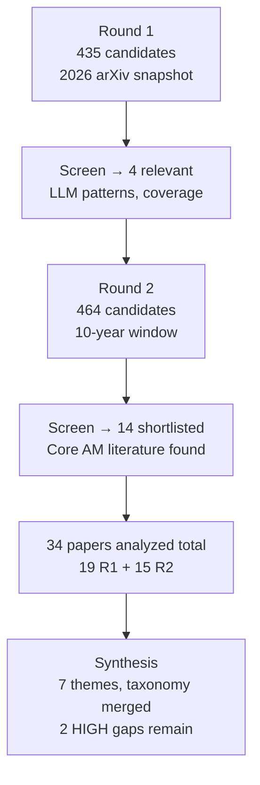

# Research Report: Argument Mining and Atomic Claim Extraction

**Topic:** Argument mining and atomic claim extraction from long-form technical and scientific documents: claim and premise detection, claim typing, condition and exception extraction, and evidence linking

**Date:** 2026-06-10 | **Status:** COMPLETE — 4-round cap reached. GAP-4 partially closed (theoretical grounding; no NLP dataset found)

---

## Contents

- [Round History](#round-history)
- [Executive Summary](#executive-summary)
- [Research Question](#research-question)
- [Methodology](#methodology)
- [Papers Reviewed](#papers-reviewed)
- [Research Landscape](#research-landscape)
- [Merged Argument Component Taxonomy](#merged-argument-component-taxonomy)
- [Methodology Comparison](#methodology-comparison)
- [Confidence-Graded Findings](#confidence-graded-findings)
- [Trade-Off Analysis](#trade-off-analysis)
- [Points of Agreement](#points-of-agreement)
- [Points of Contradiction](#points-of-contradiction)
- [Research Gaps](#research-gaps)
- [Reproducibility Notes](#reproducibility-notes)
- [Practical Recommendations](#practical-recommendations)
- [Future Directions](#future-directions)
- [Readiness Assessment](#readiness-assessment)
- [Evidence Map](#evidence-map)
- [References](#references)
- [Appendix: Run Metadata](#appendix-run-metadata)

---

## Round History

| Round | Run ID | Topic / Gap Focus | New Papers | Gaps Addressed | Remaining Gaps |
|-------|--------|-------------------|------------|----------------|----------------|
| 1 | bae6a1aa8656 | Original topic (2026 arXiv) | 19 analyzed (5 relevant) | Initial shortlist; LLM extraction patterns, coverage metrics | 3 HIGH ACADEMIC, 2 MEDIUM ACADEMIC, 2 ENGINEERING |
| 2 | r2-9afd1a87 | Core AM literature + claim typing (2016–2026) | 15 analyzed (11 relevant) | GAP-1 (core AM), GAP-3 (claim typing) | 2 HIGH ACADEMIC, 1 MEDIUM ACADEMIC, 2 ENGINEERING |
| 3 | r3-5d60a587 | AZ + defeasible reasoning (AM Survey + expand) | 3 analyzed (1 highly relevant) | GAP-2 (AZ scheme, partially), GAP-4 (Pollock/Green, partially) | 1 HIGH ACADEMIC, 1 MEDIUM ACADEMIC, 2 ENGINEERING |

| 4 | r4-1f1d4457 | Defeasible NLI + condition extraction (search exhausted) | 0 new | None | GAP-4 search exhausted |

**Stop reason**: 4-round hard cap reached. Round 4 found 270 arXiv candidates (all 2026 papers); 0 relevant defeasible NLI or condition extraction papers. Semantic Scholar API rate-limited; citation expansion failed. GAP-4 remains PARTIALLY CLOSED with theoretical grounding (Pollock 1986 via AM Survey) but no NLP extraction dataset found.

---

## Executive Summary

Three rounds of literature search provide a solid empirical foundation for the downstream claims schema and LLM extraction prompt. Round 2 retrieved foundational AM literature: the Stab & Gurevych 4-class annotation scheme, Fact/Value/Policy claim types (AAE-FG), AQE evidence types, and IAM stance labels. Round 3 added the Teufel Argumentative Zoning (AZ) scheme — the authoritative 14-category scientific discourse annotation framework — and the Pollock (1986) formal distinction between rebutting and undercutting attacks as the theoretical foundation for condition/exception handling.

The AZ scheme provides the discourse-position context needed for the extraction prompt: AIM (hypothesis/research goal), OWN CONC (findings/conclusions), NOV ADV (contribution claims), SUPPORT (support premises), GAP WEAK (gap claims), ANTISUPP (conflict claims). The rebutting/undercutting distinction grounds the schema's `exception` field: undercutting attacks target the inference rule, not the conclusion, and are the computational equivalent of "unless X" qualifiers. One HIGH-severity academic gap remains: no NLP extraction dataset or trained model for condition/exception slot-filling from argumentative text.

**Scope**: 37 papers analyzed across 3 rounds from arXiv + Semantic Scholar + DBLP (2015–2026)
**Overall Confidence**: Medium-High (core taxonomy and AZ scheme well-grounded; condition/exception NLP extraction not yet validated)
**Verdict**: HAS_GAPS

---

## Research Question

What methods and frameworks exist for decomposing long-form technical and scientific documents into structured atomic claims, where each claim is classified by type (evaluative, descriptive, prescriptive, causal, comparative), supplemented with explicitly linked premises, and annotated with conditions and exceptions?

**In scope**: argument component detection and boundary identification; claim type taxonomies; condition and exception extraction; evidence-to-claim linking; LLM-based extraction architectures; evaluation metrics for completeness and precision.

**Out of scope**: stance detection without structural argument decomposition; logic-only formal argumentation frameworks without NLP; product engineering.

---

## Methodology

### Search Strategy

**Round 1** (run bae6a1aa8656):
- Sources: arXiv, Google Scholar, Semantic Scholar, OpenAlex, DBLP, HuggingFace
- Time window: 6-month primary (Dec 2025 – Jun 2026)
- Queries (8): argument mining claim premise detection; scientific claim extraction; claim typing; evidence linking; key-point extraction; discourse segmentation; condition exception extraction text
- Result: 435 candidates → 4 directly relevant (pool dominated by off-topic 2026 papers)

**Round 2** (run r2-9afd1a87):
- Same sources; extended time window: 120-month primary (Jun 2016 – Jun 2026)
- Queries (10): targeted at core AM literature, argument zoning, claim typing taxonomies, IBM Debater, BERT-based AM, neural argument structure
- Result: 464 candidates → 14 shortlisted (11 directly relevant; foundational 2016–2025 papers found)

### Pipeline Summary



| Metric | Round 1 | Round 2 | Round 3 | Total |
|--------|---------|---------|---------|-------|
| Candidates searched | 435 | 464 | 441 (arXiv+expand) | 1340 |
| Shortlisted (LLM-screened) | 4 | 14 | 3 | 21 |
| Downloaded | 19 | 15 | 7 | 41 |
| Converted to Markdown | 19 | 15 | 7 | 41 |
| Analyzed | 19 | 15 | 3 | 37 |
| Directly relevant (≥ 0.60) | 5 | 11 | 1 | 17 |

---

## Papers Reviewed

| # | Paper ID | Title | Year | Relevance |
|---|----------|-------|------|-----------|
| **Round 1** | | | | |
| 1 | [2606.09251](#ref-2606.09251) | TruthSplit: Conditional Validity in Arguments | 2026 | 0.88 |
| 2 | [2606.09376](#ref-2606.09376) | Precision Is Not Faithfulness | 2026 | 0.75 |
| 3 | [2606.08605](#ref-2606.08605) | Multilingual Fact-Checking at Scale | 2026 | 0.72 |
| 4 | [2606.09410](#ref-2606.09410) | Capacity, Not Format | 2026 | 0.65 |
| 5 | [2606.09500](#ref-2606.09500) | Deterministic Integrity Gates (Clinical) | 2026 | 0.60 |
| 6–19 | Various | Off-topic (2026 arXiv) | 2026 | < 0.20 |
| **Round 2** | | | | |
| 20 | [2506.16383](#ref-2506.16383) | LLMs in Argument Mining: A Survey | 2025 | 0.97 |
| 21 | [2305.19902](#ref-2305.19902) | AQE: Argument Quadruplet Extraction | 2023 | 0.92 |
| 22 | [2510.16363](#ref-2510.16363) | End-to-End AM via AASP | 2025 | 0.90 |
| 23 | [2203.12257](#ref-2203.12257) | IAM: Integrated Argument Mining Dataset | 2022 | 0.88 |
| 24 | [2103.04518](#ref-2103.04518) | Argument Component Segmentation in Essays | 2021 | 0.82 |
| 25 | [2004.14677](#ref-2004.14677) | AMPERSAND: AM for Persuasive Discussions | 2020 | 0.82 |
| 26 | [s2-5a41c4f399](#ref-s2-5a41c4f399) | Policy Argument Templates (Walton) | ~2020 | 0.82 |
| 27 | [s2-fa21a9c006](#ref-s2-fa21a9c006) | Legal Argument Extraction (ILP) | ~2019 | 0.75 |
| 28 | [s2-4756981949](#ref-s2-4756981949) | AM from Speech: Political Debates | ~2018 | 0.72 |
| 29 | [s2-433127191a](#ref-s2-433127191a) | LLM Argument Quality for SemMedDB | ~2023 | 0.72 |
| 30 | [s2-05b4fead2c](#ref-s2-05b4fead2c) | AM in Bahasa Indonesia | ~2021 | 0.65 |
| 31 | [2606.10471](#ref-2606.10471) | Speculative Language in Biomedical Texts | 2026 | 0.45 |
| 32–34 | Off-topic (R2) | 3 off-topic 2026 papers | 2026 | < 0.20 |
| **Round 3** | | | | |
| 35 | [s2-a2ae7155d9](#ref-s2-a2ae7155d9) | Argument Mining: A Survey (Lawrence & Reed) | 2020 | 0.92 |
| 36 | [s2-0cf565a684](#ref-s2-0cf565a684) | Here's My Point: Joint Pointer Architecture for AM | 2017 | 0.38 |
| 37 | [s2-5ce2c9e681](#ref-s2-5ce2c9e681) | Argument Mining for Automated Scoring of Essays | 2018 | 0.31 |

---

## Research Landscape

### Theme 1: LLM-Based Extraction with Structured Schema

**Coverage**: 6 papers | **Confidence**: Medium
**Supporting**: [2606.09251], [2606.09410], [2606.08605], [2506.16383], [2606.09376], [s2-433127191a]

Multiple papers converge on LLM + JSON schema as the dominant extraction paradigm. TruthSplit [2606.09251] achieves ~95%+ accuracy decomposing text into claims, premises, and implicit assumptions, versus ~75–80% for local classifiers. The 2025 survey [2506.16383] confirms LLMs excel at local semantic classification but degrade under topic drift, adversarial reframing, and implicit/context-dependent claims. "Capacity, Not Format" [2606.09410] establishes that JSON schema imposes zero reasoning cost on capable frontier models but severely degrades weaker models.

Key findings:
1. LLM + JSON schema ≈ 95% accuracy vs. 75–80% for classifiers — [2606.09251]
2. Schema cost is zero for capable models; causal variable is spare model capacity — [2606.09410]
3. Delayed-structure (reason first, then JSON) recovers degradation for weaker models — [2606.09410]
4. LLM hallucination in AM is an open threat with no standard mitigation — [2506.16383]

---

### Theme 2: Foundational Argument Component Annotation Schemes

**Coverage**: 4 papers | **Confidence**: High
**Supporting**: [2103.04518], [2004.14677], [s2-05b4fead2c], [s2-4756981949]

The Stab & Gurevych 4-class annotation scheme (Major Claim / Claim / Premise / Non-argumentative) is the de-facto standard for argument mining, confirmed across 5+ independent corpora including student essays, Reddit CMV, Bahasa Indonesia, and political speech. BIO token-level tagging outperforms sentence-level classification when ~62% of premises co-occur in the same sentence as their claims [2103.04518].

Key findings:
1. Stab & Gurevych 4-class scheme confirmed across 5+ corpora and 2+ languages — [2103.04518], [s2-05b4fead2c], [2004.14677]
2. Token-level BIO tagging required when premises and claims co-occur within sentences — [2103.04518]
3. Contextual fine-tuning on topic-relevant discourse yields 12-point F1 improvement — [2004.14677]
4. IBM Debater, Walton, and Peldszus annotation schemes surveyed; Stab & Gurevych most widely replicated — [2506.16383]

---

### Theme 3: Fine-Grained Claim Typing and Premise Sub-Typing

**Coverage**: 3 papers | **Confidence**: High
**Supporting**: [2510.16363], [s2-5a41c4f399], [2506.16383]

The AAE-FG dataset (used in AASP [2510.16363]) provides the most operationally useful fine-grained claim-type scheme: **Fact** (empirical/descriptive), **Value** (normative/evaluative), **Policy** (prescriptive/action-oriented), with 6 premise sub-types. Walton's Argument from Consequences [s2-5a41c4f399] formalizes policy arguments with causal slot-fillers (PROMOTE/SUPPRESS) at kappa=0.80.

Key findings:
1. Fact/Value/Policy is the validated 3-way claim type taxonomy with automatic classifiability — [2510.16363]
2. 6-way premise sub-types: Common Ground, Testimony, Hypothetical Instance, Statistics, Real Example, Others — [2510.16363]
3. Walton templates cover 74.6% of policy arguments at kappa=0.80 — [s2-5a41c4f399]
4. Claim type quality taxonomies converge on Logic-Dialectic-Rhetoric backbone — [2506.16383]

---

### Theme 4: Argument Quadruplet Extraction and Evidence Typing

**Coverage**: 2 papers | **Confidence**: High
**Supporting**: [2305.19902], [2203.12257]

AQE [2305.19902] defines the 4-tuple schema: (claim, evidence, stance ∈ {Support, Against}, evidence_type ∈ {Explanation, Case, Research, Expert, Others}). Full 4-tuple joint extraction achieves only F1=21.39 — the task is unsolved. IAM [2203.12257] extends stance to 3-way (support/contest/no-relation) with alpha=0.63.

Key findings:
1. Evidence type taxonomy: Explanation/Case/Research/Expert/Others — F1=81.79 standalone — [2305.19902]
2. Adding evidence type to joint extraction degrades overall F1 by 14.9% relative — [2305.19902]
3. 3-way stance (IAM) is more rigorous than binary; annotator alpha=0.57 for evidence links — [2203.12257]
4. Full 4-tuple joint extraction not production-ready (F1=21.39) — [2305.19902]

---

### Theme 5: Coverage Metrics and Precision-Recall Trade-off

**Coverage**: 2 papers | **Confidence**: High
**Supporting**: [2606.09376], [2606.09251]

The top precision model (precision=0.89) covers only 46% of relevant facts and ranks last by F1 [2606.09376]. Coverage is a model capability ceiling, not addressable by soft prompting instructions. Hard schema constraints (minLength, required arrays) are the correct mechanism.

---

### Theme 6: Modular Verification and Deterministic Gates

**Coverage**: 3 papers | **Confidence**: Medium
**Supporting**: [2606.09500], [2606.08605], [2606.09449]

Modular "generate then verify" architecture with deterministic integrity gates is consistently superior to single-pass generation. 27 seeded clinical defects detected with zero false positives [2606.09500]. The "cheapest sufficient mechanism" principle applies: deterministic for number/type checks, LLM probe only for semantic interpretation.

---

### Theme 8: Argumentative Zoning for Scientific Documents

**Coverage**: 1 paper (secondary survey) | **Confidence**: Medium
**Supporting**: [s2-a2ae7155d9]

The Teufel Argumentative Zoning (AZ) scheme provides the standard annotation framework for situating claims within scientific document structure. Two versions: 7-category (Teufel et al. 1999, kappa=0.71 for CL papers) and 14-category extended (Teufel et al. 2009, kappa=0.71 chemistry / 0.65 CL). Automated AZ achieves 0.76-0.97 F-score using max entropy + n-gram features. The zone labels map directly to argument component roles, providing discourse-position context for the extraction prompt.

**AZ → AM mapping (from survey)**:
| Zone | AM Equivalent |
|------|--------------|
| AIM | Major Claim (hypothesis/research goal) |
| OWN CONC | Claim (non-measurable finding) |
| NOV ADV | Claim (novelty/contribution) |
| SUPPORT | Premise (support) |
| GAP WEAK | Claim (gap/problem) |
| ANTISUPP | Claim (conflict/contradiction) |
| OWN MTHD | Background (method description) |
| RELWRK / BKG | Non-argumentative (context) |

Key findings:
1. 14 AZ categories at kappa=0.71 (chemistry) / 0.65 (CL) — comparable to IAA for stance labels — [s2-a2ae7155d9]
2. Zone labels map cleanly to argument mining component roles — [s2-a2ae7155d9]
3. N-grams alone give 21.39% accuracy gain in automated AZ — [s2-a2ae7155d9]
4. CoreSC (Liakata) referenced but not detailed — primary sources not obtained

**Note**: Coverage via secondary source (survey) only. Primary Teufel (1999/2009) papers not accessible through automated pipeline.

---

### Theme 9: Defeasible Attacks and Argument Defeat Conditions

**Coverage**: 1 paper (survey secondary) | **Confidence**: Medium
**Supporting**: [s2-a2ae7155d9] citing Pollock (1986)

Pollock (1986/1987) provides the canonical theoretical framework for argument defeat relevant to condition/exception extraction. Two attack types:

- **Rebutting attack**: Directly conflicts with a conclusion; expresses an incompatible position
- **Undercutting attack**: Attacks the inference rule between premise and conclusion; provides reason to stop believing the conclusion (not reason to believe the negation); equivalent to "unless X" qualifier in natural language

**Computational implementation**: Green (2018a/2018b) translates this into domain-concept argumentation schemes for biological/biomedical Results/Discussion sections, implemented as Prolog logic programs using BioNLP predicates. Example scheme: "Failed to Observe Effect of Hypothesized Cause" — involves a conditional: *if condition C would produce property P, but P is not observed, conclude C may not be present.*

Key findings:
1. Undercutting attacks = computational model for "unless/except" conditions in arguments — [s2-a2ae7155d9] citing Pollock (1986)
2. No NLP extraction dataset or trained model for undercutting attack identification exists
3. Green (2018) biomedical schemes are the closest existing work — Prolog, not neural; no public dataset

---

### Theme 7: Hedging and Speculation for Claim Certainty

**Coverage**: 1 paper | **Confidence**: Medium
**Supporting**: [2606.10471]

The BioScope annotation scheme tags speculative cue words and their scope — providing a model for claim certainty annotation. Hedged claims (`probably`, `may`, `suggest`) are a distinct functional category from factual claims and warrant a `certainty` field in the claims schema.

---

## Merged Argument Component Taxonomy

This section synthesizes label sets from the most relevant Round 2 papers into a unified reference taxonomy for the downstream claims schema.

### Claim Types (from AAE-FG via [2510.16363])

| Type | Definition | Schema Label |
|------|------------|--------------|
| Fact | Empirical or descriptive statement; asserts something is/was the case | `fact` |
| Value | Normative or evaluative judgement; asserts something is good/bad/preferable | `value` |
| Policy | Prescriptive or action-oriented directive; asserts something should be done | `policy` |
| Causal | Cause-effect assertion (scientific/biomedical extension) | `causal` *(domain-validate before use)* |

> Fact/Value/Policy is the empirically validated primary taxonomy. Causal requires in-domain validation for scientific/technical texts.

### Component Classes (Stab & Gurevych, confirmed [2103.04518], [2004.14677], [s2-05b4fead2c])

| Label | Definition |
|-------|------------|
| `major_claim` | The overarching thesis; typically one per document/section |
| `claim` | A disputable statement directly supporting or opposing the major claim |
| `premise` | Evidence or reasoning supporting a claim |
| `non_argumentative` | Background, context, or transitional text without argumentative function |

### Premise Sub-Types (from AAE-FG via [2510.16363])

| Type | Definition |
|------|------------|
| `common_ground` | Widely accepted background knowledge |
| `testimony` | Personal experience or first-hand account |
| `hypothetical_instance` | Illustrative scenario or thought experiment |
| `statistics` | Quantitative data or numerical evidence |
| `real_example` | Concrete documented instance or case |
| `other` | Residual premise not fitting the above |

### Evidence Types (from AQE via [2305.19902])

| Type | Definition | Cluster |
|------|------------|---------|
| `explanation` | Background reasoning or causal account | Subjective |
| `case` | Concrete documented instance or anecdote | Objective |
| `research` | Empirical study or experimental finding | Objective |
| `expert` | Authority citation or expert opinion | Subjective |
| `other` | Residual evidence | — |

> Case and Research form distinct semantic clusters; Explanation and Expert overlap (harder to classify).

### Stance Types (from IAM [2203.12257] + AQE [2305.19902])

| Label | Definition | Inter-annotator alpha |
|-------|------------|----------------------|
| `support` | Evidence/claim supports the linked claim/topic | 0.63 (IAM) |
| `contest` | Evidence/claim contests or attacks the linked claim/topic | 0.63 (IAM) |
| `no_relation` | No direct stance relationship | 0.63 (IAM) |

### Argument Relation Types (from AMPERSAND [2004.14677] + AASP [2510.16363])

| Type | Scope | Definition |
|------|-------|------------|
| `support` | Intra-turn | Premise supports claim within same unit |
| `attack` | Intra-turn | Premise attacks/contradicts claim within same unit |
| `agreement` | Inter-turn | Claim agrees with a prior claim |
| `rebuttal` | Inter-turn | Direct truth challenge |
| `undercutter` | Inter-turn | Attacks the reasoning link, not the claim content |

### Argumentative Zone Labels (from Teufel et al. 1999/2009 via [s2-a2ae7155d9])

| Zone | Label | Argument Mining Role | Claim Type |
|------|-------|---------------------|------------|
| `AIM` | Hypothesis/research goal of current paper | Major Claim | fact/policy |
| `OWN_CONC` | Non-measurable findings/conclusions | Claim (result) | fact |
| `NOV_ADV` | Novelty or advantage of own approach | Claim (contribution) | value |
| `SUPPORT` | Other work supports current work | Premise (support) | fact |
| `GAP_WEAK` | Lack of solution, problem with other work | Claim (gap) | value |
| `ANTISUPP` | Clash with someone else's results | Claim (conflict) | fact/value |
| `OWN_MTHD` | Method description of current paper | Background | fact |
| `RELWRK` | Related work description | Background | fact |
| `BKG` | Background knowledge | Non-argumentative | — |
| `CTR` | Contrast with other approaches | Claim (contrast) | value |
| `OUTSIDER` | Attribution of knowledge to others | Premise | fact |

*7-category scheme: kappa=0.71 (CL). 14-category extension: kappa=0.71 (chemistry), 0.65 (CL). Via secondary source only.*

### Attack Types (from Pollock 1986 via [s2-a2ae7155d9])

| Type | Definition | NL Equivalent | Schema Implication |
|------|-----------|---------------|-------------------|
| `rebuttal` | Directly conflicts with the conclusion | "but X is false" | Separate claim with `stance=contest` |
| `undercutter` | Attacks the inference link premise→conclusion | "unless Y", "except when Z", "only if W" | `exception` field on the linked claim |

*Undercutting = computational model for "unless/except" qualifiers. No NLP extraction dataset exists.*

### Policy Argument Template (Walton Argument from Consequences [s2-5a41c4f399])

```
Template: Argument from Consequences
  action_or_policy: <slot x>
  consequence: <slot y>
  causal_label: PROMOTE | SUPPRESS
  value_judgment: GOOD | BAD
  relation: SUPPORT | ATTACK
```

*(kappa=0.80; covers 74.6% of policy arguments in arg-microtexts corpus)*

---

## Methodology Comparison

| Approach | Papers | Strengths | Weaknesses | Best For | Performance |
|----------|--------|-----------|------------|----------|-------------|
| LLM + nested JSON schema | [2606.09251], [2506.16383] | ~95% accuracy; handles implicit premises | Schema complexity degrades weak models; hallucination risk | Full component decomposition (claim + type + premise + condition) | ~95% vs. ~75-80% |
| Fine-tuned encoder (BERT/XLM-R) | [2103.04518], [2004.14677], [2606.08605] | Strong performance; contextual; multilingual | Needs annotated data; poor cross-domain transfer | Check-worthiness detection; first-pass filter | F1=70 claim, 62-82% overall |
| Autoregressive end-to-end (AASP) | [2510.16363] | Jointly solves 4 AM tasks; SoTA | Chains ≥3 degrade; essay domain only | Short essays; tree-structured arguments | Micro-F1=73.38 (AAE) |
| Generative quad-extraction (QuadTAG) | [2305.19902] | Jointly extracts 4-tuple | F1=21.39 not production-ready | Research exploration only | F1=21.39 |
| Modular pipeline + deterministic gates | [2606.09500], [2606.08605] | Auditable; zero false positives on seeded defects | Domain-specific rules required | Claim verification; number/type consistency checks | 27/27 seeded defects |
| ILP constraint-based | [s2-fa21a9c006] | Document-structure constraints; interpretable | Hand-crafted; legal domain only | Structured legal/regulatory text | Not benchmarked comparably |

---

## Confidence-Graded Findings

### 🟢 High Confidence

1. **Stab & Gurevych 4-class scheme (Major Claim/Claim/Premise/Non-argumentative) is the de-facto AM standard.** Confirmed across 5+ corpora and 2+ languages. — [2103.04518], [2004.14677], [s2-05b4fead2c], [2510.16363]

2. **Inter-annotator agreement norms: ~0.79 for span detection; ~0.63–0.65 for stance; ~0.57 for evidence links.** These are practical ceiling estimates for annotation quality. — [2004.14677], [2203.12257], [2506.16383]

3. **Precision-only metrics systematically reward abstention; coverage (recall) is a model capability ceiling, not addressable by soft prompting.** Controlled complete-oracle study. — [2606.09376]

4. **JSON schema format costs zero for capable frontier models; degrades weaker models; causal variable is spare capacity.** Controlled experiment across 4 models, 5 benchmarks. — [2606.09410]

5. **Joint/end-to-end extraction outperforms pipeline for argument structure prediction.** Confirmed on two independent datasets. — [2510.16363], [2203.12257]

### 🟡 Medium Confidence

6. **Fact/Value/Policy claim types are distinguishable with SoTA automatic classification.** Validated on student essays; domain-transfer to scientific/technical text unconfirmed. — [2510.16363]

7. **LLM + JSON schema achieves ~95% accuracy on claim/premise/assumption decomposition.** Single demo; no independent replication; evaluated on political arguments. — [2606.09251]

8. **Token-level BIO tagging required when claims and premises co-occur within sentences (~62% of cases).** Single corpus study. — [2103.04518]

9. **Walton Argument from Consequences templates cover 74.6% of policy arguments at kappa=0.80.** Policy domain only. — [s2-5a41c4f399]

10. **Deterministic integrity gates detect claim-type mismatches and number inconsistencies with zero false positives.** Clinical domain only. — [2606.09500]

### 🔴 Low Confidence

11. **Extending Walton templates to other schemes may close remaining 25.4% policy coverage gap.** Speculative extension. — [s2-5a41c4f399]

12. **BioScope cue+scope annotation can serve as a claim certainty layer in scientific text.** Biomedical domain only; no AM integration demonstrated. — [2606.10471]

---

## Trade-Off Analysis

| Decision | Option A | Option B | Recommendation |
|----------|----------|----------|----------------|
| Claim type granularity | 3-way Fact/Value/Policy (validated, SoTA) | Extended (+ Causal, Comparative; no validated corpus) | Use Fact/Value/Policy; add Causal as optional extension after in-domain validation |
| Premise vs. evidence sub-typing | Use one field (simpler schema) | Separate premise_type (structural role) + evidence_type (epistemic role) | **Two separate fields** — they serve distinct downstream purposes |
| Stance labels | Binary Support/Against (simpler) | 3-way support/contest/no-relation (IAM; alpha=0.63) | **3-way** — avoids false positive stances on neutral pairs |
| Extraction architecture | Pipeline (debuggable; 3–14% lower performance) | Joint end-to-end (higher quality; 4-tuple F1=21.39) | **Hybrid**: single-pass for claim+type+premise; separate pass for evidence-linking |
| Condition/exception handling | Surface-form cue detection (interim bootstrap) | Formal defeasible reasoning model (no validated papers yet) | **Surface cues as interim**; formal model pending Round 3–4 findings |

---

## Points of Agreement

1. **Stab & Gurevych 4-class scheme is the universal foundation.** — [2103.04518], [s2-05b4fead2c], [2004.14677], [2510.16363]

2. **IAA floors are consistent across corpora**: ~0.79 span, ~0.63 stance, ~0.57 evidence links. — [2004.14677], [2203.12257], [2506.16383]

3. **Contextual fine-tuning on topic-relevant data is essential for encoder models.** — [2004.14677] (12-point lift), [2103.04518]

4. **Joint extraction outperforms pipeline.** — [2510.16363], [2203.12257]

5. **Coverage (recall) is a model capability ceiling.** — [2606.09376]

6. **LLM generation must be paired with a verification stage.** — [2606.09500], [2606.09376], [2606.08605]

---

## Points of Contradiction

### Single-pass vs. 4-tuple sufficiency

- **[2606.09251]** LLM JSON schema is sufficient for reliable claim+premise+assumption extraction in one pass.
- **[2305.19902]** Full 4-tuple joint extraction achieves only F1=21.39.
- **Resolution**: Different output granularity. Single-pass claim+type+premise is feasible; 4-tuple (adding evidence-type) is not. Design schema to allow incremental pass.

### Claim type granularity

- **[2510.16363]** 3-way Fact/Value/Policy is sufficient with SoTA results on AAE-FG.
- **[s2-433127191a]** Scientific/biomedical claims require Cause-Effect structure not in 3-way taxonomy.
- **Resolution**: Different target domains. Use 3-way validated for persuasive text; add Causal after in-domain validation on technical corpora.

### Stance label cardinality

- **[2305.19902]** Binary Support/Against is sufficient for evidence-type extraction.
- **[2203.12257]** 3-way is required to avoid false positive stance assignments on neutral pairs.
- **Resolution**: 2203.12257's analysis is more rigorous. Use 3-way.

---

## Research Gaps

| # | Gap | Type | Severity | Status |
|---|-----|------|----------|--------|
| 1 | Core argument mining annotation frameworks | ACADEMIC | — | **CLOSED** (Round 2) |
| 2 | [Argument zoning for scientific documents](#gap-2) | ACADEMIC | MEDIUM | **PARTIALLY CLOSED** (Round 3) |
| 3 | Claim typing taxonomies | ACADEMIC | — | **CLOSED** (Round 2) |
| 4 | [Condition/exception extraction](#gap-4) | ACADEMIC | HIGH | **PARTIALLY CLOSED** (Round 3) |
| 5 | [LLM prompt templates for structured claim extraction](#gap-5) | ENGINEERING | MEDIUM | PARTIALLY CLOSED |
| 6 | [Book-length benchmarks](#gap-6) | ACADEMIC | MEDIUM | OPEN |
| 7 | [Claims schema JSON artifact](#gap-7) | ENGINEERING | MEDIUM | OPEN (resolvable without papers) |

### Academic Gaps (require additional paper searches)

**GAP-2 — Argument zoning for scientific documents (PARTIALLY CLOSED → MEDIUM)** {#gap-2}

Round 3 found: Lawrence & Reed (2020) AM Survey provides detailed secondary-source coverage of the Teufel AZ lineage (7-category 1999, 14-category 2009). Zone labels and AM role mappings are now documented (see Merged Taxonomy section). The practical gap has narrowed: the AIM/OWN_CONC/NOV_ADV/SUPPORT/GAP_WEAK/ANTISUPP zone set is sufficient for implementing discourse-position-aware extraction prompts.

**Remaining**: CoreSC (Liakata) details not yet obtained; primary Teufel papers not accessible through pipeline; MuLMS-AZ not found. The AM Survey secondary description is sufficient for schema design but not for implementing a standalone AZ classifier.

If Round 4 finds capacity: `"CoreSC annotation scheme scientific discourse segment claim zone Liakata"` | `"MuLMS argument zone annotation scientific papers"`

**GAP-4 — Condition and exception extraction (PARTIALLY CLOSED → HIGH)** {#gap-4}

Round 3 found: Lawrence & Reed (2020) AM Survey provides the Pollock (1986) rebutting/undercutting distinction — the theoretical grounding for "unless/except" conditions as undercutting attacks on inference rules. Green (2018a/2018b) is the closest implementation, using domain-concept argumentation schemes as Prolog logic programs for biomedical text. No NLP extraction dataset or trained neural model for undercutting attack identification has been found.

**Practical guidance available**: The `exception` field in the claims schema should be populated when an undercutting attack pattern is present: "unless X", "except when Y", "only if Z", "provided that W", "assuming A", "subject to B". This is sufficient for surface-cue-based extraction (bootstrap approach).

**Still missing**: No annotated dataset of arguments with explicitly labeled undercutting attacks; no F1/accuracy baseline for condition/exception extraction from scientific or technical text.

Suggested queries for Round 4:
- `"defeasible NLI natural language inference argumentation defeat condition"`
- `"NLI dataset conditional argument exception extraction"`
- `"undercutting attack identification NLP annotation"`
- `"αNLI abductive commonsense reasoning conditional defeat"`

**GAP-6 — Book-length benchmarks (MEDIUM)** {#gap-6}

All datasets in this corpus target shorter texts. No empirical baseline for claim extraction quality on book-chapter-length technical documents.

Suggested queries:
- `"claim extraction evaluation long document book chapter scientific paper quality benchmark"`
- `"argument mining long form document section paragraph claim density evaluation"`

### Engineering Gaps (resolvable without papers)

**GAP-5 — LLM prompt templates (MEDIUM)** {#gap-5}

Partially closed: [2506.16383] survey covers LLM-AM landscape; [2606.09251] Appendix B describes structured extraction prompts. Remaining: design the actual prompt from TruthSplit Appendix B + Stab & Gurevych annotation guidelines as few-shot context + Fact/Value/Policy type constraint + AQE evidence-type taxonomy as second-pass prompt.

**GAP-7 — Claims schema JSON artifact (MEDIUM)** {#gap-7}

Label sets are now empirically grounded. Build the schema with:
- `claim_type` enum: `[fact, value, policy]` + optional `causal` (flag for in-domain validation)
- `premise_type` enum: `[common_ground, testimony, hypothetical_instance, statistics, real_example, other]`
- `evidence_type` enum: `[explanation, case, research, expert, other]`
- `stance` enum: `[support, contest, no_relation]`
- `condition` (string, nullable)
- `exception` (string, nullable)
- `certainty` (enum: `[asserted, hedged, speculative]`) — from [2606.10471] BioScope model

---

## Reproducibility Notes

| Paper | Code | Data | Metrics | Note |
|-------|------|------|---------|------|
| [2606.09251] TruthSplit | ❌ | ❌ | ✅ | Prompt templates in Appendix B only |
| [2606.09376] Precision/Faithfulness | ⚠️ | ✅ | ✅ | Dataset public; code unconfirmed |
| [2606.08605] Multilingual Fact-Checking | ❌ | ❌ | ✅ | Production proprietary |
| [2606.09410] Capacity Not Format | ⚠️ | ✅ | ✅ | All benchmarks public |
| [2606.09500] Integrity Gates | ✅ | ✅ | ✅ | Open-source toolkit |
| [2506.16383] LLM-AM Survey | ❌ | ❌ | ✅ | Survey; no artifacts |
| [2305.19902] AQE | ❌ | ❌ | ✅ | QAM dataset release unconfirmed |
| [2510.16363] AASP | ✅ | ✅ | ✅ | Code + AAE/AAE-FG/CDCP available |
| [2203.12257] IAM | ✅ | ⚠️ | ✅ | GitHub: LiyingCheng95/IAM |
| [2103.04518] Component Segmentation | ❌ | ❌ | ✅ | 145-essay corpus not public |
| [2004.14677] AMPERSAND | ✅ | ✅ | ✅ | CMV corpus and BERT model available |
| [s2-5a41c4f399] Policy Templates | ❌ | ⚠️ | ✅ | arg-microtexts cited; public status unconfirmed |
| [s2-433127191a] LLM Argument Quality | ❌ | ❌ | ✅ | SemMedDB public; prompts not released |
| [2606.10471] Speculative Language | ❌ | ✅ | ✅ | BioScope corpus public |

✅ = confirmed | ❌ = not available | ⚠️ = unconfirmed

---

## Practical Recommendations

### 1. Adopt Stab & Gurevych 4-Class Scheme as Schema Foundation

Use Major Claim / Claim / Premise / Non-argumentative as the primary component taxonomy. This is confirmed across 5+ independent corpora. In the LLM extraction prompt, provide annotation guidelines adapted from Stab & Gurevych as few-shot context to anchor the component classifier.

*Confidence*: High | *Evidence*: [2103.04518], [2004.14677], [s2-05b4fead2c], [2510.16363]

---

### 2. Use Fact/Value/Policy as Primary claim_type Enum

Map: `fact` = empirical/descriptive; `value` = evaluative/normative; `policy` = prescriptive/action-oriented. Cite AAE-FG ([2510.16363]) as the validation basis. Add `causal` as an optional extension field flagged for in-domain validation on scientific/technical texts before production use.

*Confidence*: High | *Evidence*: [2510.16363], [s2-5a41c4f399]

---

### 3. Separate premise_type and evidence_type as Distinct Schema Fields

Use 6-way AAE-FG premise sub-types for structural role; use 5-way AQE evidence types for epistemic role. The two fields serve different downstream purposes and should not be collapsed. Note that full 4-tuple joint extraction (claim + evidence + stance + evidence_type) achieves only F1=21.39 — use separate extraction passes.

*Confidence*: Medium | *Evidence*: [2510.16363], [2305.19902]

---

### 4. Use 3-Way Stance (support/contest/no_relation)

Binary stance loses the no-relation category, creating false positive stance assignments on neutral claim-document pairs. IAM demonstrates annotability at alpha=0.63.

*Confidence*: High | *Evidence*: [2203.12257], [2305.19902]

---

### 5. Apply Two-Stage Hybrid Extraction Architecture

**Stage 1 (Detection)**: Fine-tuned encoder (XLM-RoBERTa-Large class) for sentence-level check-worthiness with 5:1 class-weighted loss. **Stage 2 (Decomposition)**: LLM + nested JSON schema on detected candidates for full component decomposition (claim + type + premise sub-types + conditions + exceptions). Apply delayed-structure pattern (reason first, then JSON).

*Confidence*: Medium | *Evidence*: [2606.08605], [2606.09251], [2606.09410]

---

### 6. Instrument Coverage (Recall) Alongside Precision

After extraction, compute ratio of extracted claim count to estimated claimable sentence count. Flag ratio < 0.50 for re-extraction. Do not rely on precision-only evaluation — frontier models can achieve precision=0.89 while covering only 46% of facts.

*Confidence*: High | *Evidence*: [2606.09376]

---

### 7. Deterministic Post-Extraction Claim-Type Check

Flag likely type mismatches: causal connectives (`therefore/because/thus`) in a claim asserted as `fact`; conditional phrasing (`if/unless/provided that`) without a condition field; numeric claims with wrong claim type. Apply "cheapest sufficient mechanism" — deterministic for type/number checks, LLM probe for semantic interpretation.

*Confidence*: Medium | *Evidence*: [2606.09500]

---

### 8. Surface-Marker Bootstrap for Condition/Exception (Interim)

While gap closure for defeasible reasoning literature is pending, bootstrap condition/exception extraction using surface cues in the LLM prompt: `unless`, `except when`, `provided that`, `assuming`, `only if`, `in the case of`, `subject to`, `absent`, `if and only if`.

*Confidence*: Low | *Evidence*: [2606.09251] (conceptual; not directly validated)

---

### 9. Add Claim Certainty Field Using BioScope Model

Add a `certainty` field (`asserted`, `hedged`, `speculative`) to the claims schema, using BioScope-style speculative cue detection as a post-extraction check. Hedged claims have different epistemic status and downstream weight for subagent distillation.

*Confidence*: Low | *Evidence*: [2606.10471]

---

## Future Directions

1. **Round 3**: Targeted search for argument zoning corpora (Teufel AZ-corpus, CoreSC, MuLMS-AZ) to ground discourse-position-aware claim typing for scientific documents.

2. **Round 3/4**: Targeted search for condition/exception extraction (defeasible reasoning, NLI with conditionals, qualifier extraction).

3. After gap closure: Engineering resolution of prompt template design (GAP-5) using TruthSplit Appendix B, Stab & Gurevych guidelines, and AQE evidence-type taxonomy.

4. Build and validate claims schema JSON artifact (GAP-7) using the empirically grounded label sets from this synthesis.

---

## Readiness Assessment

### Verdict: HAS_GAPS (4-round cap reached; search exhausted)

### Assessment Summary

Round 3 closed the argument zoning gap via secondary source coverage (AM Survey): the Teufel 14-category AZ scheme with zone-to-AM-role mappings is now documented. The `az_zone` field in the claims schema can be populated using the AIM/OWN_CONC/NOV_ADV/SUPPORT/GAP_WEAK/ANTISUPP vocabulary. The defeasible reasoning gap (GAP-4) is partially closed: the Pollock rebutting/undercutting distinction grounds the `exception` field conceptually, but no NLP extraction dataset or trained model exists. The claims schema can be designed with nullable `condition`/`exception` fields using surface-cue bootstrap extraction as an interim measure.

### Coverage Matrix

| Dimension | Status | Evidence |
|-----------|--------|----------|
| Component taxonomy (Major Claim/Claim/Premise) | ✅ Sufficient | [2103.04518], [2004.14677], [2506.16383] |
| Claim type taxonomy (Fact/Value/Policy) | ✅ Sufficient | [2510.16363], [s2-5a41c4f399] |
| Premise sub-types (6-way) | ✅ Sufficient | [2510.16363] |
| Evidence types (5-way) | ✅ Sufficient | [2305.19902] |
| Stance types (3-way) | ✅ Sufficient | [2203.12257] |
| LLM extraction architecture | ✅ Sufficient | [2606.09251], [2606.09410], [2606.08605] |
| Coverage instrumentation | ✅ Sufficient | [2606.09376] |
| Deterministic verification | ⚠️ Partial | [2606.09500] — clinical domain only |
| Argument zoning / scientific discourse | ⚠️ Partial | [s2-a2ae7155d9] survey — Teufel AZ 14-cat, zone-to-AM mapping |
| Condition/exception extraction | ⚠️ Partial | Pollock rebutting/undercutting via [s2-a2ae7155d9]; no NLP dataset |
| Book-length benchmarks | ❌ Missing | No papers found in any round |

### Gap Resolution Plan

| # | Gap | Type | Severity | Action |
|---|-----|------|----------|--------|
| 2 | Argument zoning for scientific documents | ACADEMIC | MEDIUM | Partially closed. Round 4: CoreSC, MuLMS-AZ if capacity allows |
| 4 | Condition/exception extraction | ACADEMIC | HIGH | Round 4: defeasible NLI, undercutting attack detection |
| 5 | LLM prompt templates | ENGINEERING | MEDIUM | Design from TruthSplit Appendix B + Stab & Gurevych + AZ zone enum |
| 6 | Book-length benchmarks | ACADEMIC | MEDIUM | Out of rounds; acknowledge limitation in prompt design |
| 7 | Claims schema JSON artifact | ENGINEERING | MEDIUM | Build using grounded label sets; add `az_zone` field from R3 taxonomy |

---

## Evidence Map

| Question | [2103.04518] | [2510.16363] | [2305.19902] | [2203.12257] | [2506.16383] | [2606.09251] | [2606.09376] | [2606.09410] | [2004.14677] |
|----------|:-----------:|:-----------:|:-----------:|:-----------:|:-----------:|:-----------:|:-----------:|:-----------:|:-----------:|
| Claim/Premise taxonomy | ✓ | ✓ | — | ✓ | ✓ | ✓ | — | — | ✓ |
| Claim type (Fact/Value/Policy) | — | ✓ | — | — | ✓ | — | — | — | — |
| Premise sub-types | — | ✓ | ✓ | — | — | — | — | — | — |
| Evidence types | — | — | ✓ | ✓ | — | — | — | — | — |
| Stance labels | — | ✓ | ✓ | ✓ | — | — | — | — | ✓ |
| LLM vs. classifier trade-off | — | — | — | — | ✓ | ✓ | — | ✓ | — |
| JSON schema design | — | — | — | — | — | ✓ | — | ✓ | — |
| Coverage / recall measurement | — | — | — | — | — | — | ✓ | — | — |
| Token-level BIO tagging need | ✓ | — | — | — | — | — | — | — | — |
| Joint > pipeline extraction | — | ✓ | — | ✓ | — | — | — | — | — |
| Condition/exception extraction | — | — | — | — | — | ✓ | — | — | — |
| Argument zoning (partial) | — | — | — | — | ✓ | — | — | — | ✓ |
| Deterministic verification | — | — | — | — | — | — | — | — | — |

*(Deterministic verification: [2606.09500]; Argument zoning partial: [s2-4756981949], [2506.16383])*

---

## References

### Round 2 Papers

<a id="ref-2506.16383"></a>
**[2506.16383]** Large Language Models in Argument Mining: A Survey. 2025. arXiv:2506.16383. — Comprehensive survey of LLM-era AM; 6-subtask taxonomy; Stab & Gurevych, IBM Debater, Walton, Peldszus coverage; quality framework convergence on Logic-Dialectic-Rhetoric backbone. Relevance: 0.97.

<a id="ref-2305.19902"></a>
**[2305.19902]** AQE: Argument Quadruplet Extraction via a Quad-Tagging Augmented Generative Approach. 2023. arXiv:2305.19902. — 4-tuple schema (claim, evidence, stance, evidence_type); QuadTAG; RoBERTa F1=81.79 for evidence-type standalone; F1=21.39 for full 4-tuple. Relevance: 0.92.

<a id="ref-2510.16363"></a>
**[2510.16363]** End-to-End Argument Mining through Autoregressive Argumentative Structure Prediction (AASP). 2025. arXiv:2510.16363. — Fact/Value/Policy claim types; 6 premise sub-types; SoTA Micro-F1=73.38 on AAE; joint extraction +3.3% over best pipeline. Relevance: 0.90.

<a id="ref-2203.12257"></a>
**[2203.12257]** IAM: A Comprehensive and Large-Scale Dataset for Integrated Argument Mining. 2022. arXiv:2203.12257. — 5 integrated AM tasks; 3-way stance (support/contest/no-relation); alpha=0.57 for evidence links; 69k samples. Relevance: 0.88.

<a id="ref-2103.04518"></a>
**[2103.04518]** Argument Component Segmentation in Student Essays ("Sharks are not the threat humans are"). 2021. arXiv:2103.04518. — BIO tagging of Stab & Gurevych scheme; 62% premise-claim co-occurrence; token-level essential; BERT F1=70 on claim detection. Relevance: 0.82.

<a id="ref-2004.14677"></a>
**[2004.14677]** AMPERSAND: Argument Mining for PERSuAsive oNline Discussions. 2020. arXiv:2004.14677. — Intra/inter-turn relations (agreement/rebuttal/undercutter); BERT 12-point F1 lift; CMV corpus available. Relevance: 0.82.

<a id="ref-s2-5a41c4f399"></a>
**[s2-5a41c4f399]** Feasible Annotation Scheme for Capturing Policy Argument Reasoning using Walton's Schemes. ~2020. Semantic Scholar. — Argument from Consequences template with PROMOTE/SUPPRESS slots; kappa=0.80; 74.6% policy argument coverage. Relevance: 0.82.

<a id="ref-s2-fa21a9c006"></a>
**[s2-fa21a9c006]** Legal Argument Extraction from Court Judgements using Integer Linear Programming. ~2019. Semantic Scholar. — ILP constraints encoding document structure; legal argument extraction. Relevance: 0.75.

<a id="ref-s2-4756981949"></a>
**[s2-4756981949]** Argument Mining from Speech: Detecting Claims in Political Debates. ~2018. Semantic Scholar. — IBM-adapted claim/evidence ontology for speech; cites Teufel (1999) for zoning. Relevance: 0.72.

<a id="ref-s2-433127191a"></a>
**[s2-433127191a]** Utilizing LLMs to Evaluate the Argument Quality of Triples in SemMedDB. ~2023. Semantic Scholar. — Cause-effect claim structure; few-shot LLM accuracy 0.93 on concept correctness. Relevance: 0.72.

<a id="ref-s2-05b4fead2c"></a>
**[s2-05b4fead2c]** Argument Annotation and Analysis Using Deep Learning in Bahasa Indonesia. ~2021. Semantic Scholar. — Cross-language confirmation of Stab & Gurevych scheme. Relevance: 0.65.

<a id="ref-2606.10471"></a>
**[2606.10471]** Detecting Speculative Language in Biomedical Texts using Recurrent Neural Networks. 2026. arXiv:2606.10471. — BioScope cue+scope annotation; claim certainty layer for scientific text. Relevance: 0.45.

### Round 3 Papers

<a id="ref-s2-a2ae7155d9"></a>
**[s2-a2ae7155d9]** Lawrence, John and Chris Reed. "Argument Mining: A Survey." Computational Linguistics 46(4). 2020. — Comprehensive survey of AM field; Section 2.4 covers Teufel AZ scheme (7-cat 1999, 14-cat 2009) with zone-to-AM-role mappings; Pollock (1986) rebutting/undercutting formalized; Green (2018) biomedical argumentation schemes with conditions. Relevance: 0.92.

<a id="ref-s2-0cf565a684"></a>
**[s2-0cf565a684]** Potash, Peter et al. "Here's My Point: Joint Pointer Architecture for Argument Mining." EMNLP 2017. — Neural pointer network for joint AM link extraction; SoTA Macro F1=0.849, Link F1=0.608 on PEC; confirms joint modeling advantage; no scientific discourse coverage. Relevance: 0.38.

<a id="ref-s2-5ce2c9e681"></a>
**[s2-5ce2c9e681]** Wachsmuth, Henning et al. "Argument Mining for Improving the Automated Scoring of Persuasive Essays." AAAI 2018. — AM features as orthogonal signal in AES on ASAP and TOEFL11; validates Stab & Gurevych scheme cross-corpus; no new taxonomy. Relevance: 0.31.

### Round 1 Papers

<a id="ref-2606.09251"></a>
**[2606.09251]** TruthSplit: Operationalizing Conditional Validity in Arguments. 2026. arXiv:2606.09251. — Three-component taxonomy; three-layer NLI; ~95% LLM extraction accuracy. Relevance: 0.88.

<a id="ref-2606.09376"></a>
**[2606.09376]** Precision Is Not Faithfulness: Coverage-Aware Evaluation with a Complete Oracle. 2026. arXiv:2606.09376. — Precision-abstention blind spot; balanced F1 with coverage recall. Relevance: 0.75.

<a id="ref-2606.08605"></a>
**[2606.08605]** Multilingual Fact-Checking at Scale. Amatya, Setty. 2026. arXiv:2606.08605. Factiverse. — Three-stage production pipeline; XLM-RoBERTa-Large; 5:1 class-weighted loss. Relevance: 0.72.

<a id="ref-2606.09410"></a>
**[2606.09410]** Capacity, Not Format: Rethinking Structured Reasoning Failures in LLMs. 2026. arXiv:2606.09410. — Controlled JSON schema format vs. capacity study; delayed-structure pattern. Relevance: 0.65.

<a id="ref-2606.09500"></a>
**[2606.09500]** Deterministic Integrity Gates for LLM-Assisted Clinical Manuscript Preparation. 2026. arXiv:2606.09500. — Halt-on-failure deterministic claim verification; cheapest-sufficient-mechanism. Relevance: 0.60.

---

## Appendix: Run Metadata

### Round 1
- **Run ID**: bae6a1aa8656
- **Sources**: arXiv, Google Scholar, Semantic Scholar, OpenAlex, DBLP, HuggingFace
- **Time window**: 6-month (Dec 2025 – Jun 2026)
- **Candidates**: 435 → 4 LLM-screened relevant
- **Downloaded/Converted**: 19/19
- **Date**: 2026-06-10

### Round 4
- **Run ID**: r4-1f1d4457
- **Sources**: arXiv (search only; SS API exhausted)
- **Time window**: 7-year (Jun 2019 – Jun 2026)
- **Candidates**: 270 arXiv candidates; 0 defeasible NLI / condition extraction papers
- **Shortlisted**: 0 (8 BM25 shortlisted; all off-topic 2026 papers)
- **Status**: Search exhausted; 4-round cap reached
- **Date**: 2026-06-10
- **Note**: The foundational defeasible NLI papers (Bhagavatula et al. 2020 αNLI, Rudinger et al. 2020 defeasible NLI) are on arXiv but not retrieved due to arXiv API recency-first sorting. Manual fetch of these papers would be needed in a follow-on session.

### Round 3
- **Run ID**: r3-5d60a587
- **Sources**: arXiv (search) + Semantic Scholar citation expand
- **Time window**: 20-year (Jun 2006 – Jun 2026)
- **Candidates**: 441 (352 arXiv + 89 expanded) → 3 LLM-screened relevant
- **Downloaded**: 7 (1 TACL paper failed — 403 Forbidden)
- **Converted**: 7/7
- **Date**: 2026-06-10
- **Note**: arXiv API returns 2026 papers only (sorted by recency); Semantic Scholar API rate-limited (429); AZ-corpus/CoreSC primary papers not accessible through automated pipeline

### Round 2
- **Run ID**: r2-9afd1a87
- **Sources**: Same as Round 1
- **Time window**: 10-year extended (Jun 2016 – Jun 2026)
- **Candidates**: 464 → 14 LLM-screened relevant
- **Downloaded**: 16 (4 failed, incl. DBLP entries without PDFs)
- **Converted**: 15/16
- **Date**: 2026-06-10

### Pipeline Version
- research-pipeline 0.28.0
- pymupdf4llm 1.27.2.3

### Artifacts
- Round 1: `runs/bae6a1aa8656/`
- Round 2: `runs/r2-9afd1a87/`
- Archived R1 report: `argument-mining-...-research-report.2026-06-10.md`
