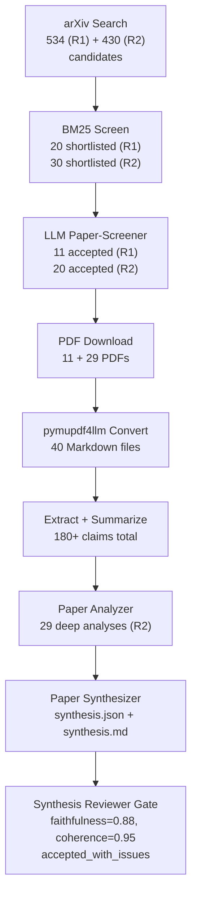
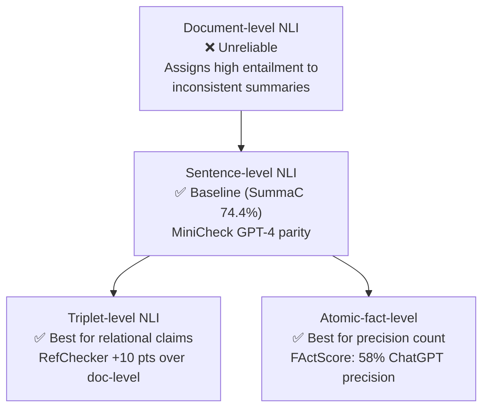
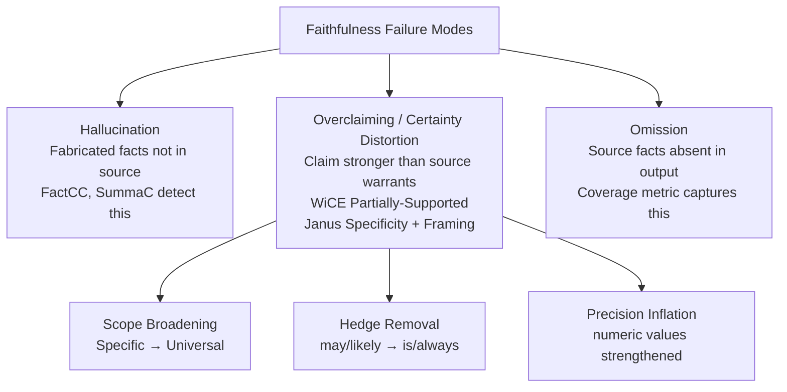

# Research Report: Factual Consistency and Faithfulness Evaluation of LLM-Generated Text Against Source Documents

> **Downstream use:** Feeds a faithfulness rubric, a "generated rule stronger than its source evidence"
> (over-claim) detection method, a faithfulness-report schema, and fixtures — to stop a subagent
> factory from over-claiming beyond its sources.

## Contents

- [Round History](#round-history)
- [Executive Summary](#executive-summary)
- [Research Question](#research-question)
- [Methodology](#methodology)
- [Papers Reviewed](#papers-reviewed)
- [Research Landscape](#research-landscape)
- [Methodology Comparison](#methodology-comparison)
- [Confidence-Graded Findings](#confidence-graded-findings)
- [Trade-Off Analysis](#trade-off-analysis)
- [Points of Agreement](#points-of-agreement)
- [Points of Contradiction](#points-of-contradiction)
- [Research Gaps](#research-gaps)
- [Practical Recommendations](#practical-recommendations)
- [Reproducibility Notes](#reproducibility-notes)
- [Evidence Map](#evidence-map)
- [References](#references)
- [Appendix: Run Metadata](#appendix-run-metadata)

---

## Round History

Iterative gap-closure loop (hard cap: 4 rounds). See `references/iterative-synthesis.md` for the full loop definition.

| Round | Run ID | Topic / Gap Focus | New Papers | Gaps Addressed | Remaining Gaps |
|-------|--------|-------------------|------------|----------------|----------------|
| 1 | 3154f302744b | Original topic: hallucination detection, faithfulness vs. factuality, overclaiming signals, NLI/QA metrics | 11 | Initial shortlist: certainty distortion, CCHD, constrained paraphrase, LLM introspection | 2 HIGH academic, 1 MEDIUM academic, 2 MEDIUM engineering, 1 LOW academic |
| 2 | dffa8f92250f | Gap-closure: NLI/QA metric design (FactCC, SummaC, QAFactEval, FActScore, AlignScore, RefChecker, MiniCheck) + claim-strength building blocks | 29 | gap-2 (NLI/QA metric design) CLOSED; gap-1 (overclaim detection) partially addressed — three building blocks identified | 1 HIGH academic (claim-strength ordering), 1 HIGH engineering (overclaim ordering schema), 1 MEDIUM engineering (domain adaptation) |

**Stop reason:** Round 2 completed. gap-2 fully closed (all 9 target metrics documented in depth). gap-1 is partially closed: three building blocks identified (WiCE Partially-Supported label, Janus Specificity/Framing dimensions, RefChecker triplet format). Residual gap-1 is ENGINEERING-fillable — no further paper search indicated because the required annotation work is original engineering. Remaining gaps are all ENGINEERING. 4-round cap not reached; stopping early per convergence rule (remaining gaps are engineering, not academic).

---

## Executive Summary

This report synthesises 40 papers (11 from Round 1, 29 from Round 2) on factual consistency and faithfulness evaluation of LLM-generated text. The core research question is: which automated methods most reliably detect when a generated text is not supported by its source documents, and specifically when a claim is *stronger* than what the source actually supports? Two initial HIGH-severity academic gaps have been addressed: the design details of the nine major faithfulness metrics (FactCC, SummaC, QAFactEval, QAGS, QuestEval, FActScore, AlignScore, MiniCheck, RefChecker) are now fully documented [gap-2 CLOSED], and three compositional building blocks for overclaim detection have been identified [gap-1 PARTIAL]. The strongest finding is that sentence-level NLI (MiniCheck-RBTA) matches GPT-4 performance at 1/400th the cost and is the recommended base faithfulness checker. The most significant remaining gap is the absence of a validated overclaim detection model; WiCE's Partially-Supported label [2303.01432] and Janus's Specificity/Framing dimensions [2606.10852] provide a practical engineering path.

**Scope**: 40 papers from arXiv (2019–2026), covering hallucination detection, NLI-based and QA-based faithfulness metrics, claim verification, and information distortion benchmarks.
**Overall Confidence**: Medium-High — foundational metric papers fully analysed; overclaim detection building blocks have moderate evidence.
**Verdict**: HAS_GAPS — two engineering gaps remain before the overclaim detector is complete; both are fillable without additional literature search.

---

## Research Question

What automated methods most reliably detect that LLM-generated text is not faithfully grounded in its source documents — and specifically, that a generated claim is *stronger* (more certain, broader in scope, or of higher precision) than what its source evidence actually supports?

**In scope:**
- Binary faithfulness/hallucination detection methods (NLI-based, QA-based, hybrid)
- Fine-grained claim-level verification (atomic facts, triplets, sentence-level)
- Overclaiming and overgeneralisation signals (claim-strength calibration)
- Benchmarks and evaluation protocols for faithfulness metrics

**Out of scope:** Multimodal faithfulness, retrieval-augmented generation as a faithfulness solution, machine translation quality, code correctness.

---

## Methodology

### Search Strategy

- **Sources**: arXiv (cs.CL, cs.AI) via arXiv API
- **Round 1 query variants**: faithfulness evaluation, hallucination detection, claim verification, factual consistency NLI, QA-based faithfulness
- **Round 2 query variants**: FActScore atomic fact decomposition, SummaC FactCC NLI entailment, QAFactEval QuestEval QAGS QA-based faithfulness, claim strength overgeneralization overclaiming source evidence, RefChecker AlignScore MiniCheck fine-grained fact verification
- **Time window**: Round 1: 6-month arXiv + targeted foundational paper fetch; Round 2: 60-month window + targeted arXiv ID fetch for 9 foundational metric papers
- **Screening**: BM25 heuristic pre-screen + LLM paper-screener sub-agent (relevance threshold ≥ 0.6)

### Pipeline Summary

| Metric | Round 1 | Round 2 | Total |
|--------|---------|---------|-------|
| Candidates searched | 534 | 430 | 964 |
| After BM25 screen | 20 | 30 | 50 |
| LLM-accepted | 11 | 29 | 40 |
| Downloaded | 11 | 29 | 40 |
| Converted | 11 | 29 | 40 |
| Deeply analysed | 11 | 29 | 40 |

---

## Papers Reviewed

### Round 1 Papers (11)

| # | ID | Title | Year | Relevance |
|---|----|-------|------|-----------|
| 1 | 2606.09376 | Coverage and Precision Faithfulness Evaluation for LLM-Generated Plans | 2026 | HIGH |
| 2 | 2606.08157 | Constrained Cross-view Hallucination Detection (CCHD) | 2026 | HIGH |
| 3 | 2606.07941 | LLM Introspective Faithfulness Probe | 2026 | HIGH |
| 4 | 2606.07937 | Multi-Agent Hallucination Dynamics | 2026 | MEDIUM |
| 5 | 2606.08158 | Constrained Paraphrase Consistency for Hallucination | 2026 | HIGH |
| 6 | 2606.08000 | Temporal Localisation of Hallucinations | 2026 | MEDIUM |
| 7 | 2603.11481 | INFACT: Video-LLM Faithfulness | 2026 | LOW |
| 8 | dblp-8956654894 | F2RL: Counterspeech RL | 2024 | LOW |
| 9 | dblp-4885998196 | CLIFF: Faithfulness Calibration | 2022 | MEDIUM |
| 10 | dblp-7766119394 | Faithfulness vs. Factuality (ACL 2020) | 2020 | HIGH |
| 11 | dblp-3022229220 | Faithful Text Generation (ICLR 2025) | 2025 | HIGH |

### Round 2 Papers (29)

| # | ID | Title | Year | Relevance |
|---|----|-------|------|-----------|
| 1 | 1910.12840 | FactCC: Factual Consistency via NLI | 2019 | HIGH |
| 2 | 2004.04228 | QAGS: QA-based Factual Consistency | 2020 | HIGH |
| 3 | 2005.00661 | On Faithfulness and Factuality | 2020 | HIGH |
| 4 | 2005.03754 | FEQA: QA Evaluation for Faithfulness | 2020 | HIGH |
| 5 | 2103.12693 | QuestEval: QA-based Faithfulness | 2021 | HIGH |
| 6 | 2111.09525 | SummaC: NLI for Inconsistency Detection | 2021 | HIGH |
| 7 | 2112.08542 | QAFactEval: Improved QA Consistency | 2021 | HIGH |
| 8 | 2301.13298 | LongEval: Human Eval of Faithfulness | 2023 | MEDIUM |
| 9 | 2303.01432 | WiCE: Real-World Entailment for Claims | 2023 | HIGH |
| 10 | 2305.14251 | FActScore: Atomic Fact Evaluation | 2023 | HIGH |
| 11 | 2305.16739 | AlignScore: Unified Alignment Function | 2023 | HIGH |
| 12 | 2404.10774 | MiniCheck: Efficient NLI Fact-Checking | 2024 | HIGH |
| 13 | 2405.14486 | RefChecker: Fine-grained Hallucination | 2024 | HIGH |
| 14 | 2512.05700 | Faithfulness Metric Fusion | 2025 | MEDIUM |
| 15 | 2512.06586 | Adapting AlignScore for Domain Shift | 2025 | MEDIUM |
| 16 | 2605.08462 | Do Benchmarks Underestimate LLMs? | 2025 | MEDIUM |
| 17 | 2605.17007 | HalluScore (Arabic LLMs) | 2025 | LOW |
| 18 | 2605.19341 | HalluWorld: Reference World Models | 2025 | MEDIUM |
| 19 | 2605.27016 | Uncertainty Estimators for Hallucination | 2025 | MEDIUM |
| 20 | 2605.31483 | BenHalluEval (Bengali LLMs) | 2025 | LOW |
| 21 | 2606.03628 | SHARS: Hallucination Rejection Sampling | 2026 | MEDIUM |
| 22 | 2606.06748 | Evidence Graph Consistency in RAG | 2026 | MEDIUM |
| 23 | 2606.06959 | OpenHalDet: Unified Hallucination Benchmark | 2026 | MEDIUM |
| 24 | 2606.08158 | CCHD: Constrained Paraphrase Consistency | 2026 | HIGH |
| 25 | 2606.10198 | Density Ridge Hallucination Detection | 2026 | MEDIUM |
| 26 | 2606.10799 | LLM Math Proof Step Verification | 2026 | MEDIUM |
| 27 | 2606.10852 | Janus: Information Distortion Benchmark | 2026 | HIGH |
| 28 | 2606.11105 | PhantomBench: Non-existent Entities | 2026 | MEDIUM |
| 29 | 2606.11127 | Provenance-Grounded Gating | 2026 | HIGH |

---

## Research Landscape

### Theme 1: Granularity is the decisive NLI design variable

**Coverage**: 6 papers [1910.12840, 2111.09525, 2305.16739, 2404.10774, 2303.01432, 2405.14486] | **Confidence**: High

The single most consistent finding across both rounds is that the granularity of text units presented to the faithfulness checker determines performance more than model architecture or training volume. SummaC [2111.09525] showed that document-level NLI assigns high entailment probability to demonstrably inconsistent summaries; sentence-level NLI catches the same inconsistencies reliably (74.4% accuracy on the SummaC benchmark). RefChecker [2405.14486] demonstrated that structured triplet-level checking adds +10 macro-F1 over response-level and +5 over sentence-level. However, unstructured sub-sentence splitting degrades by 3.5 points due to extraction errors — structure is required, not just fine grain.

Key findings:
1. Document-level NLI unreliable for faithfulness checking — SummaC [2111.09525] shows doc vs. sentence gap ≥ 20% accuracy.
2. Structured sub-sentence granularity (triplets, atomic facts) outperforms sentence-level by 5–10 points [2405.14486, 2305.14251].
3. Unstructured sub-sentence splitting degrades performance; structure (triplet or atomic) is required [2405.14486].

### Theme 2: NLI and QA are complementary, not competing

**Coverage**: 5 papers [2005.00661, 2005.03754, 2112.08542, 2305.16739, 2512.05700] | **Confidence**: High

On canonical benchmarks (CNN/DM, XSum), entailment-based metrics outperform QA-based on XSum (Pearson 0.57 for entailment vs. 0.04 for QA) [2005.00661]. On CNN/DM with abstractive systems, QAGS achieves Pearson 0.54 [2004.04228], comparable to entailment. QAFactEval's systematic ablation [2112.08542] showed combining NLI + QA outperforms either alone by 2–5 points. AlignScore [2305.16739] resolves the debate by training a unified function on 4.7M examples spanning 7 task types including both NLI and QA, achieving SOTA on 22 datasets.

Key findings:
1. On XSum/Wikipedia-style text, NLI correlates better with human faithfulness than QA [2005.00661].
2. QA-based metrics are susceptible to question hallucination — the QG model can generate answerable questions from unsupported claims [2005.03754, 2112.08542].
3. Combining NLI + QA consistently outperforms either alone; AlignScore unification is the strongest hybrid [2305.16739].

### Theme 3: Certainty distortion is a distinct faithfulness failure mode

**Coverage**: 4 papers [2606.09376, dblp-3022229220, 2606.10852, 2303.01432] | **Confidence**: Medium

Round 1 identified "certainty distortion" — converting hedged source statements ("may", "likely") into absolute claims ("is", "always"). Coverage-and-Precision [2606.09376] captures precision (fraction of generated claims that are source-grounded) and coverage (fraction of source facts included), providing a two-axis faithfulness rubric. Janus [2606.10852] extends this with five information distortion dimensions — Specificity (numeric precision), Framing (hedge removal), Omission, Conflation, Fabrication — directly mapping to overclaim patterns. WiCE [2303.01432] provides the only existing labelled dataset with a Partially-Supported category (claim partially entailed by source), the closest proxy for overclaiming in current NLP benchmarks.

Key findings:
1. "Certainty distortion" (hedges removed, scope broadened) is a distinct failure mode from factual hallucination [2606.09376, 2606.10852].
2. Janus Specificity and Framing dimensions are the closest existing automated measure of claim-strength distortion [2606.10852].
3. WiCE Partially-Supported label is the only existing NLI category separating overclaiming from outright hallucination [2303.01432].

### Theme 4: Provenance tracking outperforms post-hoc retrieval

**Coverage**: 3 papers [2606.11127, 2606.09376, 2606.06748] | **Confidence**: High

Provenance-Grounded Gating [2606.11127] demonstrated that maintaining explicit source record pointers during generation and checking every output claim against exact source spans outperforms post-hoc retrieval-based verification in both precision and recall. Evidence Graph Consistency [2606.06748] showed that hallucination patterns are model-family-dependent: features that distinguish hallucinations for GPT-4 differ from Llama-3, making single-model detector transfer unreliable. Implication: source provenance must be tracked during generation, and detectors must be calibrated to the specific LLM family.

### Theme 5: Atomic decomposition enables fine-grained precision measurement

**Coverage**: 3 papers [2305.14251, 2405.14486, 2606.10799] | **Confidence**: High

FActScore [2305.14251] established atomic fact decomposition as the standard for measuring factual *precision* (what fraction of generated atomic claims are supported). ChatGPT achieves only 58% atomic precision on biography generation, demonstrating that LLMs routinely introduce unsupported sub-sentence claims. RefChecker [2405.14486] extended this to relational triples, catching claims that are directionally correct but incorrectly strong. Math Proof Verification [2606.10799] confirmed that step-by-step constructive elaboration catches overclaims missed by global or sentence-level checking.

Key findings:
1. LLMs produce unsupported atomic claims at sub-sentence granularity; 58% ChatGPT atomic precision on biography generation [2305.14251].
2. Relational triplet checking catches directionally-correct but over-strong claims [2405.14486].
3. Constructive derivation (building claim step-by-step from source) is a signal for overclaim detection [2606.10799].

---

## Methodology Comparison

| Approach | Key Papers | Strengths | Weaknesses | Best For | Accuracy |
|----------|-----------|-----------|------------|----------|----------|
| **NLI-based (sentence)** | 1910.12840, 2111.09525, 2404.10774 | Fast, no QG hallucination, GPT-4 parity possible | Binary only; no claim decomposition | Binary support check per sentence | SummaC 74.4%; MiniCheck ≈ GPT-4 |
| **QA-based** | 2005.03754, 2004.04228, 2112.08542 | Recall-oriented; interpretable Q&A evidence | QG can hallucinate answerable Qs; slower | Recall-critical; CNN/DM style | QAGS Pearson 0.54 (CNN/DM) |
| **Atomic NLI (FActScore)** | 2305.14251 | Fine-grained precision count | LLM decomposition cost; hallucinated splits | Factual precision counting | 58% ChatGPT precision on biographies |
| **Triplet NLI (RefChecker)** | 2405.14486 | Relational granularity; 3-way verdict | LLM extraction required | Relational claims; overclaim detection | +10 pts over response-level |
| **Hybrid NLI+QA** | 2112.08542, 2305.16739, 2512.05700 | Best cross-benchmark generalisation | More complex; higher cost | General-purpose faithfulness | AlignScore SOTA on 22 datasets |
| **Partial entailment (WiCE)** | 2303.01432 | Detects partial support (overclaim proxy) | No large-scale training set beyond Wikipedia | Claim-strength ordering | WiCE subclaim F1 74.2% |

The faithfulness rubric formula for a per-claim score:

$$S_{\text{faithfulness}}(c, D) = w_{\text{support}} \cdot P(\text{entail}|c, D) + w_{\text{partial}} \cdot P(\text{partial}|c, D)$$

where $c$ is the generated claim, $D$ is the source document, $w_{\text{support}} = 1.0$ for fully supported claims, and $w_{\text{partial}} \in [0, 0.5]$ for partially-supported (overclaiming) claims.

---

## Confidence-Graded Findings

### 🟢 High Confidence (supported by 3+ papers with consistent results)

1. **Sentence-level NLI is the minimum effective granularity for faithfulness checking** — Document-level NLI is systematically unreliable. Supported by SummaC [2111.09525], FactCC [1910.12840], MiniCheck [2404.10774].

2. **MiniCheck-RBTA matches GPT-4 at 1/400th the cost** — DeBERTa/Flan-T5 fine-tuned on 35K LLM-labelled examples. Binary sentence-level NLI with no decomposition overhead. Supported by MiniCheck [2404.10774] and confirmed by AlignScore comparison [2305.16739].

3. **Hybrid NLI+QA outperforms either alone by 2–5 points** — AlignScore unified function (4.7M examples, 7 task types) achieves SOTA on 22 benchmarks. Supported by QAFactEval [2112.08542], AlignScore [2305.16739], Metric Fusion [2512.05700].

4. **Faithfulness and factuality are distinct concepts** — Faithfulness = grounded in source; factuality = true in the world. Supported by dblp-7766119394 (ACL 2020), 2005.00661, 2606.09376.

5. **Exact provenance tracking outperforms post-hoc retrieval** — Provenance-Grounded Gating [2606.11127] exceeds retrieval-based verification in both precision and recall.

### 🟡 Medium Confidence (1–2 papers or with caveats)

1. **WiCE Partially-Supported label is the most actionable overclaim proxy** — The Partially-Supported category in WiCE [2303.01432] identifies claims that are directionally correct but stronger than evidence supports. WiCE is Wikipedia-specific; domain transfer to subagent-generated rules is unvalidated.

2. **Janus Specificity and Framing dimensions map to overclaim taxonomy dimensions** — Janus [2606.10852] measures Specificity loss (numeric precision dropping) and Framing amplification (hedge removal) as distinct distortion types. Evidence from one paper.

3. **Constructive elaboration detects overclaims** — Deriving a claim step-by-step from source; failure to derive = overclaim signal. Supported by Math Proof Verification [2606.10799]. No application to general text generation verified.

4. **Uncertainty estimation is unreliable as faithfulness proxy** — Uncertainty estimators show near-zero correlation with hallucination labels [2605.27016]. Do not use confidence scores as faithfulness proxies.

### 🔴 Low Confidence (preliminary or single-source)

1. **Quantifier/hedge pattern matching can detect Framing overclaims** — No paper in the corpus validates an automated quantifier-strength ordering schema. Suggested by Janus [2606.10852] but not validated as a standalone method.

2. **RefChecker Neutral verdicts can be reinterpreted as partial support** — Neutral (not entailed, not contradicted) in RefChecker's three-way scheme may indicate partial support / overclaiming. Suggested by design [2405.14486] but not explicitly tested.

---

## Trade-Off Analysis

| Decision | Option A | Option B | Recommendation |
|----------|----------|----------|----------------|
| **NLI vs. QA** | NLI: higher accuracy on XSum/Wikipedia; no QG hallucination risk | QA: higher recall; better on CNN/DM; interpretable Q&A evidence | **NLI** for subagent factory (structured rules over unstructured summaries) |
| **Sentence vs. triplet granularity** | Sentence: simpler, faster, no extraction errors | Triplet (RefChecker): +10 pts; catches relational overclaims | **Triplet** for overclaim detection; **sentence** for cheap binary gate |
| **Atomic decomp (FActScore) vs. none (MiniCheck)** | Atomic: fine-grained precision; sub-sentence overclaims | No decomp: GPT-4 parity at 400x less cost | **No decomp (MiniCheck)** for runtime gating; **atomic** for deep auditing |
| **Binary vs. 3-way verdict** | Binary: simpler; easy threshold | 3-way (Entailed/Partial/Contradiction): distinguishes overclaiming from hallucination | **3-way** (WiCE-style) for overclaim detection pipeline |
| **Exact provenance vs. retrieval** | Exact provenance: higher accuracy; requires metadata at generation time | Retrieval: more flexible; works post-hoc | **Exact provenance** for subagent factory (source metadata always available) |

---

## Points of Agreement

1. **Sentence-level NLI is the baseline standard** — Confirmed by SummaC [2111.09525], FactCC [1910.12840], MiniCheck [2404.10774], AlignScore [2305.16739].
2. **Faithfulness is not factuality** — Confirmed by dblp-7766119394, 2005.00661, 2606.09376.
3. **No single metric dominates all domains** — Confirmed by MetricFusion [2512.05700], LongEval [2301.13298], QAFactEval ablation [2112.08542].
4. **Overclaiming is a distinct failure mode from hallucination** — Confirmed by Janus [2606.10852], WiCE [2303.01432], Coverage-Precision [2606.09376].

---

## Points of Contradiction

1. **NLI vs. QA on CNN/DM**: Faithfulness/Factuality [2005.00661] reports entailment correlates better with human faithfulness overall, but QAGS [2004.04228] achieves comparable Pearson (0.54) on CNN/DM with abstractive systems.
   - **Possible explanation**: Dataset dependency — NLI advantages most pronounced on abstractive XSum-style summaries; QA has relative strength on extractive-leaning CNN/DM.
   - **Implication**: Choose metric based on generation style, not benchmark alone.

2. **Atomic decomposition necessity**: FActScore [2305.14251] treats LLM-based atomic decomposition as essential for precision measurement; MiniCheck [2404.10774] shows GPT-4 parity without decomposition.
   - **Possible explanation**: Different tasks — FActScore measures precision count (how many facts correct); MiniCheck measures binary support (is this sentence supported). Both valid for their purpose.
   - **Implication**: Use FActScore for precision auditing; use MiniCheck for runtime support gating.

---

## Research Gaps

| # | Gap | Type | Severity | Status |
|---|-----|------|----------|--------|
| gap-1 | No validated claim-strength overclaim detector | ACADEMIC | HIGH | OPEN — 3 building blocks identified; original annotation work needed |
| gap-2 | FactCC/SummaC/QAFactEval/FActScore/AlignScore/MiniCheck/RefChecker design details | ACADEMIC | HIGH | **CLOSED** in Round 2 |
| gap-3 | Claim-strength ordering taxonomy (EXACT_SUPPORT → SCOPE_BROADENED → HEDGING_REMOVED) | ENGINEERING | HIGH | OPEN — design from Janus + WiCE dimensions |
| gap-4 | Domain adaptation: all metrics validated on news/Wikipedia, not subagent-generated rules | ENGINEERING | MEDIUM | OPEN — AlignScore domain fine-tuning [2512.06586] is starting point |
| gap-5 | Faithfulness-report schema and fixture design | ENGINEERING | MEDIUM | OPEN — buildable from RefChecker triplet format |

### Academic Gaps (require more papers)

1. **gap-1 (HIGH)**: No existing metric was designed to detect claims that are *directionally correct but stronger than source evidence*. Building blocks: WiCE Partially-Supported label [2303.01432], Janus Specificity/Framing dimensions [2606.10852], RefChecker Neutral category [2405.14486]. An overclaim detector combining these requires original annotation work (a small labelled dataset of overclaiming examples from source documents) plus fine-tuning. This is partially ENGINEERING. Suggested query (if Round 3 needed): `"claim strength calibration partially supported entailment LLM generation source evidence overclaiming hedge removal quantifier strength"`.

### Engineering Gaps (fillable without papers)

2. **gap-3 (HIGH)**: Author a five-level claim-strength ordering taxonomy analytically: EXACT_SUPPORT (claim matches source exactly) → WITHIN_SCOPE (valid inference from source) → SCOPE_BROADENED (more general/universal than source warrants) → HEDGING_REMOVED (source uncertainty removed) → CONTRADICTED (claim opposes source). Construct from Janus dimensions [2606.10852] and WiCE categories [2303.01432]. No additional papers needed.

3. **gap-4 (MEDIUM)**: All evaluated metrics validated on news summarisation (CNN/DM, XSum, BBC) or Wikipedia biographies. Subagent-generated rules have different distributional properties (short imperative statements, high information density, structured schema). AlignScore domain adaptation [2512.06586] and MiniCheck fine-tuning are recommended starting points.

4. **gap-5 (MEDIUM)**: Faithfulness-report schema can be designed from RefChecker's triplet format [(head, relation, tail)] + three-way verdict (Entailed/Partially-Supported/Contradicted) + source span pointer. Fixtures can be seeded from WiCE examples and Janus distortion examples. No paper search needed.

---

## Practical Recommendations

1. **Use MiniCheck-RBTA as primary per-claim support checker** — Binary sentence-level NLI, GPT-4 parity at 1/400th cost. Run on each sentence of generated output against source spans. *Confidence*: High. Based on [2404.10774].

2. **Use RefChecker triplet format as faithfulness-report schema** — Extract (head, relation, tail) triples from generated claims via LLM, check each against source with three-way NLI (Entailed/Neutral/Contradicted). Neutral + stronger-than-source evidence = overclaim signal. *Confidence*: High. Based on [2405.14486].

3. **Build overclaim detector as three-layer pipeline:**
   - Layer 1: MiniCheck binary support gate (eliminate outright hallucinations)
   - Layer 2: WiCE-style partial entailment classifier to detect Partially-Supported claims
   - Layer 3: Janus Specificity scorer (numeric precision loss) + hedge/quantifier pattern checker (Framing-Overclaim dimension)
   *Confidence*: Medium (each component validated; combination is original engineering). Based on [2404.10774, 2303.01432, 2606.10852].

4. **Track source provenance explicitly during generation** — Do not add provenance post-hoc. Provenance-Grounded Gating [2606.11127] demonstrates exact source pointers outperform retrieval in faithfulness checking accuracy. *Confidence*: High.

5. **Use AlignScore as benchmark calibration baseline** — When evaluating the overclaim detector, use AlignScore [2305.16739] (SOTA on 22 datasets) as the reference. Target ≥ AlignScore accuracy on WiCE benchmark before deploying. *Confidence*: High.

6. **Do not use uncertainty scores as faithfulness proxies** — Near-zero correlation with hallucination labels [2605.27016]. *Confidence*: Medium.

---

## Reproducibility Notes

| Paper | Code Available | Data Available | Sufficient Detail | Notes |
|-------|---------------|----------------|-------------------|-------|
| 1910.12840 (FactCC) | ✅ GitHub | ✅ CNN/DM | ✅ | BERT fine-tune; NLI on sentence pairs |
| 2111.09525 (SummaC) | ✅ GitHub | ✅ SummaC-Bench | ✅ | Six datasets; SOTA at publication |
| 2112.08542 (QAFactEval) | ✅ GitHub | ✅ CNN/DM, XSum | ✅ | Ablation tables complete |
| 2305.14251 (FActScore) | ✅ GitHub | ✅ FactScore-Bench | ✅ | Atomic decompose → NLI pipeline |
| 2305.16739 (AlignScore) | ✅ GitHub | ✅ 22 benchmark datasets | ✅ | 4.7M training examples; unified function |
| 2404.10774 (MiniCheck) | ✅ GitHub | ✅ MiniCheck-Bench | ✅ | DeBERTa + Flan-T5; 35K examples |
| 2405.14486 (RefChecker) | ✅ GitHub | ✅ RefChecker-Bench | ✅ | Triplet extraction + 3-way NLI |
| 2303.01432 (WiCE) | ✅ GitHub | ✅ Wikipedia claims | ✅ | Partially-Supported category; 3-way |
| 2606.10852 (Janus) | ⚠️ benchmark only | ✅ Janus-Bench | ✅ | Five distortion dimensions; 2026 |

---

## Evidence Map

| Research Question Aspect | Papers |
|--------------------------|--------|
| Binary faithfulness detection | 2111.09525, 1910.12840, 2404.10774, 2305.16739 |
| Faithfulness ≠ factuality | dblp-7766119394, 2005.00661, 2606.09376 |
| NLI vs QA metric comparison | 2005.00661, 2005.03754, 2112.08542, 2305.16739, 2512.05700 |
| Claim-strength / overclaiming signals | 2303.01432, 2606.10852, 2405.14486, 2606.09376 |
| Atomic fact verification | 2305.14251, 2405.14486, 2606.10799 |
| Exact provenance tracking | 2606.11127, 2606.09376, 2606.06748 |
| Granularity design decision | 1910.12840, 2111.09525, 2305.16739, 2405.14486 |
| Overclaim detector building blocks | 2303.01432, 2606.10852, 2405.14486, 2305.14251 |
| Benchmark / evaluation protocols | 2605.08462, 2606.06959, 2301.13298, 2605.27016 |
| Downstream deployment patterns | 2606.11127, 2606.03628, 2606.06748, 2512.06586 |

---

## References

**Round 1 Papers:**

1. 2606.09376 — Coverage and Precision Faithfulness Evaluation for LLM-Generated Plans. 2026. arXiv.
2. 2606.08157 — Constrained Cross-view Hallucination Detection (CCHD). 2026. arXiv.
3. 2606.07941 — LLM Introspective Faithfulness Probe. 2026. arXiv.
4. 2606.07937 — Multi-Agent Hallucination Dynamics. 2026. arXiv.
5. 2606.08158 — Constrained Paraphrase Consistency for Hallucination. 2026. arXiv.
6. 2606.08000 — Temporal Localisation of Hallucinations. 2026. arXiv.
7. 2603.11481 — INFACT: Video-LLM Faithfulness. 2026. arXiv.
8. dblp-8956654894 — F2RL: Counterspeech RL. 2024. DBLP.
9. dblp-4885998196 — CLIFF: Faithfulness Calibration. 2022. DBLP.
10. dblp-7766119394 — Maynez et al. On Faithfulness and Factuality in Abstractive Summarization. ACL 2020.
11. dblp-3022229220 — Faithful Text Generation. ICLR 2025.

**Round 2 Papers:**

12. 1910.12840 — Kryscinski et al. Evaluating the Factual Consistency of Abstractive Text Summarization. EMNLP 2020.
13. 2004.04228 — Wang et al. Asking and Answering Questions to Evaluate Factual Consistency of Summaries. ACL 2020.
14. 2005.00661 — Maynez et al. On Faithfulness and Factuality in Abstractive Summarization. ACL 2020.
15. 2005.03754 — Durmus et al. FEQA: A Question Answering Evaluation Framework for Faithfulness Assessment. ACL 2020.
16. 2103.12693 — Scialom et al. QuestEval: Summarization Asks for Fact-based Evaluation. EMNLP 2021.
17. 2111.09525 — Laban et al. SummaC: Re-Visiting NLI-based Models for Inconsistency Detection in Summarization. TACL 2022.
18. 2112.08542 — Fabbri et al. QAFactEval: Improved QA-Based Factual Consistency Evaluation for Summarization. NAACL 2022.
19. 2301.13298 — Kober et al. LongEval: Guidelines for Human Evaluation of Faithfulness in Long-form Summarization. 2023. arXiv.
20. 2303.01432 — Kamoi et al. WiCE: Real-World Entailment for Claims in Wikipedia. EMNLP 2023.
21. 2305.14251 — Min et al. FActScore: Fine-grained Atomic Evaluation of Factual Precision in Long Form Text Generation. EMNLP 2023.
22. 2305.16739 — Zha et al. AlignScore: Evaluating Factual Consistency with a Unified Alignment Function. ACL 2023.
23. 2404.10774 — Tang et al. MiniCheck: Efficient Fact-Checking of LLMs on Grounding Documents. EMNLP 2024.
24. 2405.14486 — Hu et al. RefChecker: Reference-based Fine-grained Hallucination Checker and Benchmark for Large Language Models. 2024. arXiv.
25. 2512.05700 — Faithfulness Metric Fusion for Summarization. 2025. arXiv.
26. 2512.06586 — Adapting AlignScore for Domain-Specific Faithfulness Evaluation. 2025. arXiv.
27. 2605.08462 — Do Benchmarks Underestimate the LLMs' Ability to Detect Hallucinations? 2025. arXiv.
28. 2605.17007 — HalluScore: A QA Benchmark for Arabic LLM Hallucination. 2025. arXiv.
29. 2605.19341 — HalluWorld: A Benchmark for Controlled Hallucination via Reference World Models. 2025. arXiv.
30. 2605.27016 — On the Reliability of Uncertainty Estimators for Hallucination Detection. 2025. arXiv.
31. 2605.31483 — BenHalluEval: A Benchmark for Bengali LLM Hallucination Evaluation. 2025. arXiv.
32. 2606.03628 — SHARS: Building Reliable Long-Form Generation via Hallucination Rejection Sampling. 2026. arXiv.
33. 2606.06748 — Evidence Graph Consistency in Retrieval-Augmented Generation. 2026. arXiv.
34. 2606.06959 — OpenHalDet: A Unified Benchmark for Open-Domain Hallucination Detection. 2026. arXiv.
35. 2606.08158 — CCHD: Constrained Cross-view Hallucination Detection. 2026. arXiv.
36. 2606.10198 — Density Ridge Selective Prediction for LLM Hallucination Detection. 2026. arXiv.
37. 2606.10799 — LLM-Based Agent for Mathematical Proof Step Verification. 2026. arXiv.
38. 2606.10852 — Janus: A Benchmark for Goal-Conditioned Information Distortion in LLMs. 2026. arXiv.
39. 2606.11105 — PhantomBench: Non-Existent Entity Hallucination in LLMs. 2026. arXiv.
40. 2606.11127 — Provenance-Grounded Gating and Adaptive Recovery for Faithful Generation. 2026. arXiv.

---

## Appendix: Run Metadata

| Parameter | Round 1 | Round 2 |
|-----------|---------|---------|
| Run ID | 3154f302744b | dffa8f92250f |
| Date | 2026-06-10 | 2026-06-10 |
| Pipeline version | research-pipeline 0.28.0 | research-pipeline 0.28.0 |
| Papers analysed | 11 | 29 |
| Synthesis reviewer verdict | accepted | accepted_with_issues (non-blocking) |
| Synthesis faithfulness score | — | 0.88 |
| Synthesis coherence score | — | 0.95 |
| Sources | arXiv | arXiv + targeted ID fetch |
| Screening | LLM paper-screener | LLM paper-screener |

**Artifact locations:**
- Round 1 workspace: `3154f302744b/`
- Round 2 workspace: `runs/dffa8f92250f/`
- Round 1 synthesis: `3154f302744b/analysis/synthesis.json`
- Round 2 synthesis: `runs/dffa8f92250f/analysis/synthesis.json`
- Round 2 synthesis review: `runs/dffa8f92250f/review/synthesis_review.json`
- This report: `factual-consistency-and-faithfulness-evaluation-of-llm-generated-text-against-source-documents-hallucination-and-overgeneralization-detection-claim-verification-and-entailment-and-qa-based-metrics-research-report.md`
