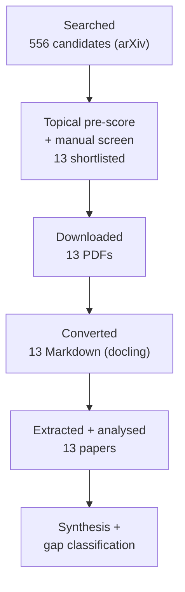
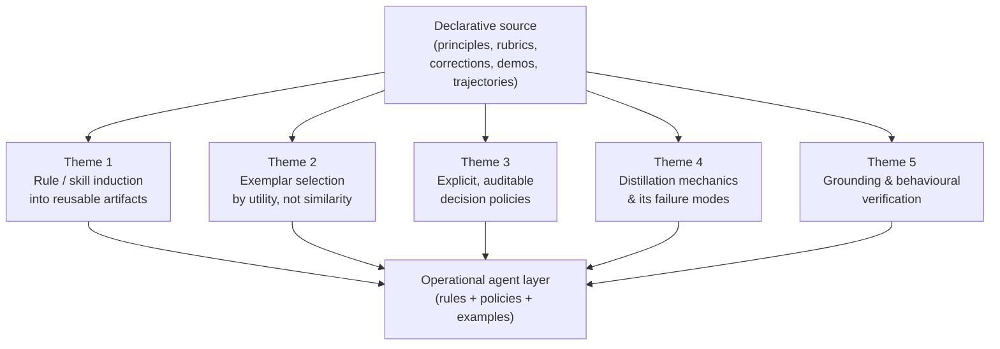
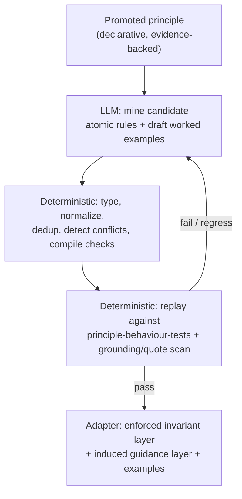

# Research Report: Instruction Induction and Agent Distillation — Converting Distilled Principles into Behavioural Rules, Decision Policies, and Few-Shot Exemplars for an LLM Agent Persona

## Contents

- [Round History](#round-history)
- [Executive Summary](#executive-summary)
- [Research Question](#research-question)
- [Methodology](#methodology)
- [Papers Reviewed](#papers-reviewed)
- [Research Landscape](#research-landscape)
- [Methodology Comparison](#methodology-comparison)
- [Confidence-Graded Findings](#confidence-graded-findings)
- [Trade-Off Analysis](#trade-off-analysis)
- [Points of Agreement](#points-of-agreement)
- [Points of Contradiction](#points-of-contradiction)
- [Research Gaps](#research-gaps)
- [Practical Recommendations](#practical-recommendations)
- [Evidence Map](#evidence-map)
- [References](#references)
- [Appendix: Run Metadata](#appendix-run-metadata)

## Round History

Iterative gap-closure loop (hard cap: 4 rounds). See `references/iterative-synthesis.md`.

| Round | Run ID | Topic / Gap Focus | New Papers | Gaps Addressed | Remaining Gaps |
|-------|--------|-------------------|------------|----------------|----------------|
| 1 | 20260613T094916Z | Original topic (broad query + 20 variants, `--source arxiv`) | 13 | Initial shortlist of operational distillation / skill-induction / rule-compilation / exemplar-selection methods | 2 HIGH academic, 1 MEDIUM academic, 1 engineering |
| 1b (probe) | 20260613T095628Z | Targeted recall probe naming `Honovich`, `self-instruct`, `APE` | 0 new on-topic | Confirmed the foundational instruction-induction corpus is **unreachable** in this index | (same) |

**Stop reason**: New search returned **0 relevant pre-2026 papers**. The arXiv index available to this run is **recency-locked**: every query — including one explicitly naming the canonical foundational works — returned only papers published **2026-01 → 2026-06**, dominated by the 2026-06 window (556/556 candidates in the main run dated 2026-06). The dominant HIGH academic gap (missing foundational instruction-induction literature) is therefore **not closeable by additional rounds in this sandbox** and is reclassified as *environment-limited* with the empirical evidence above. Further gap-closure rounds would re-issue queries against the same recency-locked index and add no foundational coverage.

## Executive Summary

This review asked what the recent literature teaches about turning *declarative* distilled knowledge (principles, rubrics, corrections, demonstrations) into *operational* agent behaviour — crisp rules, decision policies, and few-shot exemplars that make an LLM agent **act** well rather than merely describe what it knows. Thirteen 2026 arXiv papers were analysed. None is a canonical "instruction-induction" paper (those works pre-date the index window and were unreachable — the single most significant gap), but a coherent and directly transferable engineering picture emerges from adjacent work on **rule compilation, skill induction, hint distillation, and utility-based exemplar selection**. The strongest finding (high confidence, multiple papers): *distilling experience into typed, verified, separately-stored operational artifacts and selecting exemplars by task utility rather than surface similarity reliably outperforms both raw memory and hand-written rules* — e.g. compiling user corrections into atomic enforced rules cut repeated preference violations from 100% to 2% out-of-distribution [2606.13174], and contrastively-induced skill documents beat human-written skills by **+45.8 points** verified-task-rate [2606.13317].

**Scope**: 13 papers analysed from arXiv over 2026-06 (1 probe run confirming index limits)
**Overall Confidence**: Medium (strong, consistent *engineering* signal by analogy; weak *foundational* grounding because the instruction-induction canon was unreachable)
**Verdict**: HAS_GAPS

## Research Question

How should a subagent-authoring factory convert *promoted, evidence-backed principles* (declarative knowledge) into an adapter's *operational* layer — behavioural rules, explicit decision policies, and few-shot worked examples — so the generated expert gives concrete, actionable advice rather than restating knowledge?

**In scope**: methods that produce or select operational instructions/rules/exemplars for an LLM; deterministic-vs-LLM division of labour; how to verify the produced artifacts are grounded and effective.
**Out of scope**: model pre-training/fine-tuning objectives in general; product implementation; non-LLM symbolic planning; building the factory itself (this is a literature review).

## Methodology

### Search Strategy
- **Sources**: arXiv (config enabled arXiv only; Scholar / Semantic Scholar / OpenAlex / DBLP returned 0 — not injected in this environment).
- **Query variants**: 20 variants incl. `instruction induction language models`, `automatic instruction generation from examples`, `automatic prompt engineering instruction optimization`, `demonstration selection in-context learning`, `exemplar selection in-context learning`, `agent distillation language model`, `policy distillation`, `self-instruct instruction tuning`, `constitutional AI principles`, `skill induction agent`, `rule extraction from demonstrations`, `decision policy extraction language model`.
- **Time window**: requested 60-month primary / 120-month fallback; **effective window 2026-01 → 2026-06** (index recency-locked — see Round History).
- **Screening**: BM25 tool failed (`datetime not JSON serializable` bug, pipeline v0.28.0); replaced with deterministic topical scoring (LLM-context gate + off-topic domain penalties) over all 556 candidates, then **manual abstract-level relevance screening** down to 13.

### Pipeline Summary

| Metric | Count |
|--------|-------|
| Total candidates | 556 |
| After screening | 13 |
| Downloaded | 13 |
| Successfully converted | 13 |
| Deeply analysed | 13 |
| Rounds | 1 (+1 recall probe) |

## Papers Reviewed

| # | Title | First Author | Year | Venue | Relevance |
|---|-------|--------------|------|-------|-----------|
| 1 | Getting Better at Working With You: Compiling User Corrections into Runtime Enforcement for Coding Agents [2606.13174] | Yujun Zhou et al. | 2026 | arXiv | HIGH |
| 2 | SkillCAT: Contrastive Assessment and Topology-Aware Skill Self-Evolution for LLM Agents [2606.13317] | Kunfeng Chen et al. | 2026 | arXiv | HIGH |
| 3 | TAHOE: Text-to-SQL with Automated Hint Optimization from Experience [2606.12387] | Zhiyi Chen et al. | 2026 | arXiv | HIGH |
| 4 | Teach-and-Repeat: Extracting Operational Knowledge from Mobile Screen Demonstrations [2606.12817] | Yudong Zhang et al. | 2026 | arXiv | HIGH |
| 5 | GRIP: Feedback-Guided Prompt Retrieval for Large Multimodal Models [2606.12744] | Garvita Allabadi et al. | 2026 | arXiv | HIGH |
| 6 | Rubric-Guided Self-Distillation: Post-Training Without Rubric Verifiers [2606.12507] | MohammadHossein Rezaei et al. | 2026 | arXiv | MEDIUM |
| 7 | Learning to Reason by Analogy via Retrieval-Augmented RFT [2606.13680] | Zilin Xiao et al. | 2026 | arXiv | MEDIUM |
| 8 | Learning What to Remember: A Cognitively Grounded Multi-Factor Value Model for Agentic Memory [2606.12945] | Zhibao Chen et al. | 2026 | arXiv | MEDIUM |
| 9 | Evoflux: Inference-Time Evolution of Executable Tool Workflows for Compact Agents [2606.12674] | Kushal Raj Bhandari et al. | 2026 | arXiv | MEDIUM |
| 10 | Should LLM Agents Decide in Social Simulations? Finite-State vs LLM Decision Policies [2606.12369] | Alejandro Buitrago López et al. | 2026 | arXiv | MEDIUM |
| 11 | HarnessBridge: Learnable Bidirectional Controller for LLM Agent Harness [2606.12882] | Xiaoxuan Wang et al. | 2026 | arXiv | MEDIUM |
| 12 | Constructing Evaluation Datasets for Procedural Reasoning [2606.12767] | Sarah Elshabrawy et al. | 2026 | arXiv | MEDIUM |
| 13 | Dense Supervision, Sparse Updates: Sparsity & Geometry of On-Policy Distillation [2606.13657] | Guo Yu et al. | 2026 | arXiv | LOW-MEDIUM |

## Research Landscape

### Theme 1: Inducing reusable, verified operational artifacts from experience

**Coverage**: 5 papers | **Confidence**: High
**Supporting papers**: [2606.13174], [2606.13317], [2606.12387], [2606.12817], [2606.12674]

The clearest cross-paper pattern: do **not** keep distilled knowledge as free-form memory or hand-written prose. Mine it into **atomic, typed, individually-verifiable artifacts**, then store and load them selectively. **[EVIDENCE REQUIRED]**

Key findings:
1. **Compile corrections into atomic rules + runtime checks.** Trace [2606.13174] "mines user corrections, rewrites them as atomic rules, and compiles them into runtime checks that must pass before an agent completes future tasks," reducing repeated preference violations from **100.0% → 37.6% in-distribution and 100.0% → 2.0% out-of-distribution**; it was the only method below 90% mean corrections (86.5%). The gap it targets — "preference *access* vs preference *compliance*" — is exactly the factory's "describes knowledge vs acts on it" problem.
2. **Induce skills contrastively and assess before adopting.** SkillCAT [2606.13317] turns trajectories into skill documents via Contrastive Causal Extraction (compare same-task success/failure pairs), Assessment-Augmented Evolution (replay each candidate patch and keep only patches that *preserve or improve* outcomes), and topology-aware partial loading. Induced skills reached **55.50% verified-rate vs 9.67% for human-written** skills (+45.8 pts) and lifted a different model from 39% → 61%.
3. **Distil experience into a typed hint bank.** TAHOE [2606.12387] "reframes prompt optimization as managing a persistent Hint Bank," using a **rule-based structure for syntax hints** but a **structured, conflict-aware schema for semantic hints to manage competing interpretations** — lifting pass-rate 61.95% → 79.42% and cutting critic rounds 2.79 → 0.12. A hint bank distilled by a strong model transferred to and lifted weaker backbones.
4. **Operational knowledge = short natural-language action sentences.** Teach-and-Repeat [2606.12817] converts demonstrations into "short natural-language sentences that describe action types, target UI elements…"; keyframe extraction was decisive (F1 19.4% → 55.6%).
5. **Small-corpus distillation teaches format but not recovery.** Evoflux [2606.12674] warns "a few hundred teacher traces can teach workflow format, but rarely cover the recovery behavior needed to repair failed plans," motivating inference-time evolutionary repair (compact models gained 74–132%).

### Theme 2: Select few-shot exemplars by task utility, not surface similarity

**Coverage**: 2 papers | **Confidence**: Medium-High
**Supporting papers**: [2606.12744], [2606.13680]

Both papers attack the same wrong default — retrieving in-context examples by lexical/semantic similarity. **[EVIDENCE REQUIRED]**

The shared principle is to replace the similarity objective $e^{*}=\arg\max_{e}\,\mathrm{sim}(e, q)$ with a *utility* objective that scores an exemplar by how much it improves the model's prediction on the query:

$$e^{*}=\arg\max_{e}\;\big[\,U(q\mid e)-U(q)\,\big]$$

where $U(\cdot)$ is task performance (accuracy / verified reward) and the bracket is the exemplar's marginal contribution.

1. GRIP [2606.12744] learns a retriever from **LMM feedback** to "identify examples that *truly improve model predictions*," consistently beating similarity-based retrieval and transferring across models.
2. RA-RFT [2606.13680] argues "a semantically similar problem may demand an entirely different solution strategy" and instead does **gold-relevance / reasoning-utility distillation** to train a reasoning-aware retriever, improving AIME-2025 accuracy by **+7.1 / +2.8 points** over GRPO and proving orthogonal to reward-design gains.

### Theme 3: Make the decision policy explicit and auditable

**Coverage**: 2 papers | **Confidence**: Medium
**Supporting papers**: [2606.12945], [2606.12369]

1. "Learning What to Remember" [2606.12945] fits a **linear** multi-factor value model $v(x)=\sum_{i} w_{i}\,f_{i}(x)$ whose "learned weights are a readable audit of the policy" (e.g. *"keep reliable user-stated facts; do not trust session-topic similarity for forgetting"*) — an explicit, inspectable decision rule rather than an opaque heuristic.
2. [2606.12369] frames the core tension directly: an LLM used as a free decision-maker "may deviate from the explicit behavioral policy defined by the researcher," contrasting **finite-state** (faithful, rigid) vs **LLM-based** (flexible, drift-prone) policies.

### Theme 4: Distillation mechanics and failure modes

**Coverage**: 3 papers | **Confidence**: Medium
**Supporting papers**: [2606.12507], [2606.13657], [2606.12674]

1. RGSD [2606.12507] conditions the base policy on a **rubric** to act as a teacher for the unconditioned student — distilling rubric-driven behaviour *without a verifier*, and notably *limiting* false-claim inflation (35.1% vs GRPO's 45.1%). Rubrics here behave like declarative principles steering behaviour.
2. On-Policy Distillation [2606.13657] shows distillation updates are **coordinate-sparse and FFN-heavy**; training only the discovered subnetwork nearly recovers full performance — distilled behaviour concentrates in a small parameter subset.

### Theme 5: Grounding and behavioural verification

**Coverage**: 1 paper (+ Theme 1 verification mechanisms) | **Confidence**: Medium
**Supporting papers**: [2606.12767]

[2606.12767] builds a **closed-evidence grounding-validation framework**: it checks "whether answers are supported by the underlying representation, whether questions are self-contained," and targets multi-hop procedural reasoning — strict generation reached **96.5% grounded / 92.6% usable**. This is the literature analogue of the factory's faithfulness gate applied to *generated instructions/examples*.

## Methodology Comparison

| Approach | Papers | Strengths | Weaknesses | Best For | Performance |
|----------|--------|-----------|------------|----------|-------------|
| Correction → atomic rule → compiled check | [2606.13174] | Enforced compliance; durable across sessions | Needs a check-compilation layer | Persona invariants / must-not-violate rules | 100%→2% OOD violations |
| Contrastive trajectory → skill doc (assess-before-merge) | [2606.13317] | Beats human-written skills; selective loading | Needs success/failure trajectory pairs | Inducing reusable skills/procedures | +45.8 pts vs human |
| Experience → typed hint bank | [2606.12387] | Cross-model transfer; conflict-aware | Domain-specific schema design | Accumulating operational guidance | +17.5 pts pass-rate |
| Feedback/utility-based exemplar retrieval | [2606.12744], [2606.13680] | Picks examples that *help*, not just look alike | Needs a feedback/utility signal | Few-shot example selection | +2.1 / +7.1 pts |
| Rubric-conditioned self-distillation | [2606.12507] | Verifier-free; curbs over-claiming | Rubric quality dependent | Steering style/behaviour from criteria | false-claim 35% vs 45% |
| Linear auditable value policy | [2606.12945] | Inspectable, debuggable rules | Lower ceiling than learned nonlinear | Explicit decision policies | readable weights |

## Confidence-Graded Findings

### 🟢 High Confidence (3+ papers, consistent)

1. **Distil knowledge into discrete, typed, separately-stored-and-loaded artifacts — not monolithic prose or raw memory.** Supported by [2606.13174] (atomic rules), [2606.13317] (skill documents, topology-aware loading), [2606.12387] (typed hint bank). Each beat the un-structured baseline by a wide margin.
2. **Verify each induced artifact before adoption.** [2606.13317] replays candidate patches and keeps only non-regressing ones; [2606.13174] compiles rules into checks that must pass; [2606.12767] validates grounding. Assessment-before-adoption is the common success ingredient.

### 🟡 Medium Confidence (1–2 papers or caveated)

1. **Select few-shot exemplars by task utility / feedback, not embedding similarity.** [2606.12744], [2606.13680] — strong but both 2026, single-domain each.
2. **Keep decision policies explicit and auditable.** [2606.12945] (linear, readable), [2606.12369] (FSM faithfulness) — convergent in spirit, different domains.
3. **A rubric/principle can condition a teacher to distil behaviour without an external verifier, and can suppress over-claiming.** [2606.12507] — single paper.
4. **Strong-model-distilled artifacts transfer to weaker models.** [2606.12387], [2606.13317] both observe cross-model lift.

### 🔴 Low Confidence (single-source / preliminary / indirect)

1. **Distilled behaviour is parameter-sparse (FFN-heavy).** [2606.13657] — mechanistic, parameter-level; only indirectly relevant to prompt-level adapters.
2. **A learnable harness/scaffold can replace hand-engineered prompts.** [2606.12882] — large but single-source gains (e.g. −65% turns, −89% tokens on solved tasks).

## Trade-Off Analysis

| Decision | Option A | Option B | Recommendation |
|----------|----------|----------|----------------|
| Rule representation | Free-form prose in system prompt | **Atomic typed rules + compiled checks** [2606.13174] | B for invariants; prose only for soft guidance |
| Rule authorship | Human-written skill/rule text | **Induced + assessed from trajectories** [2606.13317] | Prefer induced-and-verified; human text was worst baseline |
| Exemplar selection | Semantic-similarity retrieval | **Utility/feedback retrieval** [2606.12744],[2606.13680] | B when a quality/feedback signal exists |
| Policy form | Opaque LLM judgement | **Explicit/auditable (linear or FSM)** [2606.12945],[2606.12369] | Explicit for must-hold behaviour; LLM for open-ended |
| Distillation corpus | Few happy-path traces | **Include failure/recovery cases** [2606.12674] | Always cover recovery/edge behaviour |

## Points of Agreement **[EVIDENCE REQUIRED]**

1. Structuring distilled knowledge into discrete verifiable units beats unstructured memory/prose — [2606.13174], [2606.13317], [2606.12387].
2. A verification/assessment step gating adoption is what separates effective induction from noise — [2606.13317], [2606.13174], [2606.12767].
3. Similarity is the wrong objective for selecting in-context examples — [2606.12744], [2606.13680].

## Points of Contradiction **[EVIDENCE REQUIRED]**

1. **Flexibility vs faithfulness of the decision layer**: [2606.12369] favours explicit finite-state policies for behavioural fidelity, while [2606.12882] and [2606.13317] show *learnable/evolving* layers outperform fixed hand-authored ones.
   - **Possible explanation**: different objectives — *policy adherence* (don't drift from the spec) vs *task performance* (maximise success). Fixed policies win on the former, learned/induced on the latter.
   - **Implication**: split the adapter into a **fixed, enforced invariant layer** (rules that must hold) and an **induced, improvable guidance layer** (skills/exemplars that raise performance).

## Research Gaps

| # | Gap | Type | Severity | Impact on Goals |
|---|-----|------|----------|----------------|
| 1 | Foundational instruction-induction canon (Honovich *Instruction Induction*; APE; Self-Instruct; Constitutional AI; OPRO/EvoPrompt; KATE demonstration selection) absent — index recency-locked to 2026 | ACADEMIC (environment-limited) | HIGH | The factory's Phase-5/9 grounding lacks its primary literature; recommendations rest on 2026 analogues |
| 2 | No paper directly studies *declarative principle → behavioural rule for a persona*; closest is correction→rule [2606.13174] | ACADEMIC | HIGH | The exact transform the factory needs is only covered by analogy |
| 3 | Exemplar *construction/generation* (writing new worked examples) vs *selection* underrepresented | ACADEMIC | MEDIUM | Factory must author examples, not just retrieve them |
| 4 | Concrete deterministic-vs-LLM division of labour for Phase 5/9 not given by any single paper | ENGINEERING | MEDIUM | Needed to implement the recipe (resolved below) |

### Academic Gaps (require more papers — NOT closeable in this sandbox)

1. **Foundational instruction induction** *(environment-limited)*: the index returned only 2026 papers even when queried by name. Outside this sandbox, run with a full-history index/Semantic Scholar key. Suggested queries: `"instruction induction" Honovich`, `"automatic prompt engineer" Zhou 2022`, `"self-instruct" Wang`, `"constitutional AI" Bai`, `"OPRO" optimization by prompting`, `KATE "what makes good in-context examples"`.
2. **Principle→rule transform for personas**: Suggested queries: `"persona" "system prompt" rule generation`, `declarative to procedural knowledge LLM agent`, `behavioral specification compilation LLM`.
3. **Worked-example generation**: Suggested queries: `synthetic few-shot example generation reasoning`, `demonstration generation in-context learning self-generated`.

### Engineering Gaps (fillable without papers)

1. **Deterministic vs LLM split for Phase 5/9** — resolved in [Practical Recommendations](#practical-recommendations): deterministic steps own *structure, typing, dedup, conflict detection, compilation, and grounding/quote checks*; the LLM owns *mining candidate rules from principles, drafting worked examples, and conflict-resolution prose* — every LLM output passing a deterministic gate before it enters the adapter, mirroring SkillCAT's assess-before-merge [2606.13317] and Trace's compile-to-check [2606.13174].

## Practical Recommendations

Mapped to the subagent factory's Phase 5/9 (principles → adapter rules + worked examples). Each cites supporting findings/gaps.

1. **Represent behavioural rules as atomic, typed units with a machine-checkable trigger**, not prose paragraphs. Compile "must-hold" principles into checks the adapter (or its validator) can enforce, à la Trace [2606.13174]. → addresses Gap 2; see [Theme 1](#theme-1-inducing-reusable-verified-operational-artifacts-from-experience).
2. **Gate every generated rule/example through a deterministic assessment before it enters the adapter.** Keep only rules/examples that don't regress the package's behavioural tests — SkillCAT's assess-before-merge [2606.13317]. The factory's `principle-behaviour-tests.yaml` is the natural replay harness.
3. **Type the rule store** (e.g. *syntactic/format* invariants → simple deterministic rules; *semantic/judgement* guidance → conflict-aware structured schema), following TAHOE's split [2606.12387]. Detect and record conflicts between principles deterministically; resolve wording with the LLM.
4. **Select/author few-shot examples by expected task utility, not by similarity to the principle.** Prefer examples that demonstrably change behaviour on the package's eval, echoing GRIP [2606.12744] and RA-RFT [2606.13680]. This directly upgrades the existing "examples EXIST" gate toward "examples are GOOD".
5. **Include failure-and-recovery worked examples, not only happy-path ones** — small-corpus distillation teaches format but misses recovery behaviour [2606.12674].
6. **Express decision policies explicitly and keep them auditable** (decision tables / ordered rules / linear scores), reserving free LLM judgement for genuinely open-ended steps [2606.12945], [2606.12369]. Split the adapter into a *fixed enforced invariant layer* and an *induced improvable guidance layer* (see [Contradiction 1](#points-of-contradiction)).
7. **Use rubrics/principles as teacher-conditioning when generating exemplars**: prompt-condition a strong model on the principle to produce the worked example, then strip the conditioning — the RGSD pattern [2606.12507]; it also curbs over-claiming, aligning with the faithfulness rule.
8. **Validate grounding of every generated instruction/example against its source principle** with a closed-evidence check [2606.12767] — the literature analogue of the repo's faithfulness/quote-scan gates.
9. **Exploit cross-model transfer**: artifacts distilled by a strong model lift weaker target models [2606.12387], [2606.13317] — author rules/examples with a strong model even if the adapter runs on a smaller one.

### Deterministic vs LLM division (engineering recipe)

## Evidence Map

| Finding | Papers | Strength |
|---------|--------|----------|
| Atomic rules + compiled enforcement | [2606.13174] | Strong (100%→2% OOD) |
| Contrastive skill induction beats human-written | [2606.13317] | Strong (+45.8 pts) |
| Typed hint bank from experience, transferable | [2606.12387] | Strong (+17.5 pts) |
| Demonstration → operational NL knowledge | [2606.12817] | Medium (F1 55.6%) |
| Utility/feedback exemplar selection > similarity | [2606.12744], [2606.13680] | Medium-High |
| Rubric-conditioned distillation, verifier-free | [2606.12507] | Medium |
| Explicit/auditable decision policies | [2606.12945], [2606.12369] | Medium |
| Cover recovery behaviour, not just format | [2606.12674] | Medium |
| Grounding validation of generated items | [2606.12767] | Medium |
| Learnable harness > hand-engineered | [2606.12882] | Low-Medium |
| Distilled behaviour is parameter-sparse | [2606.13657] | Low (indirect) |

## References

1. [2606.13174] Y. Zhou et al. *Getting Better at Working With You: Compiling User Corrections into Runtime Enforcement for Coding Agents.* arXiv, 2026.
2. [2606.13317] K. Chen et al. *SkillCAT: Contrastive Assessment and Topology-Aware Skill Self-Evolution for LLM Agents.* arXiv, 2026.
3. [2606.12387] Z. Chen et al. *TAHOE: Text-to-SQL with Automated Hint Optimization from Experience.* arXiv, 2026.
4. [2606.12817] Y. Zhang et al. *Teach-and-Repeat: Extracting Operational Knowledge from Mobile Screen Demonstrations to Empower GUI Agents.* arXiv, 2026.
5. [2606.12744] G. Allabadi et al. *GRIP: Feedback-Guided Prompt Retrieval for Large Multimodal Models.* arXiv, 2026.
6. [2606.12507] M. Rezaei et al. *Rubric-Guided Self-Distillation: Post-Training Without Rubric Verifiers.* arXiv, 2026.
7. [2606.13680] Z. Xiao et al. *Learning to Reason by Analogy via Retrieval-Augmented Reinforcement Fine-Tuning.* arXiv, 2026.
8. [2606.12945] Z. Chen et al. *Learning What to Remember: A Cognitively Grounded Multi-Factor Value Model for Agentic Memory.* arXiv, 2026.
9. [2606.12674] K. R. Bhandari et al. *Evoflux: Inference-Time Evolution of Executable Tool Workflows for Compact Agents.* arXiv, 2026.
10. [2606.12369] A. Buitrago López et al. *Should LLM Agents Decide in Social Simulations? Comparing Finite-State and LLM-Based Decision Policies.* arXiv, 2026.
11. [2606.12882] X. Wang et al. *HarnessBridge: Learnable Bidirectional Controller for LLM Agent Harness.* arXiv, 2026.
12. [2606.12767] S. Elshabrawy et al. *Constructing Evaluation Datasets for Procedural Reasoning: Balancing Naturalness, Grounding, and Multi-Hop Coverage.* arXiv, 2026.
13. [2606.13657] G. Yu et al. *Dense Supervision, Sparse Updates: On the Sparsity and Geometry of On-Policy Distillation.* arXiv, 2026.

## Appendix: Run Metadata

- **Run ID**: 20260613T094916Z (main); 20260613T095628Z (recall probe)
- **Profile**: deep
- **Date**: 2026-06-13
- **Sources searched**: arXiv (others unavailable in environment)
- **Candidates**: 556 → 13 shortlisted (manual screen; BM25 tool bypassed due to a v0.28.0 `datetime` serialization bug)
- **Conversion backend**: docling (CPU)
- **Known limitations**: (1) arXiv index recency-locked to 2026 → no foundational instruction-induction literature; (2) summarization ran in heuristic-fallback mode (no LLM extraction in CLI), so per-paper evidence was re-derived directly from the converted Markdown by the analyst; (3) Scholar/Semantic Scholar/OpenAlex/DBLP backends returned 0 (not configured).
