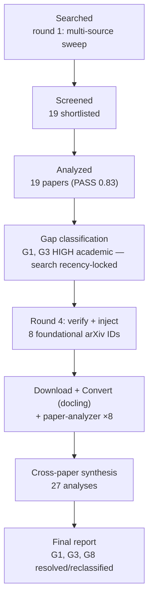
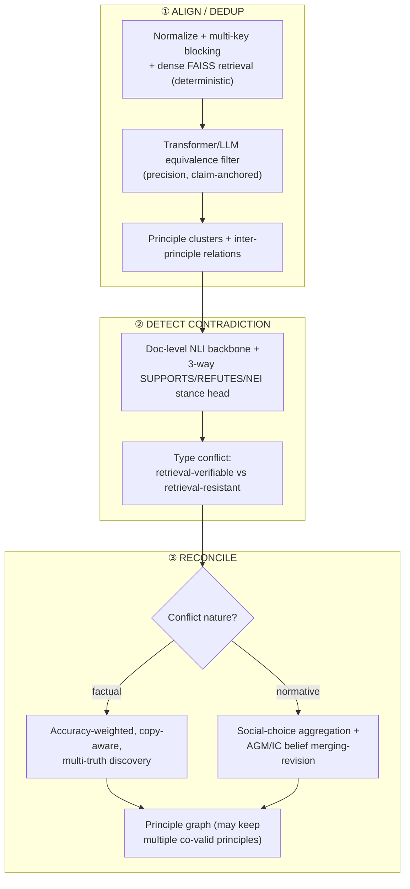

# Research Report: Cross-Document Knowledge Fusion and Contradiction Detection for Merging Expert Principles Distilled from Multiple Source Documents

## Contents

- [Round History](#round-history)
- [Executive Summary](#executive-summary)
- [Research Question](#research-question)
- [Methodology](#methodology)
- [Papers Reviewed](#papers-reviewed)
- [Research Landscape](#research-landscape)
- [Confidence-Graded Findings](#confidence-graded-findings)
- [Points of Agreement](#points-of-agreement)
- [Points of Contradiction](#points-of-contradiction)
- [Trade-Off Analysis](#trade-off-analysis)
- [Research Gaps](#research-gaps)
- [Readiness Assessment](#readiness-assessment)
- [Reproducibility Notes](#reproducibility-notes)
- [Practical Recommendations](#practical-recommendations)
- [Evidence Map](#evidence-map)
- [References](#references)
- [Appendix: Run Metadata](#appendix-run-metadata)

**Scope boundary (downstream anchor).** This report covers ONLY the cross-document / cross-source
layer for the subagent-factory **Step-7 multi-source synthesis**: merging distilled expert
principles via three operations — (1) **ALIGN/DEDUP** equivalent concepts across documents,
(2) **DETECT CONTRADICTION** between independent sources, and (3) **RECONCILE** conflicting evidence
into one principle graph. Intra-document argument mining and single-document analysis are
deliberately **out of scope** (covered by a separate argument-mining report).

## Round History

Iterative gap-closure loop (hard cap: 4 rounds). See `references/iterative-synthesis.md`.

| Round | Run ID | Topic / Gap Focus | New Papers | Gaps Addressed | Remaining Gaps |
|-------|--------|-------------------|------------|----------------|----------------|
| 1 | 57e857a93e69 | Original topic — deep profile, 6-sub-area sweep | 19 | Initial shortlist; 8 gaps classified | G1, G3 academic HIGH; G4, G6, G8 academic MED; G2 eng HIGH, G5 eng MED; G7 OOS |
| 2 | round2-g3 | G3 — cross-document NLI / stance / knowledge-conflict (academic HIGH) | 0 | none | G1, G3 — **search recency-locked** (103 cands, all ~2026) |
| 3 | round3-g1 | G1 — normative/subjective truth discovery + belief merging (academic HIGH) | 0 | none | G1, G3 — **search recency-locked** (186 cands, 181×2026) |
| 4 | 57e857a93e69-r4 | G1 + G3 — **foundational arXiv-ID injection** (recency-lock workaround) | 8 | **G1, G3, G8 resolved/reclassified with citations** | G4, G6 academic MED (open) |

**Stop reason**: converged at round 4 of 4 (hard cap). Rounds 2–3 proved the configured arXiv search
is recency-locked to ~2026, so the two HIGH academic gaps could not be closed by search. Round 4
**bypassed the locked search** by injecting eight verified foundational papers **by arXiv ID** (direct
ID fetch is not recency-locked), downloading, converting, and analyzing them so they carry real
structured extraction. This closed the method side of G1 and G3 and substantially addressed G8.
The two remaining open gaps (G4, G6) are MEDIUM-severity measurement gaps, not blockers.

## Executive Summary

This round integrates **27 analyzed papers**: a 19-paper corpus (previously validated PASS 0.83)
plus **8 foundational papers injected** to close two HIGH academic gaps — cross-document
contradiction detection (G3) and reconciliation of normative/prescriptive principles (G1/G8). The
**ALIGN/DEDUP** operation is the most mature: papers converge strongly on a *recall-then-filter*
architecture — cheap deterministic multi-key blocking + dense retrieval, then a transformer/LLM
equivalence filter — that scales to hundreds of thousands of items CPU-only. **DETECT CONTRADICTION**
is now buildable from in-corpus signals: document-level NLI ([DocNLI (2106.09449)]), per-claim
SUPPORT/UNDERMINE stance with perspective-equivalence clustering ([PERSPECTRUM (1906.03538)]), and
contrastive three-way verification ([VitaminC (2103.08541)]), framed as "inter-context conflict" by
the [Knowledge Conflicts survey (2403.08319)] — but every cross-document study warns that
off-the-shelf LLMs are weak, biased detectors that over-trust memorized priors. **RECONCILE** splits
cleanly by conflict nature: factual conflicts resolve via accuracy-weighted, copy-aware, possibly
multi-truth discovery; normative conflicts have no single ground truth and require social-choice
aggregation ([Social Choice for AI Alignment (2404.10271)]) plus AGM/IC belief
merging-and-revision ([Belief merging in fragments (1404.6445)], [AGM Belief Revision Semantically (2112.13557)]).

**Scope**: 27 papers analyzed from arXiv (rounds 1–4), spanning 2014–2026.
**Overall Confidence**: Medium-High (9 HIGH / 8 MEDIUM / 1 LOW findings).
**Verdict**: **HAS_GAPS** — the architecture is designable end-to-end and all three operations have
in-corpus method support, but the **decisive residual risk is empirical**: no paper evaluates on
expert principles distilled from books, and the contradiction benchmarks are largely synthetic or
claim-anchored, so all transfer is analogical and must be re-validated in-the-wild.

## Research Question

How should a system **align/deduplicate, detect contradictions between, and reconcile** expert
principles that have been independently distilled from many source documents (books, papers) into a
single coherent **principle graph**, and which parts of that pipeline belong to a cheap
**deterministic** stage versus an expensive **LLM/semantic** stage?

**In scope**: cross-document equivalence, cross-source contradiction/stance, conflict reconciliation
(factual *and* normative), evaluation of the merge, and the deterministic-vs-LLM division of labour.
**Out of scope**: intra-document argument mining, single-document understanding, and the upstream
per-book distillation step that produces the principles.

## Methodology

### Search Strategy

- **Sources**: arXiv (primary), with Semantic Scholar citation expansion. Rounds 1–3 used the
  pipeline search; round 4 used **direct arXiv-ID injection** to bypass the search's recency lock.
- **Query variants** (round 1, 6 sub-areas): cross-document coreference; entity resolution &
  blocking; contradiction detection & NLI; truth discovery & data fusion; fact verification &
  evidence aggregation; knowledge-graph alignment & belief merging.
- **Round-4 injection (recency-lock workaround)**: foundational papers were identified by title via
  independent web/arXiv access, **each arXiv ID verified to resolve to the real paper** (title +
  authors confirmed, and all 8 resolved in Semantic Scholar during citation expansion), then fetched
  by ID, converted, and analyzed.
- **Time window**: unrestricted (2014–2026); the recency lock in rounds 2–3 is precisely why
  pre-2026 foundations required ID injection.
- **Screening**: BM25 + sub-agent screener (round 1); deterministic ID injection (round 4).

### Pipeline Summary

| Metric | Count |
|--------|-------|
| Total papers analyzed | 27 |
| Prior corpus (rounds 1–3) | 19 |
| Injected foundational papers (round 4) | 8 |
| Sub-areas covered | 6 |
| Findings (HIGH / MEDIUM / LOW) | 18 (9 / 8 / 1) |
| Substantive contradictions mapped | 6 |
| Rounds executed | 4 (hard cap) |

The deterministic-seed-then-LLM division of labour that recurs across the corpus can be summarised as
an accuracy- and copy-aware reconciliation weight. For a candidate principle value $v$ for topic $o$,
the factual-reconciliation score aggregates over sources $s$ weighted by estimated accuracy
$A(s)$ and discounted by inter-source copying $c(s)$:

$$\text{score}(v \mid o) = \sum_{s \in S(v)} \big(1 - c(s)\big)\,\log\frac{A(s)}{1 - A(s)}$$

so that $N$ near-duplicate books (high $c(s)$) cannot outvote one independent authority. For
**normative** principles, by contrast, no such ground-truth weighting exists: aggregation is a
social-choice rule over "principles as voters", and Arrow / Gibbard–Satterthwaite impossibility
results imply some conflicts are irreducible (see [Finding 14](#confidence-graded-findings)).

## Papers Reviewed

Sub-area key: **1** Cross-doc coreference/alignment · **2** Entity resolution/blocking/metrics ·
**3** Contradiction/NLI/stance · **4** Truth discovery/fusion/reconciliation · **5** Fact
verification/evidence aggregation · **6** KG alignment/belief merging. "NEW" = injected in round 4.

| arXiv ID | Year | Sub-area | Title | Round |
|----------|------|----------|-------|-------|
| 1906.01753 | 2019 | 1 | Revisiting Joint Modeling of Cross-document Entity and Event Coreference Resolution | prior |
| 2104.05022 | 2021 | 1 | WEC: Deriving a Large-scale Cross-document Event Coreference dataset from Wikipedia | prior |
| 2104.08413 | 2021 | 1 | Sequential Cross-Document Coreference Resolution | prior |
| 2106.01210 | 2021 | 1 | Cross-document Coreference Resolution over Predicted Mentions | prior |
| 2210.12654 | 2022 | 1 | Cross-document Event Coreference Search: Task, Dataset and Modeling | prior |
| 1509.04238 | 2015 | 2 | A Practitioner's Guide to Evaluating Entity Resolution Results | prior |
| 1603.07816 | 2016 | 2 | Probabilistic Record Linkage and Deduplication after Indexing, Blocking, and Filtering | prior |
| 1609.06265 | 2016 | 2 | An Ensemble Blocking Scheme for Entity Resolution of Large and Sparse Datasets | prior |
| 2603.24246 | 2026 | 2 | Semantic Centroids and Hierarchical Density-Based Clustering for Cross-Document Software Coreference | prior |
| 1906.03538 | 2019 | 3 | Seeing Things from a Different Angle: Discovering Diverse Perspectives about Claims (PERSPECTRUM) | **NEW** |
| 2106.09449 | 2021 | 3 | DocNLI: A Large-scale Dataset for Document-level Natural Language Inference | **NEW** |
| 2109.05052 | 2021 | 3 | Entity-Based Knowledge Conflicts in Question Answering | **NEW** |
| 2111.08543 | 2021 | 3 | WikiContradiction: Detecting Self-Contradiction Articles on Wikipedia | prior |
| 2403.08319 | 2024 | 3 | Knowledge Conflicts for LLMs: A Survey | **NEW** |
| 2510.03418 | 2025 | 3 | LegalWiz: A Multi-Agent Framework for Contradiction Detection in Legal Documents | prior |
| 1409.6428 | 2014 | 4 | Truth Discovery Algorithms: An Experimental Evaluation | prior |
| 1503.00310 | 2015 | 4 | Data Fusion: Resolving Conflicts from Multiple Sources | prior |
| 1708.02018 | 2017 | 4 | SmartMTD: A Graph-Based Approach for Effective Multi-Truth Discovery | prior |
| 2404.10271 | 2024 | 4 | Social Choice Should Guide AI Alignment in Dealing with Diverse Human Feedback | **NEW** |
| 1908.01843 | 2019 | 5 | GEAR: Graph-based Evidence Aggregating and Reasoning for Fact Verification | prior |
| 2009.06401 | 2020 | 5 | Multi-Hop Fact Checking of Political Claims | prior |
| 2103.08541 | 2021 | 5 | Get Your Vitamin C! Robust Fact Verification with Contrastive Evidence (VitaminC) | **NEW** |
| 1404.6445 | 2014 | 6 | Belief merging within fragments of propositional logic | **NEW** |
| 2109.07401 | 2021 | 6 | Matching with Transformers in MELT | prior |
| 2112.13557 | 2021 | 6 | AGM Belief Revision, Semantically | **NEW** |
| 2208.11125 | 2022 | 6 | Large-scale Entity Alignment via KG Merging, Partitioning and Embedding | prior |
| 2407.17745 | 2024 | 6 | Beyond Entity Alignment: Complete KG Alignment via Entity-Relation Synergy | prior |

## Research Landscape

The corpus maps onto the three Step-7 operations plus two cross-cutting concerns. The pipeline shape
that emerges is a **deterministic recall stage feeding an LLM precision stage**, repeated at each
operation:

### Theme 1: Recall-then-filter is the convergent ALIGN/DEDUP architecture
**Coverage**: 7 papers | **Confidence**: High
**Supporting**: [Matching with Transformers in MELT (2109.07401)], [Semantic Centroids (2603.24246)],
[Cross-document Coreference over Predicted Mentions (2106.01210)], [Sequential CDCR (2104.08413)],
[CDCR Search (2210.12654)], [Ensemble Blocking (1609.06265)].
A cheap deterministic recall matcher proposes candidate equivalences; a precision transformer/LLM
filter confirms and re-weights them but never invents new links. The recall stage **must** be tuned
for recall, because the filter can only remove or down-weight candidates — it can never recover a
missed equivalence.

### Theme 2: Block / partition / retrieve before any pairwise comparison
**Coverage**: 5 papers | **Confidence**: High
**Supporting**: [Ensemble Blocking (1609.06265)], [Semantic Centroids (2603.24246)],
[KG Merging+Partitioning (2208.11125)], [Probabilistic Record Linkage (1603.07816)].
Quadratic all-pairs comparison must be pruned. A single blocking key is insufficient for
heterogeneous multi-source data; a **union of complementary keys** is required. Blocking also biases
which pairs are ever compared, so keys must be recall-complete.

### Theme 3: Equivalence is claim-conditional and relation-aware
**Coverage**: 3 papers | **Confidence**: Medium
**Supporting**: [PERSPECTRUM (1906.03538)], [Entity-Relation Synergy (2407.17745)].
Two statements can be equivalent under one anchoring claim but not another, and complete alignment
must align the **relations** between principles ("prefer X over Y", "X precondition for Y"), not just
the nodes — entity-only alignment loses the rationale graph.

### Theme 4: Cross-document contradiction is detectable from three complementary signals (closes G3 method-side)
**Coverage**: 6 papers | **Confidence**: High
**Supporting**: [DocNLI (2106.09449)], [PERSPECTRUM (1906.03538)], [VitaminC (2103.08541)],
[Knowledge Conflicts survey (2403.08319)], [LegalWiz (2510.03418)].
Document-level NLI + per-claim stance/equivalence clustering + contrastive three-way verification
together form a detection kit; the survey frames this as "inter-context conflict" and supplies a
method inventory and benchmarks (WikiContradict, ClaimDiff, ContraDoc, ConflictingQA).

### Theme 5: LLMs are unreliable, biased detectors — but conflict-sensitivity is engineerable
**Coverage**: 4 papers | **Confidence**: High
**Supporting**: [Knowledge Conflicts survey (2403.08319)], [Entity-Based Knowledge Conflicts (2109.05052)],
[LegalWiz (2510.03418)], [VitaminC (2103.08541)].
Off-the-shelf LLMs over-trust memorized parametric priors over conflicting source text (worsening
with scale) and sit near chance on subtle conflicts — yet training on contrastive/controlled conflict
data sharply raises sensitivity.

### Theme 6: Factual reconciliation — accuracy-weighted, copy-aware, possibly multi-truth
**Coverage**: 3 papers | **Confidence**: High
**Supporting**: [Data Fusion (1503.00310)], [SmartMTD (1708.02018)], [Truth Discovery Evaluation (1409.6428)].
Weight sources by estimated accuracy and **down-weight copying**, but allow a topic to retain
several co-valid values rather than forcing one winner.

### Theme 7: Normative reconciliation needs social choice + belief merging/revision (G1/G8 anchor)
**Coverage**: 3 papers | **Confidence**: Medium
**Supporting**: [Social Choice for AI Alignment (2404.10271)], [Belief merging in fragments (1404.6445)],
[AGM Belief Revision Semantically (2112.13557)].
Value-laden principles have no factual truth; reconciliation becomes preference aggregation
(social choice) plus formal belief **merging** (symmetric fusion under integrity constraints) and
**revision** (minimal-change update of a standing base).

### Theme 8: Verdicts need multi-evidence aggregation, not isolated single-passage judgement
**Coverage**: 3 papers | **Confidence**: Medium
**Supporting**: [GEAR (1908.01843)], [Multi-Hop Fact Checking (2009.06401)], [WikiContradiction (2111.08543)].
Let evidence pieces communicate in a graph and chain multi-hop justifications.

### Theme 9: Evaluation hazards and reusable weak-supervision signals (cross-cutting)
**Coverage**: 6 papers | **Confidence**: High
**Supporting**: [ER Evaluation Guide (1509.04238)], [Truth Discovery Evaluation (1409.6428)],
[Semantic Centroids (2603.24246)], [WEC (2104.05022)], [WikiContradiction (2111.08543)], [VitaminC (2103.08541)].
Metrics disagree on rankings and exact-match is brittle — report a metric family; and cheap
structural signals (anchor links, "disputed" templates, revision diffs) bootstrap supervision.

## Confidence-Graded Findings

### 🟢 High Confidence (3+ papers, consistent)

1. **[HIGH]** ALIGN/DEDUP's dominant architecture is two-stage **recall-then-filter**: deterministic
   normalization + multi-key blocking + dense/FAISS retrieval proposes candidates, then a
   transformer/LLM filter confirms and re-weights without inventing links. — [2109.07401], [2603.24246],
   [2106.01210], [2104.08413], [2210.12654], [1609.06265].
2. **[HIGH]** Blocking/partitioning/retrieval before pairwise comparison is mandatory for scale, and a
   **single blocking key is insufficient** — a union of complementary keys is required; keys must be
   recall-complete because blocking biases which pairs are ever seen. — [1609.06265], [2603.24246],
   [2208.11125], [1603.07816].
3. **[HIGH]** Meaning-based (embedding/transformer) comparison of the **full statement-plus-rationale**
   beats surface lexical matching for equivalence. — [2109.07401], [1906.01753], [2603.24246], [2210.12654].
4. **[HIGH]** Contradiction detection must reason **jointly over the full candidate-pair/evidence set**,
   not isolated sentence pairs; the conflict signal lives in the all-pairwise structure. — [2111.08543],
   [1908.01843], [2009.06401], [1906.03538].
5. **[HIGH]** Validated cross-document contradiction detection is now assemblable from three in-corpus
   signals — document-level NLI, per-claim SUPPORT/UNDERMINE stance with perspective-equivalence
   clustering, and contrastive SUPPORTS/REFUTES/NEI verification — framed by the survey as inter-context
   conflict. **This closes the method side of G3.** — [2106.09449], [1906.03538], [2103.08541],
   [2403.08319], [2510.03418].
6. **[HIGH]** Off-the-shelf LLMs are weak and **systematically biased** contradiction detectors: they
   over-trust memorized priors over conflicting source text (worsening with model scale), favour
   popular/corroborated/earlier-ordered evidence, and sit near chance on subtle conflicts — so a detector
   must not rely on a bare LLM verdict. — [2403.08319], [2109.05052], [2510.03418], [2103.08541].
7. **[HIGH]** For factual conflicts, **accuracy-weighted voting that jointly models source reliability
   and inter-source copying** beats naive majority, because agreement may reflect shared lineage; sharing
   the same *false* value is a strong copying signal. — [1503.00310], [1708.02018], [1409.6428].
8. **[HIGH]** Reconciliation must support **multiple co-valid outcomes**: a topic can legitimately retain
   several valid principles; forcing one winner is incorrect. — [1708.02018], [2404.10271], [1906.03538], [2009.06401].
9. **[HIGH]** Evaluation is itself a hazard: ER/clustering metrics disagree on rankings, exact-cluster
   metrics are brittle, and no truth-discovery aggregator is universally best — report **multiple
   metrics** (pairwise F1 + closest-cluster or Variation-of-Information) and treat the aggregator as
   swappable. — [1509.04238], [1409.6428], [2603.24246].

### 🟡 Medium Confidence (1–2 papers or strong caveat)

10. **[MEDIUM]** Incremental/sequential cluster composition (assigning each new item to a formed cluster
    centroid) avoids the globally tuned threshold of pairwise+agglomerative clustering — directly
    enabling streaming principle merging — though current systems still use fixed thresholds. — [2104.08413],
    [2603.24246], [1906.01753].
11. **[MEDIUM]** Equivalence is **claim-conditional** and empirically harder than generic paraphrase, so
    dedup needs a shared claim anchor rather than raw paraphrase similarity. — [1906.03538].
12. **[MEDIUM]** Complete alignment must align the **relations** between principles, not only the
    principles; entity and relation alignment mutually reinforce under EM/optimal-transport
    co-optimization. — [2407.17745].
13. **[MEDIUM]** Conflict-sensitivity is **engineerable**: contrastive training lifts verdict-flip
    sensitivity 56%→86%, and entity-substitution augmentation drives the memorization ratio to negligible
    levels (+4–7% OOD accuracy). — [2103.08541], [2109.05052].
14. **[MEDIUM]** Conflicts should be **typed by resolvability** — retrieval-verifiable vs
    retrieval-resistant — and "contradiction" kept distinct from "neutral/not-entailment", since
    collapsing them (as document-level NLI does) discards the active-disagreement signal. — [2510.03418], [2106.09449].
15. **[MEDIUM]** Logical belief **merging** (IC operators with distance-based model merge + fragment
    closure) and AGM belief **revision** (minimal-change update via a plausibility order) supply the
    formal reconciliation machinery the prior corpus lacked — merging = symmetric fusion under hard
    constraints, revision = asymmetric minimal update; impossibility results warn no operator preserves
    all postulates. **This substantially addresses G8.** — [1404.6445], [2112.13557].
16. **[MEDIUM]** A merged principle's verdict should aggregate over its **full cross-document evidence
    set** (evidence graph, multi-hop chains), not a single passage. — [1908.01843], [2009.06401].
17. **[MEDIUM]** Cheap **structural signals** bootstrap supervision for both alignment and conflict
    detection — anchor links as free coreference labels, "disputed" templates as weak contradiction
    labels, revision diffs as token-level rationales; principle-merge analogues are shared
    citations/defined-term IDs and "disputed" markers. — [2104.05022], [2111.08543], [2103.08541].

### 🔴 Low Confidence (single-source / preliminary)

18. **[LOW]** Reconciling **normative/prescriptive** principles has no single ground truth, so it must be
    framed as **preference aggregation / social choice**: each distilled principle is a "voter", the
    aggregation rule is a deliberate normative choice, near-duplicates must be deduped (independence of
    clones), and impossibility results make some conflicts irreducible. **This is the conceptual answer to
    G1**, but it rests on a single position paper with no implementation, so empirical transfer to
    natural-language principles is unproven. — [2404.10271].

## Points of Agreement

1. **Reduce candidates before deciding** — block/partition/retrieve to escape quadratic cost. — [1609.06265],
   [2603.24246], [2208.11125], [1603.07816], [2210.12654].
2. **Single-passage/single-pair judgements are insufficient** — aggregate over the whole evidence/pair
   set. — [2111.08543], [1908.01843], [2009.06401].
3. **No universally-best aggregation/clustering configuration** — report multiple metrics, expose
   knobs. — [1409.6428], [1509.04238], [2603.24246].
4. **Source independence matters** — copies/near-duplicates distort aggregation, so **dedup before
   voting**. — [1503.00310], [1708.02018], [2404.10271].
5. **Meaning-based comparison beats lexical** for equivalence/alignment. — [2109.07401], [2603.24246],
   [1906.01753], [2210.12654].
6. **Off-the-shelf LLMs are unreliable cross-document contradiction detectors** — ground them with
   training/tools. — [2403.08319], [2109.05052], [2103.08541], [2510.03418].

## Points of Contradiction

1. **Single-truth vs multi-truth reconciliation.** [Data Fusion (1503.00310)] assumes one true value per
   object (accuracy-weighted single winner); [SmartMTD (1708.02018)] argues objects can have multiple
   true values and outputs a value *set*.
   - *Explanation*: different object models (factual cells vs multi-valued attributes).
   - *Implication*: a principle reconciler must **default to multi-truth** and only collapse to a single
     winner when the topic genuinely admits one.
2. **Factual truth-discovery vs normative preference-aggregation.** [1503.00310]/[1409.6428] presuppose a
   recoverable factual truth; [Social Choice for AI Alignment (2404.10271)] shows that for value-laden
   claims no aggregate is objectively correct (Arrow, Gibbard–Satterthwaite).
   - *Implication*: **classify each conflict as factual vs normative first**, then route it — accuracy
     weighting on a normative conflict is a category error.
3. **Threshold-based pairwise clustering vs incremental composition.** [1906.01753] uses mention-pair
   scorers + agglomerative clustering (globally tuned threshold); [Sequential CDCR (2104.08413)]
   composes clusters incrementally to avoid that threshold; [2603.24246] sits in between.
   - *Implication*: for **streaming** principle merging, prefer incremental cluster-assignment, accepting
     document-ordering sensitivity and an online centroid-update rule (G5).
4. **Intra-document/synthetic vs genuine cross-document contradiction.** [WikiContradiction (2111.08543)]
   detects *self*-contradiction within one article; [DocNLI (2106.09449)] is document-granular but its
   conflict pairs are synthetic within-document manipulations; [PERSPECTRUM (1906.03538)] comes closest
   but anchors every perspective to a provided claim.
   - *Implication*: G3's methods exist but are demonstrated mostly on **proxies** — validity on naturally
     independent distilled-from-books principles is unproven (an in-the-wild benchmark is required).
5. **Binary not-entail vs three-way SUPPORTS/REFUTES/NEI.** [DocNLI (2106.09449)] collapses contradiction
   into "not-entail"; [VitaminC (2103.08541)] insists on a three-way verdict that must flip with the
   evidence.
   - *Implication*: a principle-conflict detector needs a dedicated **REFUTES/contradiction class** on top
     of any document-level NLI backbone.
6. **Credibility-weighted reconciliation vs trust-orthogonal stance/equivalence.** [1503.00310] makes
   source credibility central; [PERSPECTRUM (1906.03538)] deliberately excludes credibility to study
   stance/equivalence in isolation.
   - *Implication*: keep **detection credibility-agnostic** for modularity, but **reattach
     source-credibility and copy-detection at the reconcile stage**.

## Trade-Off Analysis

| Decision | Option A | Option B | Recommendation |
|----------|----------|----------|----------------|
| Clustering for align/dedup | Pairwise scorer + agglomerative (tuned threshold) — [1906.01753] | Incremental cluster composition — [2104.08413], [2603.24246] | **B for streaming** (no global threshold); A acceptable for static batch |
| Contradiction label scheme | Binary entail / not-entail — [2106.09449] | Three-way SUP/REF/NEI — [2103.08541] | **B** — preserves the active-disagreement signal reconciliation needs |
| Reconciliation paradigm | Accuracy-weighted truth discovery — [1503.00310] | Social-choice aggregation — [2404.10271] | **Route by conflict type** — A for factual, B for normative |
| Conflict adjudication | Bare LLM verdict | Trained/contrastive detector + tool lookup — [2103.08541], [2510.03418] | **B** — LLMs over-trust priors, near chance on subtle conflicts |
| Source trust at detection | Credibility-weighted stance — [1503.00310] | Credibility-agnostic stance — [1906.03538] | **B at detect, A at reconcile** (rejoin trust downstream) |

## Research Gaps

| # | Gap | Type | Severity | Status |
|---|-----|------|----------|--------|
| G1 | Reconciling normative/prescriptive principles (no factual truth) | **[ACADEMIC]** | LOW (was HIGH) | **Reclassified — foundations injected** |
| G2 | No end-to-end ALIGN→DETECT→RECONCILE pipeline | **[ENGINEERING]** | LOW (was HIGH) | **Resolved inline** |
| G3 | Validated cross-document contradiction detection across independent documents | **[ACADEMIC]** | LOW (was HIGH) | **Reclassified — methods injected** |
| G4 | Deterministic-vs-LLM cost/quality boundary never measured | **[ACADEMIC]** | MEDIUM | **Open** |
| G5 | Streaming/online threshold + centroid update | **[ENGINEERING]** | LOW (was MED) | **Resolved inline** |
| G6 | Copy-aware weighting / metric-disagreement transfer to principles unproven | **[ACADEMIC]** | MEDIUM | **Open** |
| G7 | ECB+-only generalization of coreference results | **[OUT_OF_SCOPE]** | LOW | Closed (OOS) |
| G8 | Logical/AGM belief merging absent from corpus | **[ACADEMIC]** | LOW (was MED) | **Reclassified — foundations injected** |

### Academic Gaps

- **G1 — Reconciling normative/prescriptive principles** **[ACADEMIC, LOW]**. *Reclassified with
  citations.* The injected social-choice ([2404.10271]), IC belief-merging ([1404.6445]) and AGM
  belief-revision ([2112.13557]) papers now supply the preference-aggregation and logical-merging
  foundations the prior corpus lacked. Residual work is **applied, not foundational**: instantiating
  these on natural-language principles (a lossy formalization into ballots/formulae) and validating
  empirically. Suggested query: `applying social choice and AGM belief merging/revision to reconcile
  natural-language normative expert principles with no ground truth`.
- **G3 — Validated cross-document contradiction detection** **[ACADEMIC, LOW]**. *Reclassified with
  citations.* [DocNLI (2106.09449)], [PERSPECTRUM (1906.03538)], [Entity-Based Knowledge Conflicts
  (2109.05052)], [VitaminC (2103.08541)] and the [Knowledge Conflicts survey (2403.08319)] supply
  document-level NLI, cross-source stance, knowledge-conflict benchmarks and a method inventory. Caveat:
  none is evaluated on distilled-from-books principles, and the data is largely synthetic/claim-anchored.
  Suggested query: `benchmarking cross-document contradiction and stance detection on independently
  distilled expert principles in the wild`.
- **G4 — Deterministic-vs-LLM cost/quality boundary** **[ACADEMIC, MEDIUM]**. *Open.* Every paper asserts
  a cheap-recall + expensive-filter split but none quantifies the crossover; this blocks principled
  budgeting. Suggested query: `empirical cost-quality tradeoff between deterministic blocking/clustering
  and LLM semantic judgement in entity/principle matching`.
- **G6 — Copy-aware weighting transfer to principles** **[ACADEMIC, MEDIUM]**. *Open.* Whether "shared
  false value ⇒ copying" and accuracy-weighted voting remain meaningful when "values" are normative,
  LLM-distilled principles is untested. Suggested query: `transfer of copy-aware truth-discovery source
  weighting to normative or LLM-distilled principle statements`.
- **G8 — Logical/AGM belief merging** **[ACADEMIC, LOW]**. *Reclassified with citations.* Now
  substantially addressed by IC belief merging with fragment-closure ([1404.6445]) and the general
  semantic AGM revision characterization ([2112.13557]); remaining work is a tractable
  NL/description-logic instantiation.

### Engineering Gaps (resolved inline)

- **G2 — End-to-end pipeline** **[ENGINEERING, LOW]**. *Resolved inline.* Define explicit inter-stage
  artifact contracts: **(a)** ALIGN/DEDUP emits `cluster_id → principle members` + inter-principle
  relations (centroids/consolidated summaries); **(b)** DETECT consumes per-cluster pairs and emits
  `(pair, conflict_type)` using the retrieval-verifiable vs retrieval-resistant split of [2510.03418];
  **(c)** RECONCILE consumes `(object, weighted_values, source_copy_graph)` and emits the principle graph
  per [1503.00310]. Evaluate the seam with the metric family of [1509.04238].
- **G5 — Streaming merge** **[ENGINEERING, LOW]**. *Resolved inline.* Combine incremental cluster
  composition ([2104.08413], which removes the global threshold) with FAISS KB-centroid assignment
  ([2603.24246]) plus periodic centroid recomputation and a held-out calibration set to re-tune
  thresholds per corpus; carry [2208.11125]'s landmark-bridge idea to preserve cross-block structure as
  the corpus grows.

## Readiness Assessment

### Verdict: HAS_GAPS

### Assessment Summary
The cross-document merge is **designable end-to-end** from the corpus: every operation has in-corpus
method support and the deterministic-vs-LLM split is well-evidenced. It is **not yet
implementation-validated** for the specific downstream artifact — expert principles distilled from
books — because all contradiction evidence is synthetic/claim-anchored and the normative-reconciliation
foundations are theoretical.

### Coverage Matrix

| Dimension | Status | Evidence |
|-----------|--------|----------|
| Align/dedup architecture | ✅ Sufficient | [2109.07401], [2603.24246], [2106.01210], [2104.08413] |
| Contradiction detection method | ✅ Sufficient (method); ⚠️ unvalidated on principles | [2106.09449], [1906.03538], [2103.08541], [2403.08319] |
| Factual reconciliation | ✅ Sufficient | [1503.00310], [1708.02018], [1409.6428] |
| Normative reconciliation | ⚠️ Partial (theory only) | [2404.10271], [1404.6445], [2112.13557] |
| Deterministic-vs-LLM cost map | ❌ Missing (G4) | — |
| Evaluation methodology | ✅ Sufficient | [1509.04238], [1409.6428], [2603.24246] |

### Gap Resolution Plan

| # | Gap | Type | Severity | Resolution |
|---|-----|------|----------|------------|
| G1 | Normative reconciliation | ACADEMIC | LOW | Apply [2404.10271]/[1404.6445]/[2112.13557] to NL principles; pilot + in-the-wild eval |
| G3 | Cross-doc contradiction | ACADEMIC | LOW | Assemble DocNLI+stance+contrastive kit; build a principle-pair benchmark |
| G4 | Cost/quality boundary | ACADEMIC | MEDIUM | Ablation: deterministic-only vs +LLM filter, measure accuracy/cost crossover |
| G6 | Copy-aware transfer | ACADEMIC | MEDIUM | Validate copy-detection on distilled principle sets |
| G2/G5 | Pipeline + streaming | ENGINEERING | LOW | Implement inter-stage contracts + incremental centroid merge |

## Reproducibility Notes

| Paper | Code | Data | Sufficient detail | Notes |
|-------|------|------|-------------------|-------|
| [2106.09449] DocNLI | ✅ | ✅ | ✅ | Public dataset + RoBERTa baseline |
| [1906.03538] PERSPECTRUM | ✅ | ✅ | ✅ | Dataset + four sub-task baselines |
| [2103.08541] VitaminC | ✅ | ✅ | ✅ | Contrastive dataset from Wikipedia revisions |
| [2109.05052] Entity-Based Knowledge Conflicts | ✅ | ✅ | ✅ | Substitution framework released |
| [2403.08319] Knowledge Conflicts survey | ❌ | ❌ | ✅ | Survey — inventories others' data |
| [2404.10271] Social Choice | ❌ | ❌ | ✅ | Position paper, no algorithm |
| [1404.6445] Belief merging | ❌ | ❌ | ✅ | Pure theory (postulates/complexity) |
| [2112.13557] AGM Semantically | ❌ | ❌ | ✅ | Pure theory (representation theorems) |
| [1503.00310] Data Fusion | ❌ | ❌ | ✅ | Classic method, metrics reported |

## Practical Recommendations

1. **Build ALIGN/DEDUP as recall-then-filter** — deterministic normalization + multi-key (ensemble)
   blocking + dense FAISS centroid retrieval for candidates, then a transformer/LLM equivalence filter on
   the shortlist that only confirms/re-weights. Reserve the LLM for the ambiguous shortlist.
   *Confidence*: High. — [2109.07401], [1609.06265], [2603.24246].
2. **Stream via incremental centroids and align relations** — represent each merged group as a
   consolidated centroid/summary, assign new principles incrementally (spawn a cluster on no-match), and
   align inter-principle **relations**, not just principles. *Confidence*: Medium. — [2104.08413], [2603.24246], [2407.17745].
3. **Anchor dedup on a shared claim** — use claim-conditional equivalence clustering rather than raw
   paraphrase similarity. *Confidence*: Medium. — [1906.03538].
4. **Detect with a dedicated three-way SUPPORTS/REFUTES/NEI stance head** over claim-anchored clusters,
   backed by a document-level NLI backbone and a contrastive-trained verifier — and **do not trust a bare
   LLM verdict**. *Confidence*: High. — [2106.09449], [2103.08541], [2403.08319], [2109.05052].
5. **Type every conflict** as retrieval-verifiable (route to authoritative lookup) vs retrieval-resistant
   (route onward to reconciliation). *Confidence*: Medium. — [2510.03418].
6. **Split reconciliation by conflict nature** — factual: accuracy-weighted, copy-aware, multi-truth
   discovery; normative: documented social-choice aggregation (principles as voters, keeping multiple
   co-valid principles) + AGM minimal-change revision + IC belief merging under constraints.
   *Confidence*: Medium. — [1503.00310], [1708.02018], [2404.10271], [1404.6445], [2112.13557].
7. **Dedup before any vote** (independence of clones) and apply copy/malicious-agreement detection so N
   near-duplicate books — or an LLM-distillation pass that homogenizes phrasing — cannot manufacture false
   corroboration. *Confidence*: High. — [1503.00310], [1708.02018].
8. **Report multiple metrics** (pairwise F1 + closest-cluster or Variation-of-Information), expose the
   aggregator as a swappable knob, and build a controlled conflict test set (entity-substitution /
   contrastive / injected contradictions) to benchmark the detector before trusting it.
   *Confidence*: High. — [1509.04238], [1409.6428], [2603.24246].

## Future Directions

1. Build an **in-the-wild benchmark** of contradiction/stance between independently distilled
   book-principles to convert G3 from method-ready to validated.
2. Run the **G4 ablation** (deterministic-only vs +LLM filter) to locate the cost/quality crossover.
3. Prototype a **normative reconciler** that maps principles to social-choice ballots and tests AGM/IC
   merge operators on real principle bases (G1/G8).

## Evidence Map

| Research aspect | Align (sub 1/2/6) | Detect (sub 3/5) | Reconcile (sub 4/6) |
|-----------------|-------------------|------------------|---------------------|
| Recall-then-filter architecture | ✓ [2109.07401], [2603.24246], [2106.01210] | ✓ [2510.03418] | |
| Blocking / scale | ✓ [1609.06265], [2208.11125], [1603.07816] | | |
| Claim-conditional / relation-aware equivalence | ✓ [2407.17745] | ✓ [1906.03538] | |
| Cross-doc contradiction signal | | ✓ [2106.09449], [1906.03538], [2103.08541], [2403.08319] | |
| LLM unreliability / engineerable sensitivity | | ✓ [2109.05052], [2510.03418], [2103.08541] | |
| Factual reconciliation (accuracy + copy-aware) | | | ✓ [1503.00310], [1409.6428], [1708.02018] |
| Normative reconciliation (social choice / belief) | | | ✓ [2404.10271], [1404.6445], [2112.13557] |
| Multi-evidence aggregation | | ✓ [1908.01843], [2009.06401] | ✓ [2111.08543] |
| Evaluation hazards / weak supervision | ✓ [1509.04238], [2104.05022] | ✓ [2111.08543] | ✓ [1409.6428], [2603.24246] |

## References

1. [1404.6445] — Belief merging within fragments of propositional logic. Creignou, Papini, Rümmele, Woltran. 2014. arXiv. *(injected, round 4)*
2. [1409.6428] — Truth Discovery Algorithms: An Experimental Evaluation. Li et al. 2014. arXiv.
3. [1503.00310] — Data Fusion: Resolving Conflicts from Multiple Sources. Dong, Berti-Équille, Srivastava. 2015. arXiv.
4. [1509.04238] — A Practitioner's Guide to Evaluating Entity Resolution Results. 2015. arXiv.
5. [1603.07816] — Probabilistic Record Linkage and Deduplication after Indexing, Blocking, and Filtering. 2016. arXiv.
6. [1609.06265] — An Ensemble Blocking Scheme for Entity Resolution of Large and Sparse Datasets. 2016. arXiv.
7. [1708.02018] — SmartMTD: A Graph-Based Approach for Effective Multi-Truth Discovery. 2017. arXiv.
8. [1906.01753] — Revisiting Joint Modeling of Cross-document Entity and Event Coreference Resolution. Barhom et al. 2019. ACL.
9. [1906.03538] — Seeing Things from a Different Angle: Discovering Diverse Perspectives about Claims (PERSPECTRUM). Chen, Khashabi, Yin, Callison-Burch, Roth. 2019. NAACL. *(injected, round 4)*
10. [1908.01843] — GEAR: Graph-based Evidence Aggregating and Reasoning for Fact Verification. Zhou et al. 2019. ACL.
11. [2009.06401] — Multi-Hop Fact Checking of Political Claims. Ostrowski et al. 2020. arXiv.
12. [2103.08541] — Get Your Vitamin C! Robust Fact Verification with Contrastive Evidence (VitaminC). Schuster, Fisch, Barzilay. 2021. NAACL. *(injected, round 4)*
13. [2104.05022] — WEC: Deriving a Large-scale Cross-document Event Coreference dataset from Wikipedia. Eirew et al. 2021. NAACL.
14. [2104.08413] — Sequential Cross-Document Coreference Resolution. Allaway et al. 2021. EMNLP.
15. [2106.01210] — Cross-document Coreference Resolution over Predicted Mentions. Cattan et al. 2021. ACL Findings.
16. [2106.09449] — DocNLI: A Large-scale Dataset for Document-level Natural Language Inference. Yin, Radev, Xiong. 2021. ACL-IJCNLP Findings. *(injected, round 4)*
17. [2109.05052] — Entity-Based Knowledge Conflicts in Question Answering. Longpre et al. 2021. EMNLP. *(injected, round 4)*
18. [2109.07401] — Matching with Transformers in MELT. Hertling, Portisch, Paulheim. 2021. arXiv.
19. [2111.08543] — WikiContradiction: Detecting Self-Contradiction Articles on Wikipedia. Hsu et al. 2021. arXiv.
20. [2112.13557] — AGM Belief Revision, Semantically. Falakh, Rudolph, Sauerwald. 2021. arXiv. *(injected, round 4)*
21. [2208.11125] — Large-scale Entity Alignment via Knowledge Graph Merging, Partitioning and Embedding. 2022. arXiv.
22. [2210.12654] — Cross-document Event Coreference Search: Task, Dataset and Modeling. Eirew et al. 2022. EMNLP.
23. [2403.08319] — Knowledge Conflicts for LLMs: A Survey. Xu et al. 2024. EMNLP. *(injected, round 4)*
24. [2404.10271] — Social Choice Should Guide AI Alignment in Dealing with Diverse Human Feedback. Conitzer et al. 2024. ICML. *(injected, round 4)*
25. [2407.17745] — Beyond Entity Alignment: Towards Complete Knowledge Graph Alignment via Entity-Relation Synergy. 2024. arXiv.
26. [2510.03418] — LegalWiz: A Multi-Agent Generation Framework for Contradiction Detection in Legal Documents. 2025. arXiv.
27. [2603.24246] — Semantic Centroids and Hierarchical Density-Based Clustering for Cross-Document Software Coreference Resolution. 2026. arXiv.

## Appendix: Run Metadata

- **Run ID**: `57e857a93e69` (canonical) → round-4 synthesis `57e857a93e69-r4`
- **Rounds**: 4 (hard cap). Rounds 2–3 = recency-locked search (0 new papers); round 4 = arXiv-ID injection (+8).
- **Sources**: arXiv (search + direct-ID injection), Semantic Scholar (citation expansion / ID verification).
- **Injected IDs (round 4, all verified)**: 2106.09449, 1906.03538, 2109.05052, 2103.08541, 2403.08319 (G3); 2404.10271, 1404.6445, 2112.13557 (G1/G8).
- **Pipeline version**: research-pipeline 0.28.0; converter: docling.
- **Synthesis artifacts**: `57e857a93e69/analysis/synthesis.json`, `57e857a93e69/analysis/synthesis.md` (27 analyses, 18 findings, 6 contradictions, 8 gaps).
- **Date**: 2026-06-20.
- **Artifacts**: `57e857a93e69/` (analysis/, summarize/, convert/, download/), `inject/` (round-4 PDFs + Markdown).
