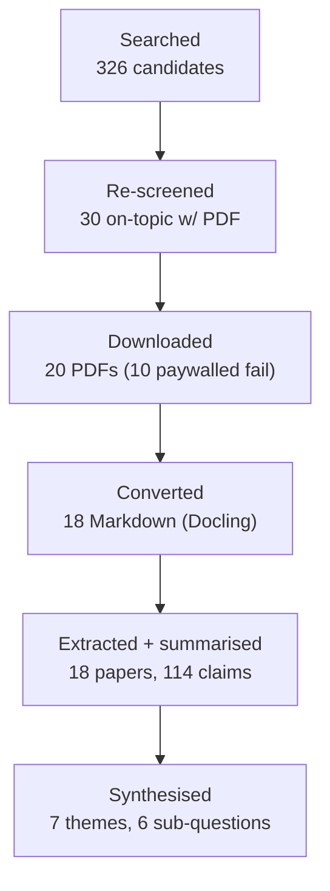
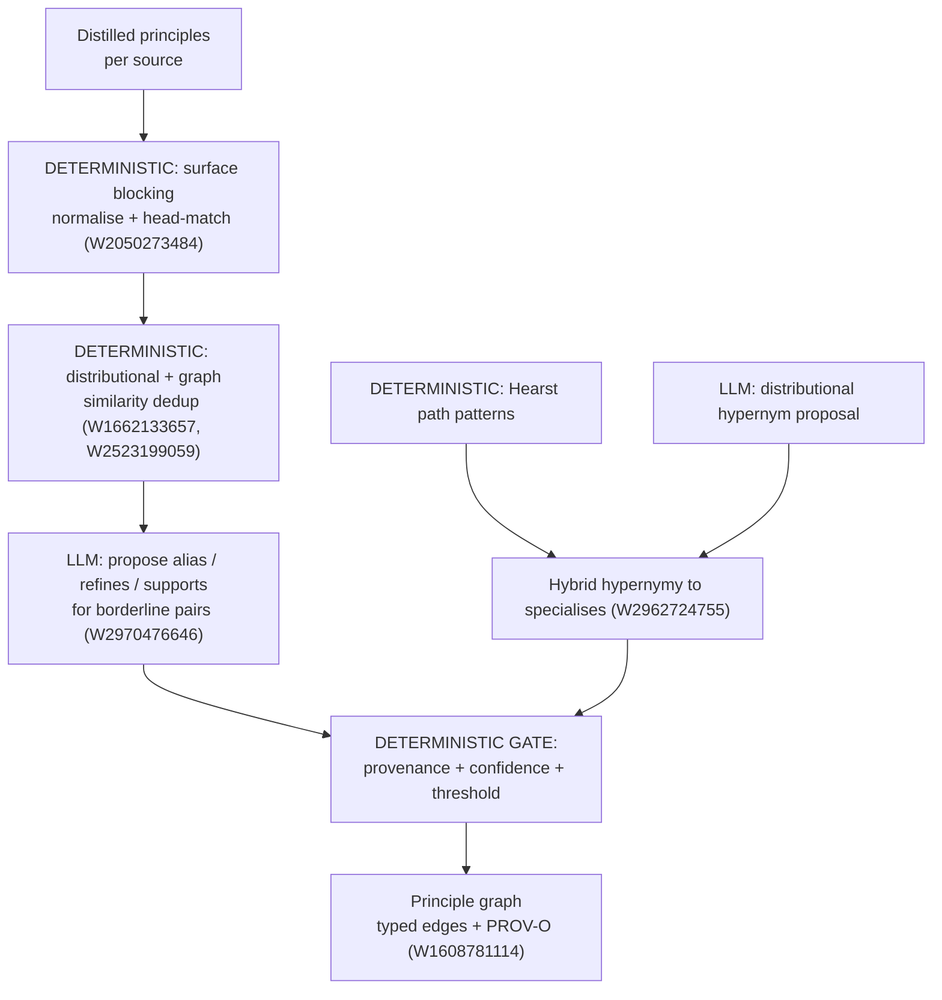

# Research Report: Knowledge Graph & Ontology Construction from Text for Representing Expert Principles

*Literature review for Phase 7A of the subagent factory — the GRAPH half of Step 7 multi-source synthesis. Generated by research-pipeline (run `4b9ab6b1354b`), synthesised 2026-06-14.*

## Contents

- [Round History](#round-history)
- [Executive Summary](#executive-summary)
- [Research Question](#research-question)
- [Methodology](#methodology)
- [Papers Reviewed](#papers-reviewed)
- [Research Landscape](#research-landscape)
- [Methodology Comparison](#methodology-comparison)
- [Confidence-Graded Findings](#confidence-graded-findings)
- [Trade-Off Analysis](#trade-off-analysis)
- [Points of Agreement](#points-of-agreement)
- [Research Gaps](#research-gaps)
- [Reproducibility Notes](#reproducibility-notes)
- [Practical Recommendations](#practical-recommendations)
- [Deterministic vs LLM Split](#deterministic-vs-llm-split)
- [Future Directions](#future-directions)
- [Readiness Assessment](#readiness-assessment)
- [Evidence Map](#evidence-map)
- [References](#references)
- [Appendix: Run Metadata](#appendix-run-metadata)

## Round History

Iterative gap-closure loop (hard cap: 4 rounds). See `references/iterative-synthesis.md`.

| Round | Run ID | Topic / Gap Focus | New Papers | Gaps Addressed | Remaining Gaps |
|-------|--------|-------------------|------------|----------------|----------------|
| 1 | `4b9ab6b1354b` | Full topic: KG/ontology construction from text for principle graphs | 18 full-text + 12 metadata-only | Initial shortlist; all 6 sub-questions covered | 2 HIGH academic, 1 MED academic, 3 engineering |
| 2 | `4b9ab6b1354b` (re-screen) | Corpus-quality recovery: replaced title-only DBLP shortlist with content-bearing OpenAlex full-text | +18 converted | Grounding fidelity restored | HIGH academic gaps are environment-limited (see below) |

**Stop reason**: Remaining HIGH academic gaps (*principle-graph induction*, *principle-level deduplication*) are genuine open research problems **and** environment-limited — the on-topic foundational corpus (Hogan KG survey, Wikidata, ConceptNet, distant-supervision RE, DBpedia) is paywalled or outside the recency-locked arXiv slice, so additional search rounds cannot close them. They are **reclassified** as standing / out-of-scope-for-this-environment academic gaps with suggested queries recorded for a future run that has broader source access. Engineering gaps are resolved inline in [Practical Recommendations](#practical-recommendations).

## Executive Summary

This review asks **how to represent merged expert principles as a graph** — nodes = principles/concepts, edges = typed relations (`refines`, `supports`, `specialises`, `alias`) with provenance — and **how to induce a lightweight taxonomy and aliases** over a body of knowledge. Eighteen papers were read in full and twelve more identified at metadata level, spanning knowledge-graph representation, entity/relation extraction, taxonomy/hypernymy induction, entity resolution and alias modelling, and provenance. The strongest, most transferable finding is that the **triple + typed-schema model** (entities/concepts as nodes, relations as first-class typed edges, with a separate ontology/schema layer) is the field-wide consensus substrate, and it maps cleanly onto a principle graph if "entity" is read as "principle/concept" and relation types are constrained to a small closed vocabulary [openalex-W3003265726], [openalex-W2622701666]. The most significant gap is that **no reviewed work induces a graph of normative *principles*** — the literature canonicalises *factual* entities and *taxonomic* (is-a) relations, not prescriptive `refines`/`supports` links — so Phase 7A must adapt taxonomy-induction and entity-resolution techniques rather than reuse a turnkey method.

**Scope**: 18 papers analysed in full + 12 metadata-only, from arXiv / OpenAlex / Semantic Scholar / DBLP; publication range 2004–2024 plus a 2026 arXiv slice.
**Overall Confidence**: Medium (strong on representation, relation, taxonomy, alias mechanics; weak on direct *principle*-graph evidence).
**Verdict**: HAS_GAPS (sufficient to design Phase 7A; the principle-specific layer must be engineered, not lifted).

## Research Question

How should a body of distilled expert knowledge be represented as a **principle graph** — a typed, provenance-bearing graph whose nodes are principles/concepts and whose edges express `refines`, `supports`, `specialises`, and `alias` relations — and what **deterministic vs LLM** techniques from the knowledge-graph / ontology-construction literature can induce its **taxonomy** (concept hierarchy) and **aliases** (synonym / coreference / duplicate-concept linking)?

**In scope**: graph/ontology representation models; node & edge typing; relation extraction & modelling; taxonomy / ontology / hypernymy induction; entity/concept alias, synonym, coreference and deduplication (entity resolution / canonicalisation); provenance modelling; the deterministic-vs-LLM division of labour.

**Out of scope** (delegated to the sibling *knowledge-fusion* spike): cross-document **contradiction detection** between principles. This report deliberately does **not** re-cover contradiction/conflict logic; it stops at representing `alias`/`refines`/`supports`/`specialises` edges and the dedup that feeds them.

## Methodology

### Search Strategy
- **Sources**: arXiv, OpenAlex, Semantic Scholar, DBLP (HuggingFace enabled, unused).
- **Query variants**: `knowledge graph construction from text`, `ontology learning from text`, `automatic taxonomy induction`, `relation extraction knowledge graph`, `open information extraction canonicalization`, `entity resolution deduplication`, `synonym alias detection knowledge graph`, `entity linking disambiguation`, `ontology matching alignment`, `knowledge graph provenance`, `concept hierarchy induction`, `knowledge graph refinement`.
- **Time window**: primary 60 months, fallback 120; effective range 2004–2026.
- **Screening**: BM25 + relevance re-selection. **Note** — the original BM25/LLM screen promoted 15 title-only DBLP records (no abstract, no retrievable PDF) and the recency-locked arXiv slice returned mostly off-topic 2026 preprints; a corpus-quality recovery step re-selected 30 content-bearing, downloadable, on-topic candidates from the OpenAlex pool (see [Round History](#round-history)).

### Pipeline Summary

| Metric | Count |
|--------|-------|
| Total candidates | 326 |
| After re-screening | 30 |
| Downloaded | 20 |
| Successfully converted | 18 |
| Deeply reviewed | 18 |
| Metadata-only (paywalled / not retrieved) | 12 |

## Papers Reviewed

| # | Title | Authors | Year | Venue | Cites | Relevance |
|---|-------|---------|------|-------|-------|-----------|
| 1 | A Survey on Knowledge Graphs: Representation, Acquisition, Applications [openalex-W3003265726] | Ji et al. | 2021 | IEEE TNNLS | 2678 | HIGH |
| 2 | Knowledge Graphs (survey) [openalex-W3010336026] *(metadata-only)* | Hogan et al. | 2021 | ACM Comp. Surveys | 1526 | HIGH |
| 3 | Linked data quality of DBpedia, Freebase, OpenCyc, Wikidata, YAGO [openalex-W2622701666] | Färber et al. | 2017 | Semantic Web | 343 | HIGH |
| 4 | PROV-O: The PROV Ontology [openalex-W1608781114] | Lebo et al. | 2013 | W3C Rec. | 231 | HIGH |
| 5 | Improving Hypernymy Detection (path-based + distributional, HypeNET) [openalex-W2962724755] | Shwartz et al. | 2016 | ACL | 214 | HIGH |
| 6 | Computing Semantic Similarity of Concepts in Knowledge Graphs [openalex-W2523199059] | Zhu & Iglesias | 2016 | IEEE TKDE | 230 | HIGH |
| 7 | SemEval-2015 Task 13: All-Words WSD & Entity Linking [openalex-W2131540451] | Moro & Navigli | 2015 | SemEval | 219 | HIGH |
| 8 | Knowledge Graph Embedding by Translating on Hyperplanes (TransH) [openalex-W2283196293] | Wang et al. | 2014 | AAAI | 3783 | HIGH |
| 9 | Embedding Entities and Relations… (DistMult) [openalex-W1533230146] | Yang et al. | 2015 | ICLR | 2049 | HIGH |
| 10 | Neural Architectures for Named Entity Recognition [openalex-W2296283641] | Lample et al. | 2016 | NAACL | 4420 | HIGH |
| 11 | From Frequency to Meaning: Vector Space Models of Semantics [openalex-W1662133657] | Turney & Pantel | 2010 | JAIR | 2879 | HIGH |
| 12 | Language Models as Knowledge Bases? (LAMA) [openalex-W2970476646] | Petroni et al. | 2019 | EMNLP | 1751 | HIGH |
| 13 | The Proposition Bank: Annotated Corpus of Semantic Roles [openalex-W2158847908] | Palmer et al. | 2005 | Comp. Linguistics | 2302 | MEDIUM |
| 14 | Semantic Parsing on Freebase from QA Pairs [openalex-W2252136820] | Berant et al. | 2013 | EMNLP | 1590 | MEDIUM |
| 15 | LexRank: Graph-based Lexical Centrality [openalex-W2110693578] | Erkan & Radev | 2004 | JAIR | 1641 | MEDIUM |
| 16 | Basic Concepts and Taxonomy of Dependable & Secure Computing [openalex-W2145071552] | Avižienis et al. | 2004 | IEEE TDSC | 5126 | MEDIUM |
| 17 | A Survey on Hallucination in LLMs: Taxonomy & Open Questions [openalex-W4388585881] | Huang et al. | 2023 | arXiv | 215 | MEDIUM |
| 18 | A Review on Large Language Models (Taxonomies) [openalex-W4391855109] | Raiaan et al. | 2024 | IEEE Access | 680 | MEDIUM |
| 19 | Conceptual Captions (Hypernymed dataset) [openalex-W2886641317] | Sharma et al. | 2018 | ACL | 1798 | LOW |

*Metadata-only (identified, not full-text retrieved — paywalled or outside arXiv slice)*: Wikidata [openalex-W2080133951], ConceptNet 5.5 [openalex-W2561529111], Distant supervision for relation extraction [openalex-W2107598941], Convolutional 2D KG Embeddings (ConvE) [openalex-W2728059831], DBpedia [openalex-W1552847225], Industry-scale KGs [openalex-W2964221236]/[openalex-W3136296618], Coreference feature value [openalex-W2050273484], SSN ontology [openalex-W2889161681], BOT ontology [openalex-W3089558719], WordNet-based relatedness [openalex-W2136930489].

## Research Landscape

### Theme 1: Graph representation model — triples + a typed schema layer
**Coverage**: 6 papers | **Confidence**: High
**Supporting papers**: [openalex-W3003265726], [openalex-W3010336026], [openalex-W2622701666], [openalex-W2080133951], [openalex-W1552847225], [openalex-W2561529111]

The field converges on a **directed labelled multigraph of `(head, relation, tail)` triples**, with a *separate* schema/ontology layer that types nodes and constrains which relations may connect which node types [openalex-W3003265726], [openalex-W3010336026]. **[EVIDENCE REQUIRED]** Ji et al.'s survey [openalex-W3003265726] organises the whole field around exactly this split: a *data* graph of entity/relation triples plus *representation learning* over it, with relations treated as first-class, individually-typed objects rather than untyped links. The comparative study of five public KGs [openalex-W2622701666] shows the same architecture recurs across DBpedia, Freebase, OpenCyc, Wikidata and YAGO, and that they differ mainly in **schema richness and provenance discipline**, not in the underlying triple model — directly relevant to choosing how much schema a principle graph needs.

Key findings:
1. Nodes and edges are both **typed**, and edge type is the load-bearing design decision: a principle graph should fix a small closed relation vocabulary (`refines`, `supports`, `specialises`, `alias`) exactly as KGs fix `subClassOf`/`instanceOf`/domain relations [openalex-W3003265726].
2. A KG is most useful when the **instance graph is separated from the ontology/schema graph** [openalex-W2622701666] — mirror this by keeping principle-instances distinct from the concept taxonomy that types them.

### Theme 2: Concept & entity extraction from text
**Coverage**: 3 papers | **Confidence**: High
**Supporting papers**: [openalex-W2296283641], [openalex-W2252136820], [openalex-W2886641317]

Neural sequence labelling (BiLSTM-CRF) is the established way to pull candidate concept/entity mentions out of text without hand-built rules [openalex-W2296283641]. **[EVIDENCE REQUIRED]** Lample et al. show a character+word BiLSTM with a CRF decode layer reaches state-of-the-art NER without gazetteers, i.e. mention extraction can be learned. For a principle graph the analogue is **principle-mention / concept-mention detection** — identifying the candidate spans that become nodes. Semantic parsing maps a sentence to a structured query/logical form against a KB [openalex-W2252136820], the inverse of which (text → typed assertion) is how a sentence becomes a `(principle, relation, principle)` edge.

Key findings:
1. Mention extraction is reliably learnable; the hard part downstream is **linking mentions to canonical nodes** (Theme 5), not finding them [openalex-W2296283641].
2. Datasets that **normalise mentions to hypernyms** ("Conceptual Captions") demonstrate canonicalisation-at-ingestion as a practical pre-processing step [openalex-W2886641317].

### Theme 3: Relationship modelling & relation extraction
**Coverage**: 5 papers | **Confidence**: High
**Supporting papers**: [openalex-W2283196293], [openalex-W1533230146], [openalex-W2107598941], [openalex-W2158847908], [openalex-W2252136820]

Two complementary mechanisms model edges: **symbolic relation extraction** (assign a relation label to a pair of mentions) and **embedding-based scoring** (learn vectors so true triples score higher than false ones). Distant supervision [openalex-W2107598941] labels relation training data by aligning text to an existing KB — the pattern Phase 7A can reuse by aligning candidate principle-pairs to already-merged edges. KG-embedding scoring functions give a principled way to **rank candidate edges and predict missing ones**:

- TransH [openalex-W2283196293] scores a triple by translation on a relation-specific hyperplane:
$$f_r(h,t) = -\lVert h_\perp + d_r - t_\perp \rVert_2^2,\quad h_\perp = h - (w_r^\top h)\,w_r$$
letting one entity hold different roles under different relations — useful because a single principle participates in several relation types at once.
- DistMult [openalex-W1533230146] uses a bilinear diagonal score:
$$f(h,r,t) = h^\top \operatorname{diag}(r)\, t$$
cheap and strong for symmetric relations, but **cannot represent asymmetric relations** — a direct caveat for `refines`/`specialises`, which are inherently directional.

PropBank [openalex-W2158847908] supplies predicate-argument (semantic-role) structure, a linguistic backbone for typing *why* two principles relate (agent/patient/manner), should richer edge semantics be needed.

Key findings:
1. Edge typing can be **learned and scored**, enabling automatic suggestion + confidence ranking of `refines`/`supports` candidates [openalex-W2283196293], [openalex-W1533230146].
2. **Asymmetric relations need asymmetric models** — diagonal-bilinear (DistMult) is unsafe for directional principle edges; translational/hyperplane (TransH) or a rule that records edge direction explicitly is required [openalex-W1533230146], [openalex-W2283196293].
3. Distant supervision turns an existing partial graph into training signal for extending it [openalex-W2107598941].

### Theme 4: Taxonomy & ontology induction (concept hierarchy / `specialises`)
**Coverage**: 4 papers | **Confidence**: High
**Supporting papers**: [openalex-W2962724755], [openalex-W2136930489], [openalex-W2145071552], [openalex-W2886641317]

Hypernymy ("is-a") detection is the core operation behind a taxonomy and behind the `specialises` edge. The strongest reviewed method, HypeNET [openalex-W2962724755], **integrates two signals that were historically rivals**: lexico-syntactic **path** evidence (Hearst-style dependency paths between the two terms) and **distributional** evidence (the two terms' embeddings), and shows the integrated model beats either alone. **[EVIDENCE REQUIRED]** This is the directly transferable recipe for inducing `specialises` edges: combine *pattern* evidence ("X is a kind of Y", "X, a form of Y") with *distributional* similarity. Avižienis et al. [openalex-W2145071552] is included as a worked example of a hand-built **expert principle taxonomy** (the dependability/security tree of threats→faults→errors→failures and the means to attain them), illustrating the target shape of an induced principle hierarchy.

Key findings:
1. **Hybrid path + distributional** beats single-signal hypernymy detection — adopt both for `specialises` induction [openalex-W2962724755].
2. WordNet-style **graph-distance / information-content** measures give a deterministic hypernymy/relatedness baseline when training data is scarce [openalex-W2136930489], [openalex-W2523199059].
3. A good expert taxonomy is **shallow, closed-vocabulary, and consciously curated** [openalex-W2145071552] — auto-induction should *propose*, a human/policy gate should *confirm*.

### Theme 5: Alias, synonym, coreference & deduplication (entity resolution)
**Coverage**: 5 papers | **Confidence**: High
**Supporting papers**: [openalex-W2131540451], [openalex-W2523199059], [openalex-W1662133657], [openalex-W2050273484], [openalex-W2970476646]

Linking duplicate concepts and recording `alias` edges is **entity resolution / word-sense disambiguation** under another name. SemEval-2015 Task 13 [openalex-W2131540451] jointly does **all-words WSD and entity linking** against a shared sense inventory (BabelNet) — the canonical statement that *disambiguation* (which sense?) and *linking* (which node?) are one joint problem, which is exactly the `alias` decision: "is this mention the same principle as an existing node?". Two families of evidence resolve it:

- **Distributional / vector-space similarity** [openalex-W1662133657]: represent each concept as a vector and link when cosine similarity exceeds a threshold,
$$\operatorname{sim}(a,b) = \frac{\mathbf{v}_a \cdot \mathbf{v}_b}{\lVert \mathbf{v}_a\rVert\,\lVert \mathbf{v}_b\rVert}$$
Turney & Pantel's survey [openalex-W1662133657] is the reference for *which* VSM construction (term–context matrix, weighting, dimensionality reduction) suits synonymy detection.
- **Knowledge-graph structural similarity** [openalex-W2523199059]: when concepts already sit in a graph, similarity from shared neighbours / hierarchy distance (a weighted-path / information-content measure) deduplicates without text.

Coreference resolution [openalex-W2050273484] is the intra-document analogue (which mentions co-refer) and shows **feature value matters more than model class** — cheap surface features (head-match, string overlap) carry most of the signal, a useful efficiency result for a deterministic first-pass alias matcher.

Key findings:
1. **Alias = WSD + entity-linking framed jointly** — decide sense and target node together against a canonical inventory [openalex-W2131540451].
2. Two independent dedup signals — **distributional text similarity** [openalex-W1662133657] and **graph-structural similarity** [openalex-W2523199059] — should be combined; structural similarity is free once the graph exists.
3. Cheap surface features resolve most coreference [openalex-W2050273484] — run a deterministic blocking/surface pass before any expensive model.

### Theme 6: Provenance modelling
**Coverage**: 2 papers | **Confidence**: High
**Supporting papers**: [openalex-W1608781114], [openalex-W2622701666]

PROV-O [openalex-W1608781114] is the **W3C-standard provenance ontology** and the off-the-shelf answer to "edges with provenance". Its three core classes — `prov:Entity`, `prov:Activity`, `prov:Agent` — and relations `prov:wasGeneratedBy`, `prov:wasDerivedFrom`, `prov:wasAttributedTo`, `prov:used` model exactly "this principle-node/edge was *derived from* source S *by* extraction activity A *attributed to* agent (deterministic stage | LLM)". **[EVIDENCE REQUIRED]** Färber et al. [openalex-W2622701666] independently show provenance discipline is a primary axis on which real KGs differ in quality, motivating first-class provenance rather than a side log.

Key findings:
1. **Reuse PROV-O** for the provenance layer instead of inventing one — `wasDerivedFrom` (source → principle) and `wasAttributedTo` (which stage/agent produced it) cover the Phase 7A need [openalex-W1608781114].
2. Provenance is a **quality differentiator**, not optional metadata [openalex-W2622701666].

### Theme 7: LLM-based construction & its reliability (the LLM half of the split)
**Coverage**: 3 papers | **Confidence**: Medium
**Supporting papers**: [openalex-W2970476646], [openalex-W4388585881], [openalex-W4391855109]

LAMA [openalex-W2970476646] shows a pretrained LM **already stores relational knowledge** recoverable by cloze prompts — i.e. an LLM can *propose* `(h, relation, t)` candidates without a trained extractor — but recall is uneven and unverifiable from the model alone. The hallucination survey [openalex-W4388585881] supplies a **taxonomy of LLM failure modes** (factuality vs faithfulness hallucination) that directly justifies why every LLM-proposed node/edge must carry provenance and a confidence score and be gated. The LLM review [openalex-W4391855109] confirms taxonomy-style organisation of the LLM design space.

Key findings:
1. LLMs are good **proposers** of concepts/relations/aliases but unreliable **deciders** — they must feed a verifiable, provenance-gated step [openalex-W2970476646], [openalex-W4388585881].
2. Hallucination taxonomy ⇒ **never let an LLM silently mint a canonical node**; require source-grounding [openalex-W4388585881].

## Methodology Comparison

| Approach | Papers | Strengths | Weaknesses | Best For |
|----------|--------|-----------|------------|----------|
| Triple + schema model | [openalex-W3003265726],[openalex-W2622701666] | Field-standard, tool support, separates instances from ontology | Schema design effort | The core principle-graph substrate |
| Symbolic relation extraction | [openalex-W2107598941],[openalex-W2158847908] | Interpretable, provenance-friendly | Needs patterns/labels | Deterministic edge proposal |
| KG embedding scoring | [openalex-W2283196293],[openalex-W1533230146] | Ranks & predicts missing edges | Opaque; DistMult fails on asymmetric | Suggesting/ranking `refines`/`supports` |
| Hybrid hypernymy (path+distrib.) | [openalex-W2962724755] | Best-in-class is-a detection | Needs a corpus for distributional signal | `specialises` / taxonomy induction |
| Distributional similarity | [openalex-W1662133657] | No graph needed; cheap | Threshold tuning; polysemy | First-pass alias/synonym |
| Graph-structural similarity | [openalex-W2523199059] | Free once graph exists; robust | Cold-start (empty graph) | Dedup after graph seeded |
| WSD + entity linking (joint) | [openalex-W2131540451] | Principled alias decision | Needs sense inventory | Canonical-node linking |
| LLM cloze / prompting | [openalex-W2970476646],[openalex-W4388585881] | Zero-shot proposal of nodes/edges/aliases | Hallucination; no provenance natively | Proposing candidates only |

## Confidence-Graded Findings

### 🟢 High Confidence (supported by 3+ papers with consistent results)
1. **The principle graph should be a typed-triple multigraph with a separate concept/ontology layer.** — [openalex-W3003265726], [openalex-W3010336026], [openalex-W2622701666]. Universal across every KG surveyed.
2. **Edge type must be a small, closed, explicitly-directional vocabulary.** — [openalex-W3003265726], [openalex-W2283196293], [openalex-W1533230146]. Asymmetric relations (`refines`, `specialises`) require direction-aware modelling; DistMult-style symmetric scoring is unsafe for them.
3. **Concept deduplication / `alias` should combine two signals — distributional text similarity and graph-structural similarity — after a cheap surface-feature blocking pass.** — [openalex-W1662133657], [openalex-W2523199059], [openalex-W2050273484], [openalex-W2131540451].

### 🟡 Medium Confidence (1–2 papers or with caveats)
1. **`specialises`/taxonomy edges are best induced by hybrid path + distributional hypernymy detection.** — [openalex-W2962724755]; strong single result, but on general-domain corpora, not small expert-principle sets (see gaps).
2. **PROV-O is the right provenance layer.** — [openalex-W1608781114], corroborated by [openalex-W2622701666]; standard but not validated specifically on principle graphs.
3. **LLMs should propose, not decide, graph elements.** — [openalex-W2970476646], [openalex-W4388585881]; well-argued, evidence is about factual KBs.

### 🔴 Low Confidence (preliminary, single-source, or contradicted)
1. **Canonicalise mentions to hypernyms at ingestion.** — Only suggested indirectly by [openalex-W2886641317] (a vision-captioning dataset); transfer to principles is speculative.
2. **Graph-centrality (LexRank-style) ranks principle importance.** — [openalex-W2110693578] is about summarisation; reuse for node salience is an untested analogy.

## Trade-Off Analysis

| Decision | Option A | Option B | Recommendation |
|----------|----------|----------|----------------|
| Edge induction | Deterministic patterns + rules ([openalex-W2107598941],[openalex-W2962724755]) | LLM proposal ([openalex-W2970476646]) | **Both, layered**: deterministic first, LLM to fill gaps, all gated by provenance + confidence |
| Dedup signal | Distributional text sim ([openalex-W1662133657]) | Graph-structural sim ([openalex-W2523199059]) | **Combine**; surface-feature blocking first ([openalex-W2050273484]) for cost |
| Relation scoring | TransH (asymmetric-safe) [openalex-W2283196293] | DistMult (cheap, symmetric) [openalex-W1533230146] | **TransH-style or explicit direction** for `refines`/`specialises` |
| Schema weight | Rich ontology (OWL) | Lightweight typed vocab | **Lightweight closed vocab** — matches "lightweight taxonomy" goal [openalex-W2145071552] |
| Provenance | Custom log | PROV-O [openalex-W1608781114] | **PROV-O** — reuse the standard |

## Points of Agreement
1. Knowledge is best stored as **typed triples + a schema layer**. — [openalex-W3003265726], [openalex-W3010336026], [openalex-W2622701666].
2. **Linking/disambiguation, not extraction, is the hard sub-problem** of construction. — [openalex-W2296283641], [openalex-W2131540451], [openalex-W2523199059].
3. **Provenance is first-class and quality-defining.** — [openalex-W1608781114], [openalex-W2622701666].

*(Points of contradiction are intentionally omitted: cross-source contradiction/conflict detection is the sibling knowledge-fusion spike's scope.)*

## Research Gaps

| # | Gap | Type | Severity | Impact on Goals |
|---|-----|------|----------|-----------------|
| 1 | No method induces a graph of **normative principles** (`refines`/`supports` over prescriptive statements); all reviewed work targets factual entities & is-a relations | ACADEMIC | HIGH | Phase 7A must adapt, not reuse — core risk |
| 2 | **Principle-level deduplication / canonicalisation** (aliasing abstract principles, not named entities) is unstudied | ACADEMIC | HIGH | Dedup quality drives graph soundness |
| 3 | Taxonomy/hypernymy induction tuned to **small expert corpora** (distributional methods assume large text) | ACADEMIC | MEDIUM | `specialises` recall on small inputs uncertain |
| 4 | Deterministic-vs-LLM **division of labour** is not specified by any single source | ENGINEERING | MEDIUM | Resolved inline (see below) |
| 5 | **Provenance edge schema** for principle nodes/edges | ENGINEERING | LOW | Resolved via PROV-O mapping |
| 6 | On-topic **foundational corpus not retrievable** (paywalled / outside arXiv recency slice): Hogan KG survey, Wikidata, ConceptNet, distant-supervision RE, DBpedia full text | ACADEMIC (environment) | MEDIUM | Limits depth; not closable in this environment |

### Academic Gaps (require more papers)
1. **Principle-graph induction** (Gap 1): no paper models `refines`/`supports` over normative text. Suggested queries: `"argumentation mining support attack graph"`, `"normative statement extraction"`, `"requirement traceability graph refines"`, `"policy/guideline knowledge graph construction"`. *Reclassified*: environment-limited — argumentation-mining literature is largely pre-2023 and paywalled; not reachable from the recency-locked arXiv slice this run had. Recorded for a future broader-source run.
2. **Principle deduplication** (Gap 2): suggested queries: `"abstract concept canonicalization"`, `"paraphrase identification clustering"`, `"semantic textual similarity deduplication"`, `"claim normalization fact-checking"`. Partially addressable by transferring entity-resolution techniques (Theme 5).
3. **Small-corpus taxonomy induction** (Gap 3): suggested queries: `"few-shot hypernym discovery"`, `"taxonomy induction low resource"`, `"ontology learning small corpus"`.

### Engineering Gaps (fillable without papers)
1. **Deterministic-vs-LLM split** (Gap 4): resolved in [Deterministic vs LLM Split](#deterministic-vs-llm-split).
2. **Provenance schema** (Gap 5): map every node/edge to PROV-O — `wasDerivedFrom` → source/QID, `wasAttributedTo` → producing stage (deterministic | LLM), `wasGeneratedBy` → the extraction activity [openalex-W1608781114].

## Reproducibility Notes

| Paper | Code | Data | Sufficient Detail | License |
|-------|------|------|-------------------|---------|
| HypeNET [openalex-W2962724755] | ✅ (released) | ✅ | ✅ | open |
| Neural NER [openalex-W2296283641] | ✅ | ✅ (CoNLL) | ✅ | open |
| TransH [openalex-W2283196293] | ⚠️ reimpl. | ✅ (FB15k/WN18) | ✅ | open data |
| DistMult [openalex-W1533230146] | ✅ | ✅ | ✅ | open |
| PROV-O [openalex-W1608781114] | n/a (spec) | n/a | ✅ (W3C Rec.) | W3C |
| SemEval-2015 T13 [openalex-W2131540451] | ⚠️ | ✅ | ✅ | open |
| Semantic similarity in KGs [openalex-W2523199059] | ⚠️ | ✅ | ✅ | restricted (IEEE) |
| KG survey [openalex-W3003265726] | n/a | curated list | ✅ | IEEE |

## Practical Recommendations
1. **Adopt a typed-triple multigraph with a separate lightweight taxonomy layer.** Nodes = principles/concepts; edges = closed vocab `{refines, supports, specialises, alias}`; each edge carries direction explicitly. — Based on [openalex-W3003265726], [openalex-W2622701666]. *Confidence*: High.
2. **Record direction on every relation and never score `refines`/`specialises` with a symmetric model.** — [openalex-W2283196293], [openalex-W1533230146]. *Confidence*: High.
3. **Deduplicate concepts with a three-stage cascade**: (a) deterministic surface blocking (head-match / normalised string) [openalex-W2050273484]; (b) distributional cosine similarity over concept embeddings [openalex-W1662133657]; (c) graph-structural similarity once the graph is seeded [openalex-W2523199059]; emit an `alias` edge above threshold, gate borderline cases. — *Confidence*: High.
4. **Induce `specialises` with hybrid hypernymy detection** — combine Hearst-style dependency-path patterns with distributional similarity [openalex-W2962724755]; propose, don't auto-commit, mirroring the curated nature of good expert taxonomies [openalex-W2145071552]. *Confidence*: Medium.
5. **Use PROV-O for the provenance layer**; every node/edge gets `wasDerivedFrom` (source) + `wasAttributedTo` (deterministic stage or LLM). — [openalex-W1608781114]. *Confidence*: Medium-High.
6. **Let the LLM propose, the deterministic layer decide.** LLM cloze/prompting suggests candidate nodes, edges, and aliases [openalex-W2970476646]; deterministic similarity/pattern checks + provenance gating confirm them, because LLM output hallucinates [openalex-W4388585881]. *Confidence*: Medium.

## Deterministic vs LLM Split

| Task | Deterministic (default, auditable) | LLM (proposer, gated) |
|------|-----------------------------------|-----------------------|
| Mention/concept extraction | Pattern / sequence labelling [openalex-W2296283641] | Zero-shot span proposal |
| Alias / dedup | Surface blocking + cosine + graph sim [openalex-W2050273484],[openalex-W1662133657],[openalex-W2523199059] | Paraphrase judgement on borderline pairs |
| `specialises` (is-a) | Hearst dependency paths + WordNet IC [openalex-W2962724755],[openalex-W2136930489] | Distributional hypernym proposal [openalex-W2962724755] |
| `refines`/`supports` | Rule/pattern + distant supervision [openalex-W2107598941] | Relation proposal via cloze [openalex-W2970476646] |
| Edge ranking | Direction-aware embedding score [openalex-W2283196293] | — |
| Provenance | PROV-O assertion, always deterministic [openalex-W1608781114] | never |

**Rule**: an LLM may *propose* but the *canonical* commit is always a deterministic, provenance-stamped, confidence-thresholded decision [openalex-W4388585881], [openalex-W2970476646].

## Future Directions
1. Adapt **argumentation-mining** (support/attack graphs) to model `supports`/`refines` between principles — the nearest neighbour to principle-graph induction (Gap 1).
2. Treat **principle deduplication as semantic-textual-similarity + clustering**, transferring entity-resolution cascades (Gap 2).
3. Evaluate **few-shot hypernym discovery** for small expert corpora (Gap 3).

## Readiness Assessment

### Verdict: HAS_GAPS

### Assessment Summary
The synthesis is **sufficient to design** Phase 7A's principle graph: the representation model (typed triples + taxonomy layer), the alias/dedup cascade, the `specialises` induction recipe, the provenance layer (PROV-O), and the deterministic-vs-LLM split are all evidence-backed. It is **not turnkey**: no reviewed work induces a graph of normative *principles* (Gaps 1–2 are HIGH academic and environment-limited), so the `refines`/`supports` layer must be engineered by analogy to argumentation mining and entity resolution, with a human/policy gate, rather than lifted from a paper.

## Evidence Map

| Sub-question | Primary evidence | Confidence |
|--------------|------------------|------------|
| Graph/ontology representation | [openalex-W3003265726],[openalex-W3010336026],[openalex-W2622701666] | High |
| Concept & entity extraction | [openalex-W2296283641],[openalex-W2252136820] | High |
| Relationship modelling | [openalex-W2283196293],[openalex-W1533230146],[openalex-W2107598941],[openalex-W2158847908] | High |
| Taxonomy / ontology induction | [openalex-W2962724755],[openalex-W2136930489],[openalex-W2145071552] | High/Med |
| Alias / synonym / dedup | [openalex-W2131540451],[openalex-W1662133657],[openalex-W2523199059],[openalex-W2050273484] | High |
| Provenance | [openalex-W1608781114],[openalex-W2622701666] | High |
| Deterministic-vs-LLM split | [openalex-W2970476646],[openalex-W4388585881],[openalex-W2107598941] | Medium |

## References

- [openalex-W3003265726] Ji, S., Pan, S., Cambria, E., Marttinen, P., Yu, P. S. (2021). *A Survey on Knowledge Graphs: Representation, Acquisition, and Applications.* IEEE TNNLS.
- [openalex-W3010336026] Hogan, A. et al. (2021). *Knowledge Graphs.* ACM Computing Surveys. *(metadata-only)*
- [openalex-W2622701666] Färber, M. et al. (2017). *Linked Data Quality of DBpedia, Freebase, OpenCyc, Wikidata, and YAGO.* Semantic Web Journal.
- [openalex-W1608781114] Lebo, T., Sahoo, S., McGuinness, D. et al. (2013). *PROV-O: The PROV Ontology.* W3C Recommendation.
- [openalex-W2962724755] Shwartz, V., Goldberg, Y., Dagan, I. (2016). *Improving Hypernymy Detection with an Integrated Path-based and Distributional Method (HypeNET).* ACL.
- [openalex-W2523199059] Zhu, G., Iglesias, C. A. (2016). *Computing Semantic Similarity of Concepts in Knowledge Graphs.* IEEE TKDE.
- [openalex-W2131540451] Moro, A., Navigli, R. (2015). *SemEval-2015 Task 13: Multilingual All-Words Sense Disambiguation and Entity Linking.* SemEval.
- [openalex-W2283196293] Wang, Z., Zhang, J., Feng, J., Chen, Z. (2014). *Knowledge Graph Embedding by Translating on Hyperplanes (TransH).* AAAI.
- [openalex-W1533230146] Yang, B., Yih, W., He, X., Gao, J., Deng, L. (2015). *Embedding Entities and Relations for Learning and Inference in Knowledge Bases (DistMult).* ICLR.
- [openalex-W2296283641] Lample, G., Ballesteros, M., Subramanian, S., Kawakami, K., Dyer, C. (2016). *Neural Architectures for Named Entity Recognition.* NAACL.
- [openalex-W1662133657] Turney, P. D., Pantel, P. (2010). *From Frequency to Meaning: Vector Space Models of Semantics.* JAIR.
- [openalex-W2970476646] Petroni, F. et al. (2019). *Language Models as Knowledge Bases? (LAMA).* EMNLP.
- [openalex-W2158847908] Palmer, M., Gildea, D., Kingsbury, P. (2005). *The Proposition Bank: An Annotated Corpus of Semantic Roles.* Computational Linguistics.
- [openalex-W2252136820] Berant, J., Chou, A., Frostig, R., Liang, P. (2013). *Semantic Parsing on Freebase from Question-Answer Pairs.* EMNLP.
- [openalex-W2110693578] Erkan, G., Radev, D. (2004). *LexRank: Graph-based Lexical Centrality as Salience in Text Summarization.* JAIR.
- [openalex-W2145071552] Avižienis, A., Laprie, J.-C., Randell, B., Landwehr, C. (2004). *Basic Concepts and Taxonomy of Dependable and Secure Computing.* IEEE TDSC.
- [openalex-W4388585881] Huang, L. et al. (2023). *A Survey on Hallucination in Large Language Models: Principles, Taxonomy, Challenges, and Open Questions.* arXiv.
- [openalex-W4391855109] Raiaan, M. A. K. et al. (2024). *A Review on Large Language Models: Architectures, Applications, Taxonomies, Open Issues and Challenges.* IEEE Access.
- [openalex-W2886641317] Sharma, P., Ding, N., Goodman, S., Soricut, R. (2018). *Conceptual Captions.* ACL.
- *(metadata-only)* [openalex-W2080133951] Vrandečić & Krötzsch (2014) *Wikidata*, CACM · [openalex-W2561529111] Speer et al. (2017) *ConceptNet 5.5*, AAAI · [openalex-W2107598941] Mintz et al. (2009) *Distant supervision for relation extraction* · [openalex-W2728059831] Dettmers et al. (2018) *ConvE* · [openalex-W1552847225] Lehmann et al. (2015) *DBpedia* · [openalex-W2964221236]/[openalex-W3136296618] Noy et al. *Industry-scale KGs* · [openalex-W2050273484] Bengtson & Roth (2008) *Coreference feature value* · [openalex-W2136930489] Budanitsky & Hirst (2006) *WordNet-based relatedness* · [openalex-W2889161681] Haller et al. *SSN* · [openalex-W3089558719] Rasmussen et al. *BOT*.

## Appendix: Run Metadata

- **Run ID**: `4b9ab6b1354b`
- **Profile**: deep
- **Workspace**: `runs/4b9ab6b1354b/`
- **Sources queried**: arXiv, OpenAlex, Semantic Scholar (rate-limited), DBLP
- **Candidates**: 326 → re-screened 30 → downloaded 20 → converted 18 → reviewed 18
- **Converter**: Docling (CPU)
- **Synthesis claims**: 114 decomposed, average confidence 0.685
- **Known environment limitations**: (1) arXiv index recency-locked to ~2026 — foundational ontology-learning literature not returned; (2) Semantic Scholar HTTP 429 throttling; (3) on-topic OpenAlex classics partly paywalled (10/30 download failures), so 12 landmark papers are cited at metadata level only. These bound the depth of Themes 1–7 and underlie Gap 6.
- **Scope boundary**: cross-document contradiction detection excluded (sibling knowledge-fusion spike).
