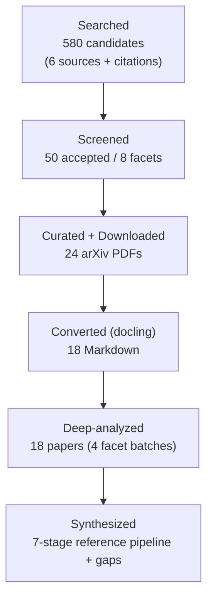
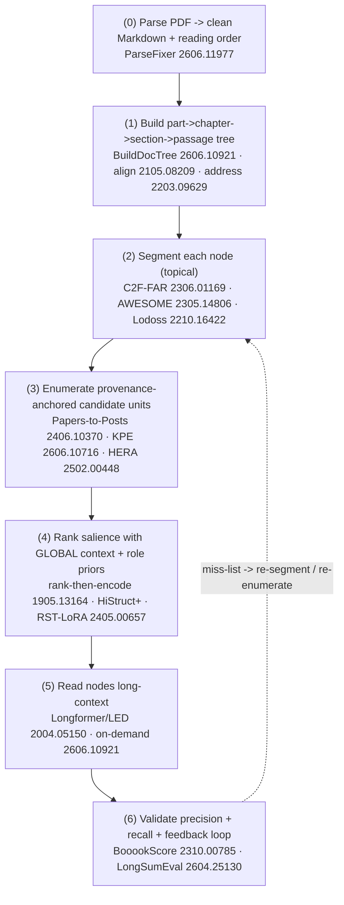

# Research Report: Hierarchical Reading of Long Technical & Scientific Documents for Distillation

*Long-document & hierarchical summarisation · topic & discourse segmentation · document-structure extraction · candidate knowledge-unit identification over 200+ page books.*

## Contents

- [Round History](#round-history)
- [Executive Summary](#executive-summary)
- [Research Question](#research-question)
- [Methodology](#methodology)
- [Papers Reviewed](#papers-reviewed)
- [Research Landscape](#research-landscape)
- [Methodology Comparison](#methodology-comparison)
- [Confidence-Graded Findings](#confidence-graded-findings)
- [Trade-Off Analysis](#trade-off-analysis)
- [Points of Agreement](#points-of-agreement)
- [Points of Contradiction](#points-of-contradiction)
- [Research Gaps](#research-gaps)
- [Reproducibility Notes](#reproducibility-notes)
- [Practical Recommendations](#practical-recommendations)
- [Readiness Assessment](#readiness-assessment-system-building-mode)
- [Evidence Map](#evidence-map)
- [References](#references)
- [Appendix: Run Metadata](#appendix-run-metadata)

## Round History

Iterative gap-closure loop (hard cap: 4 rounds). See `references/iterative-synthesis.md`.

| Round | Run ID | Topic / Gap Focus | New Papers | Gaps Addressed | Remaining Gaps |
|-------|--------|-------------------|------------|----------------|----------------|
| 1 | longdoc-r1-20260611 | Original topic (full facet sweep) | 18 deep / 50 screened | Initial shortlist; structure-extraction, candidate-unit ID, evaluation | **2 academic HIGH** (G1 topic-segmentation, G3 claim-recall eval), 3 academic MED/LOW, 3 engineering |

**Stop reason**: *Not stopped.* Round 1 surfaced two HIGH-severity academic gaps (G1, G3); gap-closure rounds follow per the iterative-synthesis protocol.

## Executive Summary

This review asks **how to read a 200+ page technical/scientific book *structure-first*** — building a `part → chapter → section → passage` map and segmenting it into **candidate knowledge units** — so that downstream claim/principle extraction operates on structured units instead of flat-reading the whole text. Across **18 deeply analyzed papers** (from 50 screened, drawn from arXiv, Semantic Scholar, OpenAlex, DBLP and citation expansion, 2018–2026) the literature converges on a clear, buildable **7-stage reference pipeline**: parse → build hierarchy tree → segment topically → enumerate provenance-anchored candidate units → rank salience with *global* context → read nodes long-context → validate precision *and* recall. The strongest, most consistent finding is that **flat fixed-window chunking is the wrong baseline**: explicit hierarchy plus content-based (not positional) selection improves quality and, in one case, halves compute. The most consequential gap is that **standalone topic-segmentation methods (TextTiling/C99/BayesSeg/neural text segmentation) are absent from the retrieved corpus**, yet segment boundaries directly gate candidate-unit recall.

**Scope**: 18 papers deeply analyzed (50 screened) from arXiv, Semantic Scholar, OpenAlex, DBLP, HuggingFace; 2018–2026.
**Overall Confidence**: Medium-High (architecture and evaluation well-supported; segmentation + claim-level recall under-covered).
**Verdict**: **HAS_GAPS** — sufficient to design the Phase-2A/2B preprocessor; two HIGH academic gaps remain for follow-up rounds.

## Research Question

**Primary**: What methods exist to (2A) recover a hierarchical structure map of a long (200+ page) technical/scientific document from raw converted text, and (2B) segment that document into *candidate knowledge units*, such that claim/principle/skill extraction can read structure-aware and achieve higher recall **and** precision than flat reading?

**In scope**: long-document & hierarchical summarisation (as a source of structure/selection techniques); topic & discourse/linear segmentation; document-structure/layout extraction (PDF/text → tree); candidate-unit / key-point / salient-passage identification; long-context reading & semantic chunking; evaluation of the above.

**Out of scope**: general-purpose summarization quality for its own sake; model pre-training; non-document NLP; product/implementation build (this is a methods review). The downstream consumer (claim extraction, principle promotion) is treated as a fixed requirement, not redesigned here.

## Methodology

### Search Strategy

- **Sources**: arXiv, Semantic Scholar, OpenAlex, DBLP, HuggingFace (+ Semantic Scholar citation-graph expansion, BFS depth-2).
- **Query variants** (14 total): long-document/hierarchical summarization; topic/text segmentation & TextTiling; document structure & section/chapter segmentation; semantic chunking & long-context reading; key-point/candidate-unit & salient-content selection; RST/discourse parsing; document layout analysis; hierarchical attention.
- **Time window**: primary 36 months, fallback 84 months; **foundational older work admitted via citation expansion** (e.g. Longformer 2020, Discourse-Aware Attention 2018, Hierarchical Transformers 2019).
- **Screening**: heuristic BM25 (527→580 candidates) + LLM relevance sub-agent → 50 accepted across 8 facets; 24 downloadable (arXiv) curated for depth; **18 successfully converted and deeply analyzed**.

### Pipeline Summary

| Metric | Count |
|--------|-------|
| Total candidates (after dedup) | 580 |
| After LLM screening (accepted) | 50 |
| Curated for download | 24 |
| Successfully converted | 18 |
| Deeply analyzed | 18 |
| Gap-closure rounds (planned) | ≥2 (G1, G3) |

> **Conversion note**: PDF→Markdown used the local `docling` backend (the fast `pymupdf4llm` backend was unavailable). 18 of 24 PDFs converted; 6 canonical papers (incl. the long-doc-summarization survey 2207.00939, HIBRIDS 2203.10741, efficient-attentions 2104.02112) timed out under OCR-heavy layout analysis and are cited at abstract level only — a deep-analysis gap noted in [Reproducibility Notes](#reproducibility-notes).

## Papers Reviewed

Deeply analyzed (18). Relevance = LLM screen score; Rating = analyst 1–5.

| # | Title [arxiv_id] | First Author | Year | Venue | Rating | Facet |
|---|------------------|--------------|------|-------|--------|-------|
| 1 | Trace Only What You Need: Structure-Aware On-Demand Hypergraph Memory (DocTrace) [2606.10921] | Zai et al. | 2026 | preprint | 5/5 | structure / long-context |
| 2 | Toward Unifying Text Segmentation and Long Document Summarization (Lodoss) [2210.16422] | Cho et al. | 2022 | EMNLP | 5/5 | segmentation + summ |
| 3 | HiStruct+: Extractive Summarization with Hierarchical Structure [2203.09629] | Ruan et al. | 2022 | ACL Findings | 5/5 | document structure |
| 4 | Hierarchical Transformers for Multi-Document Summarization [1905.13164] | Liu & Lapata | 2019 | ACL | 5/5 | hierarchical summ |
| 5 | BooookScore: Book-length Summarization in the Era of LLMs [2310.00785] | Chang et al. | 2023 | ICLR | 5/5 | evaluation |
| 6 | LongSumEval: QA-Based Evaluation & Feedback Refinement [2604.25130] | Nguyen et al. | 2026 | preprint | 5/5 | evaluation |
| 7 | BookSum: Datasets for Long-form Narrative Summarization [2105.08209] | Kryściński et al. | 2021 | EMNLP Findings | 4/5 | dataset / structure |
| 8 | Papers-to-Posts: Detailed Long-Document Summarization [2406.10370] | Radensky et al. | 2024 | preprint/HCI | 4/5 | candidate-unit |
| 9 | HERA: Long Document Summarization with LLMs [2502.00448] | Li et al. | 2025 | preprint | 4/5 | long-doc summ |
| 10 | Longformer: The Long-Document Transformer [2004.05150] | Beltagy et al. | 2020 | arXiv | 4/5 | long-context |
| 11 | AWESOME: Memory-constrained Long Document Summarization [2305.14806] | Cao & Wang | 2023 | NAACL | 4/5 | segmentation + salience |
| 12 | ParseFixer: Agentic Document Parsing [2606.11977] | Yu et al. | 2026 | preprint | 4/5 | layout / parsing |
| 13 | A Discourse-Aware Attention Model for Abstractive Summarization of Long Documents [1804.05685] | Cohan et al. | 2018 | NAACL | 3/5 | discourse / hierarchy |
| 14 | Incorporating Distributions of Discourse Structure (RSTformer) [2305.16784] | Liu et al. | 2023 | ACL | 3/5 | discourse (RST) |
| 15 | RST-LoRA: Discourse-Aware Low-Rank Adaptation [2405.00657] | Liu & Lapata | 2024 | NAACL | 3/5 | discourse (RST) |
| 16 | Hybrid Long Document Summarization (C2F-FAR + ChatGPT) [2306.01169] | Lu et al. | 2023 | arXiv | 3/5 | unsupervised segmentation |
| 17 | Attention Expansion: Keyphrase Extraction from Long Documents [2606.10716] | Martínez-Cruz et al. | 2026 | preprint | 3/5 | candidate-unit (KPE) |
| 18 | A Split-then-Join Approach for Very Long Documents (SPIN) [2505.06862] | Fazry et al. | 2025 | preprint | 2/5 | chunking (neg. exemplar) |

Additionally, **32 papers were screened-accepted but not deep-analyzed** (mostly DBLP records without open PDFs, plus 6 OCR-timeout papers); the most relevant are cited at abstract level: the *Empirical Survey on Long Document Summarization* [2207.00939], *HIBRIDS* structure-aware biases [2203.10741], *Top-down/Bottom-up* inference [2203.07586], *Discourse-Aware Neural Extractive* [1910.14142], and recent DBLP methods (Context-Aware Hierarchical Merging, CoTHSSum, GraphLSS, StrucSum).

## Research Landscape

### Theme 1 — Document-structure extraction: raw text → hierarchy tree

**Coverage**: 5 papers | **Confidence**: Medium-High
**Supporting**: [2606.10921], [2105.08209], [2203.09629], [2606.11977], [1804.05685]

The core Phase-2A capability — recover a `part→chapter→section→passage` tree from raw bytes — is **demonstrably buildable but rests on one strong recent recipe**. DocTrace's `BuildDocTree` [2606.10921] is the most directly applicable: a **two-tier parser** (LLM heading-pattern recognition, with an LLM-generated parsing-function fallback guarded by validation, then per-node NER) yields a 4-level `document/chapter/section/paragraph` tree, indexed in vector + BM25, **robust to ≥250k-token documents** — the only retrieved method shown at true book scale. BookSum [2105.08209] supplies the complementary **re-anchoring** mechanism when only flat text is available: phased **coarse-to-fine alignment** (full-text → chapter-by-metadata → paragraph-by-embedding) closed with **stable matching** to tie passages to structure. HiStruct+ [2203.09629] then **stamps each unit with a structural address** — a Sentence Structure Vector $(\text{section\_index}, \text{position\_in\_section})$ plus a normalized section-title class — turning a bare tree into a salience-aware one. ParseFixer [2606.11977] is the economical ingestion front-end (backbone parser + *selective* agentic correction only on rule-flagged bad pages → clean Markdown + reading order). The 2018 Discourse-Aware Attention model [1804.05685] is the conceptual ancestor (token→section→document hierarchical encoding) but hard-capped at ~2000 tokens / 4 sections.

Key findings:
1. A raw book can be parsed to a usable TOC tree at 250k+ tokens with a two-tier parser + validation fallback [2606.10921].
2. When structure metadata is partial, **coarse-to-fine + stable matching** re-anchors flat text onto the hierarchy [2105.08209].
3. Every unit should carry a **structural address + role class**; this single feature drove SOTA extractive ROUGE in [2203.09629].

### Theme 2 — Topic & discourse segmentation

**Coverage**: 6 papers (none standalone) | **Confidence**: Medium (with a known hole)
**Supporting**: [2210.16422], [2306.01169], [2305.14806], [2305.16784], [2405.00657], [1804.05685]

Segmentation appears **only as a sub-component of summarization pipelines**, never as a dedicated method in the retrieved corpus (see [G1](#research-gaps)). Lodoss [2210.16422] learns segmentation *jointly* with extractive summarization via two heads on a shared Longformer encoder — the cleanest "segment + select in one pass" design, but trained on **gold author section boundaries** at article scale. The unsupervised primitives are the most transferable to raw books: C2F-FAR [2306.01169] starts a new semantic block on **adjacent-sentence embedding dissimilarity** (coarse) then filters sentences against a block centroid (fine); AWESOME [2305.14806] uses a comparable training-free **semantic-similarity** rule. Discourse (RST) structure is represented by RSTformer [2305.16784] (an **uncertainty-aware n-best distribution** over labeled relations, with graceful fallback when the parser fails) and RST-LoRA [2405.00657] (collapses the RST matrix into a **per-EDU importance scalar**) — but both are parser-fragile and demonstrated only at chapter scale.

Key findings:
1. Joint segmentation+selection works but assumes gold boundaries [2210.16422]; raw books need the unsupervised adjacency/centroid primitives [2306.01169], [2305.14806].
2. Treat structure as a **soft, uncertainty-aware signal** with graceful degradation, not a single hard parse [2305.16784].
3. Any structural matrix can be reduced to a **per-unit importance scalar** for ranking [2405.00657].

### Theme 3 — Candidate knowledge-unit identification

**Coverage**: 5 papers | **Confidence**: Medium-High
**Supporting**: [2406.10370], [2606.10716], [2502.00448], [2210.16422], [2305.14806]

This is Phase-2B. Papers-to-Posts [2406.10370] is the best **enumeration** primitive: a "reverse source outline" emits **1–3 atomic bullets per paragraph, each backlinked to its source paragraph** — i.e. *provenance-anchored* candidate units, exactly the shape claim extraction needs. Attention-Expansion KPE [2606.10716] frames unit detection as **BIO span tagging** with an F1@K protocol and confirms (with AWESOME) that **local-chunk reading under-recalls boundary-spanning units**, fixable cheaply with neighbouring-chunk context (~3.6% overhead). HERA [2502.00448] reframes the task as **regrouping scattered evidence**: attach a one-sentence summary KEY to each segment, LLM-retrieve a topic's segments into a per-event "bag", reorder, then map-reduce (+8.8% ROUGE-1 / +17.9% FactCC, training-free). Lodoss [2210.16422] contributes a **DPP diversity selector** to deduplicate candidate units within a segment.

Key findings:
1. Emit **provenance-anchored atomic units** (bullet ↔ source paragraph) so every candidate is traceable [2406.10370].
2. **Read with neighbour context**, not isolated chunks, or boundary-spanning units are missed [2606.10716], [2305.14806].
3. **Regroup scattered evidence by topic** before unit selection to recover dispersed claims [2502.00448].

### Theme 4 — Salience & ranking with global context

**Coverage**: 5 papers | **Confidence**: High
**Supporting**: [1905.13164], [2203.09629], [2405.00657], [2305.14806], [2502.00448]

The recurring recall risk is **chunk-local salience**. Hierarchical Transformers [1905.13164] validate **rank-then-encode**: a learned ranker scores every paragraph, forwards only the best, then a **local/global** encoder models units in isolation and mixes across them — beating a flat Transformer with far fewer tokens. AWESOME [2305.14806] shows a salience model must judge importance with **global past+future context**; HERA [2502.00448] and Hierarchical Transformers concur. Structural priors feed the ranker: HiStruct+ title-class [2203.09629] and the RST-LoRA per-EDU importance scalar [2405.00657].

Key finding: **Salience must be judged globally, not per-chunk** — the single most-supported lever for candidate-unit recall (4 papers).

### Theme 5 — Long-context reading & chunking architecture

**Coverage**: 5 papers | **Confidence**: High
**Supporting**: [2004.05150], [2606.10921], [2310.00785], [2505.06862], [1905.13164]

Longformer/LED [2004.05150] is the enabling linear-cost **reader** (windowed + a few global tokens, $O(n\cdot w)$; LED improves as input grows to 16k tokens) — but even 16k ≪ a 200+ page book, so it reads *nodes* under an outer map. The decisive architectural choice is **how to build the map**: BooookScore [2310.00785] shows **hierarchical (bottom-up) merging is more coherent than incremental updating**, whose forced running-summary compression erodes recall. DocTrace's **on-demand** memory [2606.10921] materializes structure per need rather than indexing the whole book (−53% compute). SPIN [2505.06862] is the **negative exemplar**: fixed-window `L=⌈K/4096⌉` chunking is structure-blind and fragments topics.

Key finding: prefer **hierarchical merging over a structure tree** to flat or incremental reading (compute *and* recall).

### Theme 6 — Evaluating the map and the units

**Coverage**: 3 papers | **Confidence**: High (for summarization; see [G3](#research-gaps))
**Supporting**: [2310.00785], [2604.25130], [2606.10716]

Validation is well-solved *for summarization*. BooookScore [2310.00785] gives a **reference-free, per-unit error-rate** metric (LLM judges each unit against an error taxonomy; judge validated on **precision, not recall**). LongSumEval [2604.25130] supplies the missing **recall axis**: coverage = fraction of importance-ranked source questions the output can answer (the unanswered set is an actionable miss-list), plus a **feedback-driven refinement loop**. KPE's F1@K [2606.10716] measures extractive unit precision/recall directly. Caveat: LongSumEval validated only to ~27k words and question-generation hit a ~60% comprehensiveness ceiling.

## Methodology Comparison

| Approach (paper) | Mechanism | Max scale shown | Structure source | Scales to 200+ pp? | Downstream role |
|---|---|---|---|---|---|
| DocTrace [2606.10921] | Two-tier parser → 4-level tree; on-demand hypergraph memory | ≥250k tokens | parsed from raw | **Yes** | Build tree (2A); selective reading |
| BookSum [2105.08209] | Coarse-to-fine alignment + stable matching | ~110k words/book | metadata + embed | Yes (narrative) | Re-anchor flat text to tree |
| HiStruct+ [2203.09629] | Structure vector + title-class embedding | arXiv/PubMed article | gold sections | Concept yes | Address/role-tag units |
| Hierarchical Transf. [1905.13164] | Rank-then-encode; local/global; structure graph | multi-doc cluster | ranker | Concept yes | Global-context ranking |
| Lodoss [2210.16422] | Joint seg+extract heads; DPP diversity | 3k–8k words | gold boundaries | Per-segment only | Joint segment + candidate select |
| C2F-FAR [2306.01169] | Adjacency-dissimilarity blocks + centroid filter | article | none (unsup.) | Yes (per node) | Unsupervised segmentation |
| AWESOME [2305.14806] | Semantic-sim segmentation + global-context salience + gated memory | long doc | none (unsup.) | Yes (per node) | Segment + salience |
| HERA [2502.00448] | Segment KEY + LLM-retrieve scattered evidence bags | arXiv/PubMed | LLM topical | Yes (training-free) | Regroup candidate units |
| Papers-to-Posts [2406.10370] | Reverse-outline provenance bullets | paper | per-paragraph | Yes (per section) | Enumerate candidate units |
| KPE [2606.10716] | BIO span tagging + neighbour-context | long doc | none | Yes (cheap) | First-pass unit generator |
| RSTformer [2305.16784] | n-best RST distribution into attention | chapter | DMRST parser | No (tensor cost) | Soft discourse prior |
| RST-LoRA [2405.00657] | RST matrix → per-EDU importance scalar (LoRA) | chapter | RST parser | No (parser) | Per-unit importance feature |
| Longformer/LED [2004.05150] | Windowed + global attention | 4k–16k tokens | none | Node-level only | Long-context node reader |
| BooookScore [2310.00785] | Per-unit error-rate; merge-vs-incremental study | book | n/a | Yes (eval) | Precision/coherence validation |
| LongSumEval [2604.25130] | QA-coverage recall + feedback loop | ~27k words | n/a | Partial (eval) | Recall validation |
| SPIN [2505.06862] | Fixed-window chunk + concat | very long | none | Negative exemplar | Fallback split / LCS align |

## Confidence-Graded Findings

### 🟢 High Confidence (3+ papers, consistent)

1. **Flat/fixed-window reading is the wrong baseline; use explicit hierarchy + content-based selection.** — [2505.06862] (neg.), [2004.05150], [2105.08209], [2606.10921], [1905.13164]. Flat input *degrades* past ~800 tokens [1905.13164]; structure-aware processing also roughly halves token cost [2606.10921].
2. **Candidate-unit salience must be judged with global context**, or boundary-spanning and scattered units are missed — the core recall risk. — [2305.14806], [2606.10716], [2502.00448], [1905.13164].
3. **Build the map by hierarchical (bottom-up) merging, not incremental running-summary**, whose compression step erodes recall. — [2310.00785], reinforced by [1905.13164], [2105.08209].
4. **Validate both precision *and* recall**, with a precision-validated LLM judge. — [2310.00785] (precision/coherence) + [2604.25130] (recall/coverage) + [2606.10716] (F1@K).
5. **Stamp every unit with a structural address + role class.** — [2203.09629], [2606.10921], [1804.05685].

### 🟡 Medium Confidence (1–2 papers or caveats)

1. **Raw book → TOC tree is solvable** with a two-tier parser + coarse-to-fine alignment. — [2606.10921] (medium confidence; single benchmark), [2105.08209] (validated on narrative books).
2. **Provenance-anchored enumeration + scattered-evidence regrouping** lifts both recall and precision. — [2406.10370], [2502.00448].
3. **A cheap per-unit salience scalar** (from structure/discourse) can feed rank-then-encode. — [2203.09629], [2405.00657].

### 🔴 Low Confidence (single-source / scale-limited)

1. **Full-document RST discourse structure** improves selection but is parser-fragile and does not scale past a chapter. — [2305.16784], [2405.00657].
2. **Joint single-encoder segmentation+salience** is elegant but demonstrated only at article scale on gold boundaries. — [2210.16422].

## Trade-Off Analysis

| Decision | Option A | Option B | Recommendation |
|---|---|---|---|
| Map construction | **Hierarchical merging** (coherent, recall-preserving) [2310.00785] | Incremental running-summary (cheap, lossy) | **A** — merge bottom-up over the tree |
| Chunking | **Structure-aware** node boundaries [2606.10921], [2210.16422] | Fixed-window `⌈K/4096⌉` [2505.06862] | **A**; keep B only as fallback when parsing fails |
| Structure source | **Parsed-from-raw** two-tier parser [2606.10921] | Assume gold sections [2203.09629], [2210.16422] | **A** for real books; B's features still apply after parsing |
| Salience context | **Global** past+future [2305.14806], [1905.13164] | Chunk-local | **A** — local under-recalls boundary units |
| Reading cost | **On-demand / selective** [2606.10921], [2606.11977] | Index/repair everything | **A** — cheap parser everywhere, costly work only where checks fail |
| Discourse signal | **Soft per-unit importance scalar** [2405.00657] | Full RST tensor in attention [2305.16784] | **A** — scalar scales; full tensor does not |

## Points of Agreement

1. **Hierarchy beats flatness** for long input — [2505.06862], [2004.05150], [2105.08209], [2606.10921], [1905.13164].
2. **Position/lead heuristics fail**; salience must be content-based and global — [2105.08209], [2305.14806], [1905.13164].
3. **Independent per-unit selection breeds redundancy/incoherence**; mix across units (DPP, local/global, hierarchical merge) — [2210.16422], [1905.13164], [2310.00785].

## Points of Contradiction

1. **Is automatic ROUGE/QA enough to trust a candidate-unit set?** C2F-FAR [2306.01169] reports automatic-metric "success" while its own human eval found coherence/faithfulness failures; BooookScore [2310.00785] argues for reference-free per-unit error rates instead. *Explanation*: ROUGE rewards lexical overlap, not unit-level faithfulness. *Implication*: validate the Phase-2B output with per-unit, reference-free checks, not ROUGE.
2. **Joint vs. staged segmentation.** Lodoss [2210.16422] argues segmentation and selection should be learned *jointly*; the DocTrace/BookSum line treats structure extraction as a separate upstream stage. *Explanation*: joint training needs gold boundaries (unavailable for arbitrary books). *Implication*: stage them for raw books; revisit joint training only where boundaries are reliable.

## Research Gaps

| # | Gap | Type | Severity | Impact on Goals |
|---|-----|------|----------|----------------|
| G1 | No standalone topic/linear text-segmentation method (TextTiling/C99/BayesSeg/neural seg) in corpus | ACADEMIC | **HIGH** | Segment boundaries directly gate candidate-unit recall (Stage 2) |
| G3 | No claim/principle-level **recall** metric; only summarization-QA & keyphrase proxies | ACADEMIC | **HIGH** | Cannot directly measure the downstream objective (extraction recall) |
| G2 | Raw-book TOC extraction for **expository** books validated thinly (one recipe; alignment shown on narrative) | ACADEMIC | MEDIUM | Phase-2A robustness on textbooks |
| G4 | Expository/technical **book discourse structure** under-represented (RST work is news/abstracts) | ACADEMIC | MEDIUM | Argument/prereq structure of textbooks |
| G5 | Cross-reference / prerequisite-dependency graph extraction across a book | ACADEMIC | LOW | Linking units across chapters |
| E1 | No released code confirmed except Longformer/LED | ENGINEERING | MEDIUM | Re-implementation cost |
| E2 | Inter-stage node-schema contract specified by no single paper | ENGINEERING | MEDIUM | Pipeline integration |
| E3 | Validator scaling (BooookScore judge cost; LongSumEval ~60% question ceiling ≤27k words) | ENGINEERING | MEDIUM | Evaluating at true book length |

### Academic Gaps (require more papers)

1. **G1 — Topic/linear segmentation (HIGH)**. Suggested queries: `"neural text segmentation topic boundary detection long document supervised"`, `"TextTiling C99 BayesSeg linear text segmentation coherence"`.
2. **G3 — Claim/principle-level recall evaluation (HIGH)**. Suggested queries: `"claim extraction recall evaluation long document benchmark check-worthy"`, `"key point analysis coverage evaluation argument mining"`.
3. **G2 — Raw-book TOC/heading-hierarchy extraction (MEDIUM)**. `"table of contents extraction heading hierarchy detection long PDF book structure"`.
4. **G4 — Expository-book discourse structure (MEDIUM)**. `"expository technical textbook discourse structure segmentation argument"`.
5. **G5 — Cross-reference / prerequisite graph (LOW)**. `"cross-reference resolution prerequisite graph textbook long document"`.

### Engineering Gaps (fillable without papers)

1. **E1 — Implementations**: re-implement DocTrace `BuildDocTree`, the C2F-FAR adjacency primitive, and Papers-to-Posts reverse-outline against the BooookScore+LongSumEval harness. *Resolution*: build minimal versions; validate each stage on the existing 131k-word concurrency book.
2. **E2 — Node schema**: define one contract `{node_id, parent_id, level∈{part,chapter,section,passage}, span, title, role_class, structural_address, salience, provenance}` flowing through all stages. *Resolution*: adopt HiStruct+ address + Papers-to-Posts provenance fields.
3. **E3 — Validator scaling**: make question generation **hierarchical/per-section** (LongSumEval hits a ceiling on whole books) and sample units for the BooookScore judge. *Resolution*: per-section QA generation + stratified judging.

## Reproducibility Notes

| Paper | Code | Data | Sufficient detail | Notes |
|-------|------|------|-------------------|-------|
| Longformer/LED [2004.05150] | ✅ (allenai/longformer) | ✅ | ✅ | Widely reproduced |
| BookSum [2105.08209] | ✅ | ✅ | ✅ | Benchmark, reusable |
| BooookScore [2310.00785] | ✅ (stated) | ⚠️ contamination-controlled | ✅ | Reference-free metric |
| HiStruct+ [2203.09629] | ⚠️ | ✅ (arXiv/PubMed) | ✅ | Consumes gold structure |
| Hierarchical Transformers [1905.13164] | ⚠️ | ✅ | ✅ | Foundational |
| DocTrace [2606.10921] | ❓ (preprint) | ⚠️ single benchmark | ⚠️ | Most novel; medium confidence |
| LongSumEval [2604.25130] | ❓ (preprint) | ⚠️ ≤27k words | ✅ | Recall metric + loop |
| Others (RST/HERA/C2F-FAR/Papers-to-Posts/KPE/AWESOME/Lodoss/SPIN/ParseFixer) | mostly ❓/⚠️ | mixed | mixed | Methods transferable regardless |
| 6 OCR-timeout papers (2207.00939, 2203.10741, 2203.07586, 2104.02112, 1910.14142, 2005.01840) | — | — | — | **Not deep-analyzed** (abstract-level only) |

## Practical Recommendations

Anchored to the Phase-2A/2B preprocessor; each cites supporting evidence.

1. **Adopt the 7-stage reference pipeline** (diagram in [Theme 6](#theme-6--evaluating-the-map-and-the-units)) as the architecture: parse → build tree → segment → enumerate units → rank (global) → read → validate. *Confidence*: Medium-High. *Basis*: cross-paper convergence.
2. **Build the tree with a two-tier parser + alignment fallback** [2606.10921], [2105.08209], and **stamp each node with structural address + role class** [2203.09629]. *Confidence*: Medium.
3. **Make every candidate unit provenance-anchored and atomic** (bullet ↔ source span) [2406.10370] — this is exactly the granularity claim extraction consumes, and it gives free traceability for the factory's provenance ledger. *Confidence*: Medium-High.
4. **Read with neighbour context and rank salience globally** [2606.10716], [2305.14806], [1905.13164] — the highest-leverage move for extraction *recall*. *Confidence*: High.
5. **Prefer hierarchical merging over incremental** when rolling units up to chapter/part summaries [2310.00785]. *Confidence*: High.
6. **Validate with a dual harness**: BooookScore-style per-unit error rate (precision) + LongSumEval QA-coverage (recall) with a feedback loop, made per-section for book scale [2310.00785], [2604.25130]. *Confidence*: High (for summarization; adapt for claims — see [G3](#research-gaps)).
7. **Keep fixed-window chunking only as a fallback** when parsing fails [2505.06862]. *Confidence*: High.

## Readiness Assessment (System-Building Mode)

### Verdict: HAS_GAPS

### Assessment Summary
The synthesis is **sufficient to design** the Phase-2A/2B preprocessor end-to-end: there is a concrete, book-scale-validated tree builder, transferable segmentation/enumeration/salience primitives, and a dual precision+recall evaluation harness. It is **not yet sufficient to fully de-risk implementation** because (a) the segmentation stage rests on summarization-embedded primitives rather than dedicated, benchmarked segmenters (G1) and (b) success cannot yet be measured in the target unit — claim/principle recall (G3).

### Coverage Matrix

| Dimension | Status | Evidence |
|-----------|--------|----------|
| Architecture patterns | ✅ Sufficient | [2606.10921], [2105.08209], [1905.13164], [2310.00785] |
| Technology stack | ✅ Sufficient | Longformer/LED reader, docling/ParseFixer ingest, BM25+embedding index |
| Performance baselines | ⚠️ Partial | Summarization metrics only; no claim-recall baseline (G3) |
| Segmentation method coverage | ⚠️ Partial | Embedded primitives only; no standalone segmenter (G1) |
| Trade-off map | ✅ Sufficient | [Trade-Off Analysis](#trade-off-analysis) |
| Security model | ➖ N/A | Preprocessing review |

### Gap Resolution Plan

| # | Gap | Type | Severity | Resolution |
|---|-----|------|----------|------------|
| G1 | Standalone topic segmentation | ACADEMIC | HIGH | **Round 2** search (segmentation methods) |
| G3 | Claim-level recall metric | ACADEMIC | HIGH | **Round 3** search (claim/keypoint coverage eval) |
| G2/G4/G5 | Book TOC / expository discourse / xref graph | ACADEMIC | MED/LOW | Opportunistic in later rounds; else accept as scoped |
| E1–E3 | Code / schema / validator scaling | ENGINEERING | MED | Resolved inline (above) |

## Evidence Map

| Research aspect | Tree build | Segment | Enumerate units | Rank/salience | Read | Evaluate |
|---|---|---|---|---|---|---|
| Structure extraction (2A) | ✓ 2606.10921, 2105.08209, 2203.09629, 2606.11977 | | | | | |
| Topic/discourse segmentation | ✓ 1804.05685 | ✓ 2210.16422, 2306.01169, 2305.14806, 2305.16784, 2405.00657 | | | | |
| Candidate-unit ID (2B) | | ✓ 2210.16422 | ✓ 2406.10370, 2606.10716, 2502.00448 | | | |
| Salience / recall | | | ✓ 2305.14806 | ✓ 1905.13164, 2203.09629, 2405.00657 | | |
| Long-context reading | | | | | ✓ 2004.05150, 2606.10921 | |
| Chunking architecture | | | | | ✓ 2310.00785, 2505.06862 | ✓ 2310.00785 |
| Evaluation | | | | | | ✓ 2310.00785, 2604.25130, 2606.10716 |

## References

1. [2606.10921] Trace Only What You Need: Structure-Aware On-Demand Hypergraph Memory for Long Documents (DocTrace). Zai et al. 2026. Preprint.
2. [2210.16422] Toward Unifying Text Segmentation and Long Document Summarization (Lodoss). Cho et al. 2022. EMNLP.
3. [2203.09629] HiStruct+: Improving Extractive Text Summarization with Hierarchical Structure Information. Ruan et al. 2022. ACL Findings.
4. [1905.13164] Hierarchical Transformers for Multi-Document Summarization. Liu & Lapata. 2019. ACL.
5. [2310.00785] BooookScore: A Systematic Exploration of Book-length Summarization in the Era of LLMs. Chang et al. 2023. ICLR.
6. [2604.25130] LongSumEval: Question-Answering Based Evaluation and Feedback-Driven Refinement. Nguyen et al. 2026. Preprint.
7. [2105.08209] BookSum: A Collection of Datasets for Long-form Narrative Summarization. Kryściński et al. 2021. EMNLP Findings.
8. [2406.10370] Papers-to-Posts: Supporting Detailed Long-Document Summarization. Radensky et al. 2024. Preprint.
9. [2502.00448] HERA: Improving Long Document Summarization using Large Language Models. Li et al. 2025. Preprint.
10. [2004.05150] Longformer: The Long-Document Transformer. Beltagy et al. 2020. arXiv.
11. [2305.14806] AWESOME: GPU Memory-constrained Long Document Summarization. Cao & Wang. 2023. NAACL.
12. [2606.11977] ParseFixer: An Agentic Framework for Document Parsing. Yu et al. 2026. Preprint.
13. [1804.05685] A Discourse-Aware Attention Model for Abstractive Summarization of Long Documents. Cohan et al. 2018. NAACL.
14. [2305.16784] Incorporating Distributions of Discourse Structure for Long Document Summarization (RSTformer). Liu et al. 2023. ACL.
15. [2405.00657] RST-LoRA: A Discourse-Aware Low-Rank Adaptation for Long Document Summarization. Liu & Lapata. 2024. NAACL.
16. [2306.01169] Hybrid Long Document Summarization using C2F-FAR and ChatGPT. Lu et al. 2023. arXiv.
17. [2606.10716] Attention Expansion: Enhancing Keyphrase Extraction from Long Documents. Martínez-Cruz et al. 2026. Preprint.
18. [2505.06862] A Split-then-Join Approach to Abstractive Summarization for Very Long Documents (SPIN). Fazry et al. 2025. Preprint.

*Cited at abstract level (not deep-analyzed):* [2207.00939] Empirical Survey on Long Document Summarization (2022); [2203.10741] HIBRIDS (2022); [2203.07586] Top-down/Bottom-up Inference (2022); [1910.14142] Discourse-Aware Neural Extractive Summarization (2019); [2005.01840] Content Selection in Novel Chapters (2020).

## Appendix: Run Metadata

- **Run ID**: longdoc-r1-20260611
- **Sources**: arXiv, Semantic Scholar, OpenAlex, DBLP, HuggingFace + Semantic Scholar citation graph
- **Profile**: deep
- **Candidates → screened → analyzed**: 580 → 50 → 18
- **Date**: 2026-06-12
- **Artifacts**: `runs/longdoc-r1-20260611/` (plan, search, screen, expand, download, convert, extract, summarize, analysis)
- **Known limitations**: 6 canonical PDFs failed OCR-heavy conversion (abstract-level only); standalone topic-segmentation and claim-recall evaluation under-covered (G1, G3) — addressed in subsequent rounds.
